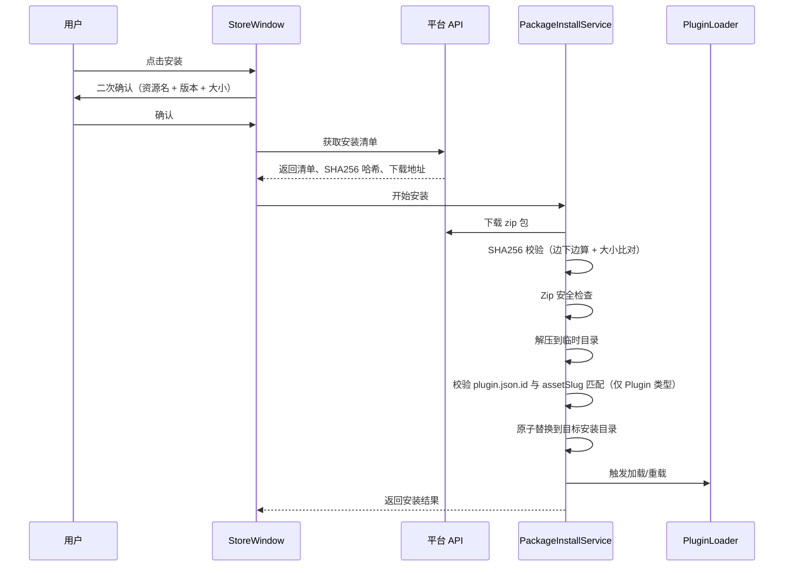

# 23. 桌面端应用商店集成方案

## 1. 目标

在 Cortana 桌面端中接入运营平台资源分发能力，提供独立的“应用商店 / 资源中心”窗体，实现账号登录、资源浏览、已购同步、一键安装、更新检测和本地插件管理联动。

本方案不把应用商店功能直接塞进设置页，而是新增独立功能项目与独立窗体。UI 壳子只负责入口、依赖注入和宿主能力适配，避免设置页职责过重。

## 2. 当前代码基础

### 2.1 平台端已具备的能力

- `Netor.Cortana.Platform.Api` 已提供客户端安装接口：
  - `GET /api/v1/client/install/{assetIdOrSlug}`
  - `GET /api/v1/client/sync`
  - `POST /api/v1/client/updates`
- 安装清单已包含：
  - 资源 ID、Slug、类型、名称、开发者
  - 当前版本 ID、版本号、发布说明
  - 包哈希、哈希算法、包大小
  - 签名算法、包签名
  - 下载地址
  - Manifest 内容
- 平台端已有下载授权校验、订阅校验、包完整性校验、对象存储、本地/S3 存储 Provider、审核风控。

### 2.2 桌面端已具备的能力

- `Netor.Cortana.UI` 已通过 DI 注册 `HttpClient`，可以接入平台 API Client。
- 桌面端已有统一插件目录：
  - `App.UserPluginsDirectory`
  - `AppPaths.UserPluginsDirectory`
- `PluginLoader` 当前只扫描用户全局插件目录，并且已经启动目录监听。
- `PluginManagementPage` 已支持插件刷新、卸载、重载、删除。
- 设置窗体 `SettingsWindow` 已有左侧导航和统一样式，可增加“应用商店”入口。

### 2.3 当前缺口

- 桌面端没有平台账号登录状态和 Token 保存。
- 桌面端没有运营平台 API Client。
- 桌面端没有本地安装记录。
- 桌面端没有下载、哈希校验、签名校验、安全解压、原子替换安装服务。
- 桌面端没有应用商店窗体。
- 当前平台签名为 HMAC，不适合桌面端校验。

## 3. 项目拆分建议

### 3.1 新增项目

建议新增独立项目：

```text
Src/Netor.Cortana.Store/Netor.Cortana.Store.csproj
```

项目定位：桌面端应用商店功能模块，不直接依赖平台 Admin/Web，不承载主 UI 壳子的通用设置逻辑。

建议包含：

```text
Netor.Cortana.Store
├── Abstractions
│   ├── IPlatformAccountStore.cs
│   ├── IPlatformMarketClient.cs
│   ├── IPackageInstallService.cs
│   └── IInstalledAssetStore.cs
├── Models
│   ├── PlatformAccountSession.cs
│   ├── StoreAssetItem.cs
│   ├── StoreInstallManifest.cs
│   ├── InstalledAssetRecord.cs
│   └── PackageInstallResult.cs
├── Services
│   ├── PlatformAccountService.cs
│   ├── PlatformMarketClient.cs
│   ├── InstalledAssetStore.cs
│   ├── PackageInstallService.cs
│   ├── PackageSignatureVerifier.cs
│   └── SafeZipExtractor.cs
├── ViewModels
│   ├── StoreWindowViewModel.cs
│   ├── StoreLoginViewModel.cs
│   ├── StoreAssetsViewModel.cs
│   ├── StoreInstalledViewModel.cs
│   └── StoreUpdatesViewModel.cs
├── Views
│   ├── StoreWindow.axaml
│   ├── StoreLoginView.axaml
│   ├── StoreAssetsView.axaml
│   ├── StoreInstalledView.axaml
│   └── StoreUpdatesView.axaml
└── DependencyInjection.cs
```

### 3.2 UI 壳子职责

`Netor.Cortana.UI` 保持宿主角色：

- 引用 `Netor.Cortana.Store`。
- 在 `App.axaml.cs` 中调用 `services.AddCortanaStore()`。
- 注册 `StoreWindow` 或由 Store 项目注册窗体。
- 给设置页、主菜单或托盘菜单提供“应用商店”入口。
- 向 Store 项目提供宿主路径能力：
  - 用户插件目录
  - 用户数据目录
  - 插件加载/重载能力
  - 系统提示/Toast 能力

### 3.3 Store 项目职责

`Netor.Cortana.Store` 负责：

- 平台账号登录、退出、会话状态读取。
- 资源列表、资源详情、已购同步、更新检测。
- 包下载、哈希校验、签名校验。
- Zip 安全检查与安全解压。
- 插件安装目录规划。
- 本地安装记录维护。
- 安装进度、失败原因、重试状态。

## 4. UI 入口设计

### 4.1 设置窗体入口

在 `SettingsWindow` 左侧导航增加一项：

```text
应用商店
```

行为建议：

- 点击后打开独立 `StoreWindow`。
- 不在设置页右侧嵌入完整商店界面。
- 设置页可继续停留在当前页面，不改变已有设置导航结构。

这样设置窗体只是入口，不承担市场浏览、安装、更新等复杂流程。

### 4.2 应用商店窗体入口

可选扩展入口：

- 主窗口菜单增加“应用商店”。
- 托盘菜单增加“应用商店”。
- 插件管理页顶部增加“打开应用商店”按钮。

第一阶段建议只做设置窗体入口，减少 UI 改动面。

## 5. 应用商店窗体设计

### 5.1 总体要求

- 保持当前 Cortana 桌面端深色风格。
- 沿用现有资源：
  - `BaseBrush`
  - `MantleBrush`
  - `Surface0Brush`
  - `Surface1Brush`
  - `TextBrush`
  - `SubtextBrush`
  - `AccentBrush`
- 组件圆角、间距、按钮样式与 `SettingsWindow`、`PluginManagementPage` 保持一致。
- 不做营销式首页，不做大面积宣传 Hero。
- 第一屏应直接显示可操作的资源列表、登录状态和安装状态。

### 5.2 推荐布局

```text
StoreWindow
├── 顶部工具栏
│   ├── 标题：应用商店
│   ├── 搜索框
│   ├── 分类筛选
│   └── 当前账号区域
├── 左侧导航
│   ├── 资源市场
│   ├── 我的资源
│   ├── 可用更新
│   └── 安装记录
└── 主内容区
    ├── 资源列表 / 资源详情
    ├── 登录提示
    ├── 安装进度
    └── 错误和重试提示
```

### 5.3 登录状态展示

应用商店窗体顶部展示账户区域，参考 Windows 应用商店的常规交互：

- 未登录：
  - 顶部右侧（或左侧）显示“登录”按钮，主操作位明显
  - 资源市场可正常浏览资源列表与详情
  - 详情页的“安装”按钮置灰，悬浮提示“需要登录后才能安装”
  - 我的资源、可用更新、安装记录三个视图显示登录引导，不展示内容
  - 登录弹窗中提供“没有账号？前往网页注册”链接，注册全部走 Web 端
- 已登录：
  - 显示登录用户名 / 昵称
  - 显示账号邮箱或手机号的简要信息
  - 显示“同步资源”
  - 显示“退出登录”

### 5.4 注册与账号自助

桌面端不实现注册、修改密码、忘记密码、找回密码等账号自助流程。所有这些操作都跳转到网页端完成。

第一阶段：

- 登录弹窗中显示“前往网页注册”和“忘记密码”两个链接。
- 点击后用系统默认浏览器打开平台 Web 对应页面。
- 用户在 Web 完成操作后回到客户端登录。

平台 Web 端必须提供的页面（缺失的需要补齐，**这是阻塞项**）：

- `/account/register`：注册（已存在）
- `/account/forgot-password`：忘记密码（**当前缺失，需要补**）
- `/account/reset-password`：重置密码（**当前缺失，需要补**）
- `/account/profile`：账户中心，可改密码、邮箱、手机（**当前缺失，需要补**）

后续优化方向（不在第一阶段，仅作记录）：

- 网页登录完成后通过自定义协议（如 `cortana://login?token=...`）回跳客户端，自动带回登录态。
- 网页端发起 OAuth-Device-Code 风格的配对流程，桌面端轮询网页授权结果。

这两条目前不开发，需要等第一阶段稳定后再讨论。

## 6. 登录与会话方案

### 6.1 平台 BaseUrl 配置

桌面端通过 `appsettings.json` 与系统设置共同决定平台地址：

- 默认值写在 `appsettings.json` 的 `Platform.BaseUrl`，发布时由打包脚本注入官方平台地址。
- 系统设置中暴露 `Platform.BaseUrl` 项，便于私有化部署用户切换。
- 切换 BaseUrl 时强制清空当前 Token 并退出登录。

### 6.2 登录接口

平台端已具备：

```text
POST /api/v1/auth/login
```

桌面端登录流程：

1. 用户输入账号、密码。
2. 调用平台登录接口。
3. 获取 AccessToken、过期时间、账号信息。
4. 保存会话。
5. 刷新应用商店账户区域。

### 6.3 Token 保存

第一阶段使用本地加密保存：

- Windows：DPAPI（`ProtectedData.Protect` Scope=CurrentUser）。
- 跨平台计划在后续版本接入系统 Keychain，第一阶段仅 Windows，参考 5.5 节。

存储内容（字段命名与平台 `ApiLoginResponse` / `ApiAccountResponse` 保持一致）：

```json
{
  "baseUrl": "https://platform.example.com",
  "accessToken": "...",
  "expiresAtUtc": "2026-06-03T00:00:00Z",
  "account": {
    "id": "...",
    "no": "...",
    "loginUserName": "...",
    "nickName": "...",
    "email": "...",
    "phone": "..."
  }
}
```

### 6.4 登录过期与账号状态校验

桌面端：

- API 返回 `401` 时标记会话失效。
- 应用商店顶部显示“登录已过期”，安装、同步、更新按钮置灰，提示重新登录。
- 启动时不主动验证 Token，惰性等首个 API 401 再处理。

平台 API：

- `ApiTokenService` 当前是 stateless HMAC，签发后 30 天内不会因为账号被禁用而失效，需要在请求处理管线（`GetCurrentAccountAsync`）里**额外校验账号当前状态**。
- 账号 `Status != 0`（被禁用/冻结）时直接返回 `401`，让客户端走重新登录流程。
- 这条校验是**阻塞项**，必须在桌面端商店上线前补齐，否则禁用账号仍能拉取安装清单。

## 7. 包完整性方案

### 7.1 校验目标

桌面端商店只需要确认"我下载下来的包没有被改过"，不需要做"是平台签发的"这种身份背书：

- 通信走 HTTPS，传输层已经保证不会被中间人篡改。
- 安装清单（含 `packageHash`）来自平台 API，HTTPS 已经能保证清单本身可信。
- 因此**只需 SHA256 哈希校验包内容**：客户端下载完整 zip 后，本地算 SHA256 与清单上的 `packageHash` 比对。

### 7.2 移除签名机制

**完全删除** `PackageSignatureService` 与安装清单中的 `signature` / `signatureAlgorithm` 字段：

- 平台不再生成、保存、下发签名。
- 不需要配置签名私钥，不需要管理密钥轮换。
- 客户端不内置任何公钥。
- 25-Step3 完成的 Verify 流水线骨架在 26 落地阶段一并清除。

### 7.3 完整性校验流程

```text
1. 客户端调用 GET /api/v1/client/install/{idOrSlug} 获取清单
2. 清单返回 packageHash (SHA256, hex 小写) 与 packageSize
3. 客户端按 DownloadUrl 下载 zip（HTTPS）
4. 边下边算 SHA256；下载完成后比对 packageHash
   - 不一致 → 删除已下载内容，提示完整性失败
   - 一致 → 继续 Zip 安全检查与解压
5. 同时校验 PackageSize 与实际下载字节数一致
```

### 7.4 用户密码哈希

用户密码哈希使用 MD5 是历史选择，第一阶段保留不动；**完整性校验链路上必须用 SHA256**，不要降级成 MD5。

## 8. 安装流程

### 8.1 一键安装



第一阶段所有安装、更新都需要用户二次确认，不做静默；与 §11.2 _"暂不做自动静默安装/更新"_ 对齐。

### 8.2 安装目录与 AssetType 映射

桌面端按 AssetType 分别落到对应目录。`IAppPaths` 当前只暴露了 `UserPluginsDirectory` 与 `UserSkillsDirectory`，本方案落地前需要补全。

| AssetType | 目标目录（桌面端） | 平台 BlobKey 子目录 | 备注 |
|---|---|---|---|
| Plugin (1) | `IAppPaths.UserPluginsDirectory/{assetSlug}` | `plugins/` | 已有 |
| Skill (2) | `IAppPaths.UserSkillsDirectory/{assetSlug}` | `skills/` | 已有 |
| Agent (3) | `IAppPaths.UserAgentsDirectory/{assetSlug}` | `agents/` | **当前 IAppPaths 缺失，需要补字段 + 实现** |
| Solution (4) | `IAppPaths.UserSolutionsDirectory/{assetSlug}` | `solutions/` | **当前 IAppPaths 缺失，需要补字段 + 实现** |

`Netor.Cortana.Store` 不直接选择目录，而是通过新接口 `IAssetInstallTargetResolver`（由 UI 壳子实现）按 AssetType 解析目标目录。

### 8.3 assetSlug 与 plugin.json.id 关系

`{UserPluginsDirectory}/{assetSlug}` 仅是文件系统的目录命名规则，与插件运行时 ID 无关：

- 创作者上传时，平台**不强制** `plugin.json.id == assetSlug`。
- 桌面端卸载/重载时，`PluginLoader.UnloadPlugin(dirName)` 按目录名定位（已支持），不需要 plugin.json.id 一致。
- 但商店在“更新”流程里需要先卸载旧目录，文档默认 `dirName == assetSlug`：所以 **assetSlug 必须保持稳定**（一旦发布不允许修改），否则更新会找不到旧目录。
- 这条由平台 `AssetService.UpdateAssetAsync` 在 Slug 变更时拦截。

### 8.4 安装失败回滚

更新已存在资源时按以下顺序：

1. 调用 `PluginLoader.UnloadPlugin(assetSlug)` 卸载旧实例。
2. 等待最多 3 秒，让进程插件子进程退出、native dll 句柄释放。
3. 解压 zip 到临时目录 `{UserDataDirectory}/store/staging/{assetSlug}-{guid}/`。
4. 把已存在的目标目录重命名为 `{assetSlug}.bak-{timestamp}`（同分区原子操作）。
5. 把临时目录移动到目标目录。
6. 调用 `PluginLoader.LoadPluginByPathAsync(targetDir)`（**当前缺失，见 §8.6**）触发加载。
7. 加载成功 → 删除 `.bak`；加载失败 → 删除新目录、把 `.bak` 还原。

启动时 `PackageInstallService` 主动扫描并清理一次 staging 与孤儿 `.bak` 目录，处理"安装中途宿主崩溃"的残留。

### 8.5 Zip 安全要求

桌面端复用平台同款规则，不重新发明，但保留**最小防御**——平台漏掉的桌面端兜底：

- 禁止绝对路径。
- 禁止 `..` 路径穿越。
- 禁止符号链接条目。
- 限制单文件大小 ≤ 100MB、文件数量 ≤ 500（与平台 `PackageRiskService` 一致）。
- 单包总解压大小：Plugin / Skill / Agent ≤ 100MB；Solution / Voice 类带模型 ≤ 800MB（与 25 文档保持一致）。
- 解压后必须存在与 AssetType 对应的清单文件：
  - Plugin → `plugin.json`
  - Skill → `skill.md`（或者项目约定的 skill 清单）
  - Agent → `agent.json`
  - Solution → `solution.json`

### 8.6 PluginLoader 接口缺口与补齐

当前 `Src/Netor.Cortana.Plugin/PluginLoader.cs` 已有：

- `UnloadPlugin(string pluginDirName)`：按目录名卸载。
- `ReloadPluginAsync(string pluginDirName)`：先卸再装，要求目录已存在。
- `ReloadPluginByIdAsync(string pluginId)`：按 plugin.json.id 重载。

**缺口**：商店把新目录解压到 `UserPluginsDirectory/{assetSlug}` 后，没有"按路径加载尚未加载过的目录"的入口。`FileSystemWatcher` 虽然会感知新目录，但：

- 监听是异步的，商店不能立刻汇报“安装成功”状态。
- 解压完成 → 目录创建事件触发 → 写文件还在继续 → 加载会读到不完整文件。

需要在 `PluginLoader` 上新增：

```csharp
/// <summary>
/// 主动加载指定路径的插件目录。目录必须位于已配置的插件根目录之下。
/// 用于应用商店安装/更新完成后立即激活新插件，而不依赖 FileSystemWatcher。
/// </summary>
public Task<bool> LoadPluginByPathAsync(string pluginPath, CancellationToken cancellationToken = default);
```

实现要点：

- 校验 `pluginPath` 必须是 `GetPluginRootDirectories()` 中某个根目录的直接子目录，拒绝外部任意路径。
- 调用现有 `TryLoadPluginDirectoryAsync` 完成加载。
- 返回是否真正加载到一个有效插件（区分目录存在但 plugin.json 缺失/无效的情况）。

`sys_load_plugin` 工具同步加上，便于 AI Agent 走商店流程也能驱动加载。

### 8.7 平台端代理下载与 CDN 直链（后续优化）

当前 `/api/v1/assets/{id}/download` 走 `Results.File(stream)` 经平台代理流。在大包（含模型的 voice 插件 ≥ 200MB）+ 公网部署场景下平台带宽会爆。第一阶段不在范围内，后续版本：

- 当 `AssetVersion.StorageProvider == "S3"` 且 S3 配置中开启 `PublicBaseUrl` 时，下载 endpoint 直接 302 到 S3 预签名 URL。
- 客户端按 302 跳转，不影响现有逻辑。

## 9. 同步与更新流程

### 9.1 同步

同步按钮调用：

```text
GET /api/v1/client/sync
```

平台只会返回**当前账号有效订阅且资源已发布**的清单（参见 `Program.cs:240`）。"已失效"、"已下架"等状态不在响应里。

桌面端通过本地安装记录与平台返回比对，得出 4 种状态：

| 状态 | 判断条件 |
|---|---|
| 已授权但未安装 | 平台返回，本地没有 |
| 已安装且最新 | 双方都有，本地 versionId == 平台 versionId |
| 已安装但平台有新版 | 双方都有，本地 versionId != 平台 versionId |
| 已失效或不再授权 | 本地有记录，平台没有返回 |

后两种是桌面端推断，平台不直接给。状态推断逻辑放在 `InstalledAssetStore.MergeWith(syncResponse)`。

### 9.2 更新

更新按钮调用：

```text
POST /api/v1/client/updates
```

请求体使用本地安装记录，字段与平台 `ApiClientInstalledAsset`（PascalCase）一致，由 `JsonSerializerOptions` 控制 camelCase 序列化：

```json
{
  "installedAssets": [
    {
      "assetId": "...",
      "assetSlug": "...",
      "versionId": "...",
      "versionName": "...",
      "packageHash": "..."
    }
  ]
}
```

桌面端通过 `JsonSerializerOptions { PropertyNamingPolicy = JsonNamingPolicy.CamelCase }` 发送；平台需要在 `Program.cs` 顶部 `builder.Services.ConfigureHttpJsonOptions` 启用同样的 camelCase 策略，避免大小写不匹配 400。这是阻塞项。

第一阶段不做静默更新，只提示用户确认（与 §11.2 一致）。

## 10. 本地安装记录

建议第一阶段用 JSON 文件，不急于扩展数据库表。

位置：

```text
{UserDataDirectory}/store/installed-assets.json
```

记录字段：

```json
{
  "assets": [
    {
      "assetId": "...",
      "assetSlug": "...",
      "assetType": "Plugin",
      "assetName": "...",
      "versionId": "...",
      "versionName": "...",
      "packageHash": "...",
      "packageSize": 12345,
      "installedDirectory": "...",
      "installedAtUtc": "2026-06-03T00:00:00Z",
      "lastVerifiedAtUtc": "2026-06-03T00:00:00Z"
    }
  ]
}
```

后续如果需要查询、统计、安装历史，再迁移到 SQLite。

## 11. 第一阶段范围

### 11.1 必做

平台端阻塞项（先于桌面端 Store 项目）：

- 移除 `PackageSignatureService`，从安装清单中删除 `signature` / `signatureAlgorithm` 字段；25-Step3 完成的 Verify 流水线骨架一并清除（落地见 26-Step1）。
- `GetCurrentAccountAsync` 增加账号状态校验，禁用账号返回 401。
- API JSON 序列化全局启用 camelCase。
- 平台 Web 端补齐 `/account/forgot-password`、`/account/reset-password`、`/account/profile`。

桌面端宿主能力补齐：

- `IAppPaths` 增加 `UserAgentsDirectory`、`UserSolutionsDirectory` 字段并实现。
- `PluginLoader` 增加 `LoadPluginByPathAsync(pluginPath)` 接口。
- `sys_load_plugin` 工具暴露给 AI Agent，与现有 `sys_unload_plugin` / `sys_reload_plugin` 配套。

应用商店项目主体：

- 新增 `Netor.Cortana.Store` 项目。
- UI 壳子注入 Store 服务、注册 `StoreWindow`。
- 通过事件中心解耦：Store 项目发布安装/更新进度事件，UI 壳子的 Toast/气泡监听。
- 设置窗体增加应用商店入口。
- 新增独立 `StoreWindow`。
- 登录、退出、当前账号展示。
- 未登录时浏览资源市场可用，安装按钮置灰；其他视图显示登录引导。
- 平台 BaseUrl 通过 `appsettings` + 系统设置切换。
- 平台 API Client。
- 一键安装资源（覆盖 4 种 AssetType，分别落到对应目录）。
- SHA256 完整性校验（边下边算 + 大小比对）。
- Zip 安全解压 + 安装失败原子回滚（含 staging 与 .bak 残留清理）。
- 本地安装记录。
- 同步已授权资源（含 4 种状态推断）。
- 检查更新（用户确认后才执行）。

### 11.2 暂不做

- 桌面端注册 / 改密 / 找回密码（一律跳 Web）。
- 自定义协议回跳客户端登录（`cortana://login` 等），第一阶段稳定后讨论。
- 支付收银台内嵌（统一跳 Web 完成订阅）。
- 用户钱包 / 余额扣费（候选方案，后续讨论）。
- 自动静默安装 / 静默更新。
- 复杂评分评论。
- 创作者中心桌面端入口。
- 企业资源策略。
- 签名证书链与吊销列表。
- 跨平台（macOS/Linux）：当前桌面端依赖 winmm 等 Windows 原生库，仅承诺 Windows，跨平台后续讨论。
- S3 直链 / CDN 加速（后续优化，仍走平台代理）。

## 12. 风险与注意事项

- 完整性依靠 SHA256 + HTTPS 双层防护；安装清单本身的可信性由 HTTPS 保证，不再单独引入签名机制（与 §7 一致）。
- 安装包解压必须使用临时目录和原子替换，避免半安装状态。
- 插件运行中更新前必须先卸载，否则进程插件或 native 插件可能锁文件；更新流程要等待句柄释放（最多 3 秒）。
- `assetSlug` 一旦发布不允许修改（依赖文件系统目录命名稳定性）。
- `plugin.json.id` 与 `assetSlug` 不要求一致：卸载使用目录名，按 ID 重载是另一条路径。
- UI 风格必须复用现有资源，不单独引入新的视觉体系。
- Store 项目不直接依赖 `Netor.Cortana.UI` 的具体窗体；与 UI 之间通过 `IAssetInstallTargetResolver`、`IToastService` 等接口 + 事件中心解耦。
- 第一阶段桌面端不实现注册/改密/找回密码，相应的 Web 页面缺失会让用户卡死，必须先在 Web 端补齐。
- API JSON 大小写策略：camelCase 必须双端一致，否则首次请求就 400。
- 大包代理走平台带宽，第一阶段允许；后续 S3 直链优化。
- 跨平台暂不在范围，winmm 等 Windows 原生依赖通过插件解耦的策略已在 5.5 中提及，桌面端 Store 项目按 Windows-only 设计。

## 13. 建议落地顺序

阶段 P0（平台端阻塞项，与桌面端开发并行进行）：

1. 移除 `PackageSignatureService`，安装清单清掉 `signature` / `signatureAlgorithm` 字段。
2. 平台 API 全局 camelCase 序列化、`GetCurrentAccountAsync` 校验账号状态。
3. 平台 Web 端补齐忘记密码、重置密码、账号中心页面。

阶段 P1（桌面端宿主能力）：

1. `IAppPaths` 补齐 Agents/Solutions 目录字段。
2. `PluginLoader.LoadPluginByPathAsync` 接口实现 + `sys_load_plugin` 工具。

阶段 P2（Store 项目主体）：

1. 新建 Store 项目 + DI 扩展。
2. 平台账号、Token、API Client、BaseUrl 配置。
3. 安装记录与安装服务（含原子回滚、staging 清理）。
4. StoreWindow 基础 UI、登录态切换。
5. 设置窗体入口接入。
6. 接入 install / sync / updates 流程（覆盖 4 种 AssetType）。
7. 测试、构建、人工流程验证。
