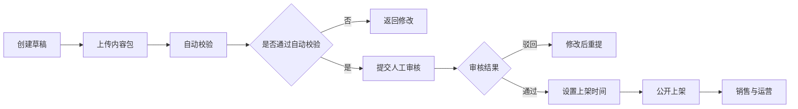

# 05. 创作者中心与收益体系

## 1. 创作者入驻

入驻流程：

1. 提交开发者申请。
2. 完成实名或企业认证。
3. 绑定收款账户。
4. 签署平台协议。
5. 完成安全考试或规则确认。
6. 获得上传权限。

## 2. 内容发布流程

## 3. 创作者数据看板

- 销售额。
- 订阅人数。
- 新增订阅。
- 取消订阅。
- 退款率。
- 评分趋势。
- 安装量。
- 活跃用户。
- 版本使用分布。
- 崩溃率和投诉率。

## 4. 收益中心

- 可结算余额。
- 冻结金额。
- 已提现金额。
- 平台服务费。
- 退款扣减。
- 税费扣减。
- 结算单下载。
- 提现申请。

## 5. 创作者分层

| 等级 | 条件 | 权益 |
|---|---|---|
| 新入驻 | 完成认证 | 可提交内容审核 |
| 认证开发者 | 通过首个作品审核 | 可发布公开内容 |
| 优质开发者 | 评分、留存、退款率达标 | 推荐权重提升 |
| 官方合作伙伴 | 平台签约 | 联合推广、定制商务政策 |

## 6. 创作者违规处理

- 轻微违规：提醒、要求修改。
- 一般违规：限制上架、降低推荐、冻结版本。
- 严重违规：下架内容、冻结收益、暂停账号。
- 恶意违规：永久封禁、资金冻结、法务处理。
