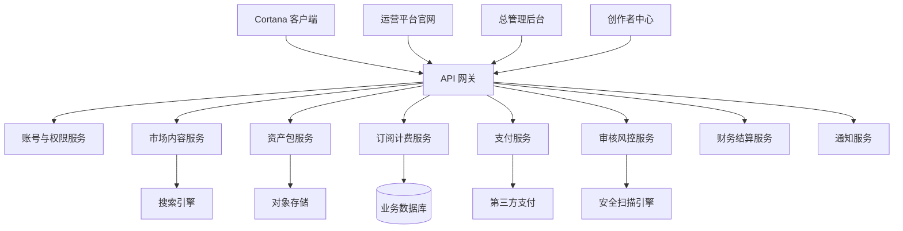

# 07. 技术架构与服务划分

## 1. 总体架构

建议采用前后端分离 + 服务化模块设计。

## 2. 后端服务划分

| 服务 | 职责 |
|---|---|
| Auth Service | 用户、组织、角色、权限、认证 |
| Marketplace Service | 商品、分类、搜索、详情、评价 |
| Asset Package Service | 插件包、技能包、智能体包、解决方案包存储和版本管理 |
| Subscription Service | 套餐、订阅、授权、试用、续费 |
| Payment Service | 支付、退款、渠道回调、对账 |
| Review Service | 审核流程、审核记录、安全扫描、人工复核 |
| Finance Service | 创作者分成、结算、提现、发票、财报 |
| Notification Service | 邮件、短信、站内信、客户端通知 |
| Analytics Service | 数据统计、行为分析、销售分析 |
| Admin Service | 后台聚合管理接口 |

## 3. 前端应用划分

建议拆分为：

- 官网市场前台。
- 用户管理中心。
- 创作者中心。
- 企业管理中心。
- 平台总管理后台。
- Cortana 客户端内嵌市场页面。

## 4. 数据存储

建议存储类型：

- 关系型数据库：用户、订单、订阅、商品、审核、财务。
- 对象存储：插件包、技能包、智能体包、解决方案包、图标、截图。
- 搜索引擎：商品搜索、标签检索、作者检索。
- 缓存：登录态、授权校验、热门商品、价格表。
- 日志系统：支付回调、审核记录、安装事件、安全事件。
- 数据仓库：经营分析、转化漏斗、留存和收入分析。

## 5. 推荐技术栈

结合当前 Cortana 项目以 .NET 为核心，建议：

- 后端：ASP.NET Core / Minimal API / OpenAPI。
- 数据库：PostgreSQL 或 SQL Server；早期可 SQLite 低成本验证。
- 缓存：Redis。
- 搜索：Meilisearch / OpenSearch / Elasticsearch。
- 对象存储：S3 兼容存储、Azure Blob、MinIO。
- 后台任务：Hangfire / Quartz.NET。
- 消息队列：RabbitMQ / Azure Service Bus / Kafka。
- 身份认证：ASP.NET Core Identity + OAuth / OIDC。
- 管理后台：Blazor / React / Vue。
- 客户端集成：Cortana 内置市场页 + 本地授权缓存 + 自动安装器。
