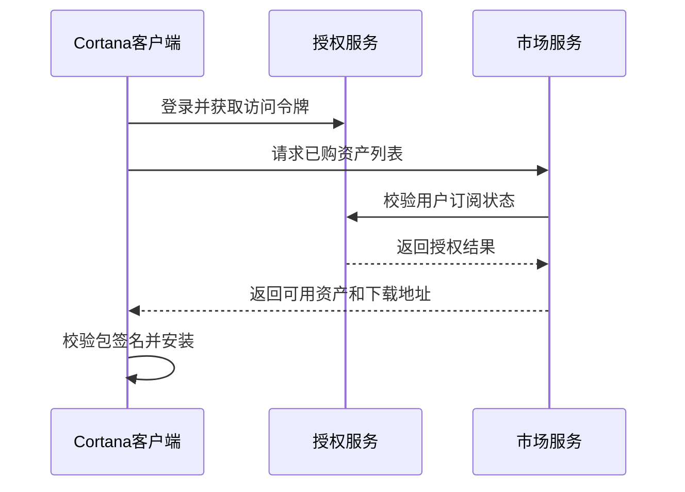

# 08. 打包分发与客户端集成

## 1. 统一资产包模型

建议所有可售卖内容都抽象为 `Asset`：

| 字段 | 说明 |
|---|---|
| AssetId | 全局唯一 ID |
| AssetType | Plugin / Skill / Agent / Solution |
| Name | 名称 |
| Slug | URL 友好标识 |
| OwnerId | 作者 |
| CurrentVersion | 当前版本 |
| Visibility | Public / Private / Enterprise / Unlisted |
| PricingModel | Free / Subscription / UsageBased / EnterpriseContract |
| ReviewStatus | Draft / Reviewing / Approved / Rejected / Suspended |
| RiskLevel | Low / Medium / High / Critical |

## 2. 包清单建议

每个包建议包含 `manifest.json`：

```json
{
  "schemaVersion": "1.0",
  "assetType": "plugin",
  "id": "com.example.window-tools",
  "name": "Window Tools",
  "version": "1.0.0",
  "publisher": "example",
  "cortanaVersion": ">=1.3.5",
  "permissions": ["window.manage", "process.launch"],
  "entry": "WindowTools.dll",
  "dependencies": [],
  "license": "commercial",
  "pricing": {
    "model": "subscription",
    "period": "monthly"
  }
}
```

## 3. 签名与校验

- 平台对审核通过的包进行签名。
- 客户端安装前校验签名、哈希、来源和授权。
- 高风险插件必须声明权限并弹窗确认。
- 解决方案安装前展示包含资产和权限汇总。
- 支持撤销签名和强制下架。

## 4. 客户端市场入口

- 首页展示推荐内容。
- 已登录用户同步订阅。
- 一键安装插件、技能和智能体。
- 显示可更新版本。
- 显示订阅到期提醒。

## 5. 授权校验流程



## 6. 离线策略

- 允许短期离线使用。
- 本地缓存授权令牌和到期时间。
- 超过宽限期后要求联网校验。
- 被下架或撤销的高风险插件联网后立即禁用。

## 7. 打包工具方向

平台需要提供统一打包工具，用于生成插件、技能、智能体和解决方案包。

建议能力：

- 生成标准目录结构。
- 生成 `manifest.json`。
- 校验版本号、依赖、权限声明。
- 计算包哈希。
- 本地预检查。
- 上传到平台。
- 支持命令行和图形界面。
