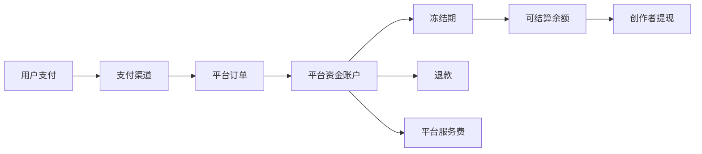

# 10. 财务结算与资金管理

## 1. 资金流

## 2. 财务对象

- 订单。
- 支付流水。
- 退款单。
- 订阅账单。
- 分成记录。
- 结算单。
- 提现单。
- 发票。
- 税务扣减。

## 3. 财务后台能力

- 对账报表。
- 渠道流水导入。
- 退款审批。
- 创作者结算。
- 提现审核。
- 异常账单处理。
- 财务导出。

## 4. 结算规则建议

- 每月生成结算单。
- 设置冻结期，用于退款和风控处理。
- 支持平台服务费、税费、退款扣减拆分。
- 支持手动结算和后续自动结算。
- 结算单需要可以追溯到订单和订阅。

## 5. 财务风控

- 高频退款用户标记。
- 异常交易金额标记。
- 创作者自买自卖识别。
- 支付回调重复处理。
- 渠道对账差异报警。
