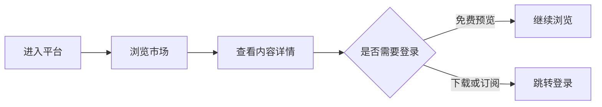
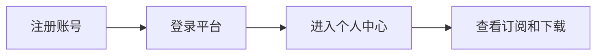
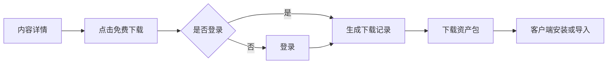
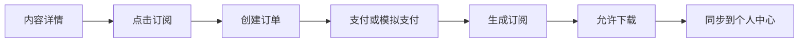

# 14. 第一阶段实施计划：个人用户 MVP

## 1. 阶段定位

第一阶段目标是让运营平台先跑起来，完成面向个人用户的最小商业闭环。

该阶段不追求完整平台化能力，不引入企业、团队、创作者分成、复杂审核、法务协议、财务结算等重模块。核心是先让个人用户可以：

1. 登录平台。
2. 浏览插件、技能、智能体和解决方案。
3. 查看内容详情和预览信息。
4. 下载免费内容。
5. 订阅付费内容。
6. 在个人中心查看自己的订阅和已下载内容。
7. 在 Cortana 客户端中完成基础安装或同步。

## 2. 第一阶段范围

### 2.1 必须完成

- 个人用户注册、登录、退出。
- 用户资料基础维护。
- 市场首页。
- 内容列表。
- 内容详情。
- 插件、技能、智能体、解决方案的预览。
- 免费下载。
- 订阅型商品。
- 基础订单。
- 基础支付或模拟支付。
- 订阅状态管理。
- 我的订阅。
- 我的下载。
- 客户端基础下载和安装入口。
- 简单后台录入内容。

### 2.2 暂不实现

- 企业空间。
- 团队成员管理。
- 企业席位。
- 创作者开放上传。
- 创作者收益结算。
- 自动提现。
- 复杂审核流。
- 法务协议中心。
- 发票系统。
- 复杂退款流程。
- 风控系统。
- 多级管理员权限。
- 私有市场。
- 分销系统。
- 按调用量计费。

### 2.3 可简化处理

| 模块 | 第一阶段处理方式 |
|---|---|
| 支付 | 可先接入一个支付渠道，或使用模拟支付闭环 |
| 审核 | 仅后台手动录入和人工标记上架 |
| 法务 | 暂时只保留占位，不进入实现阻塞项 |
| 财务 | 只记录订单和订阅，不做结算体系 |
| 创作者 | 所有内容先由平台内部录入 |
| 权限 | 只区分普通用户和管理员 |
| 授权 | 只判断订阅是否有效 |
| 客户端安装 | 先完成下载和导入，不追求完整自动化 |

## 3. 第一阶段用户流程

### 3.1 游客流程

### 3.2 注册登录流程

### 3.3 免费内容下载流程

### 3.4 付费订阅流程

## 4. 第一阶段功能清单

### 4.1 账号模块

- 注册。
- 登录。
- 退出。
- 当前用户信息。
- 修改昵称和头像。
- 登录状态保持。

第一阶段不做：

- 实名认证。
- 企业认证。
- 多因素认证。
- 第三方账号绑定。

### 4.2 市场模块

- 首页推荐区。
- 分类导航。
- 内容列表。
- 搜索。
- 类型筛选：插件、技能、智能体、解决方案。
- 免费 / 付费筛选。
- 内容详情页。
- 版本号展示。
- 作者展示。
- 价格展示。
- 预览图和说明文档展示。

### 4.3 资产模块

第一阶段支持四类资产：

- 插件。
- 技能。
- 智能体。
- 解决方案。

资产状态：

| 状态 | 说明 |
|---|---|
| Draft | 草稿 |
| Published | 已上架 |
| Hidden | 隐藏 |
| Offline | 下架 |

### 4.4 下载模块

- 免费内容可直接下载。
- 付费内容需要有效订阅后下载。
- 下载前记录用户、资产、版本、时间。
- 下载地址可先由后台配置。
- 下载包可先存放在本地文件服务或对象存储。

### 4.5 订阅模块

第一阶段只做最简订阅：

- 免费订阅。
- 月度订阅。
- 年度订阅。
- 订阅开始时间。
- 订阅结束时间。
- 订阅状态。

订阅状态：

| 状态 | 说明 |
|---|---|
| Active | 有效 |
| Expired | 已过期 |
| Canceled | 已取消 |

暂不做：

- 自动续费。
- 订阅升级降级。
- 宽限期。
- 退款冻结。
- 企业席位。

### 4.6 订单模块

- 创建订单。
- 查看订单。
- 支付成功后生成订阅。
- 订单关联用户、资产、订阅方案。

订单状态：

| 状态 | 说明 |
|---|---|
| Pending | 待支付 |
| Paid | 已支付 |
| Canceled | 已取消 |
| Failed | 支付失败 |

### 4.7 个人中心

- 我的订阅。
- 我的下载。
- 我的订单。
- 账号资料。

### 4.8 简易管理后台

第一阶段后台只服务平台内部运营，不开放创作者。

- 创建资产。
- 编辑资产。
- 上传封面和预览图。
- 配置下载包。
- 设置价格。
- 上架 / 下架。
- 查看用户。
- 查看订单。
- 查看订阅。

## 5. 第一阶段页面清单

### 5.1 前台页面

- 首页。
- 市场列表页。
- 搜索结果页。
- 分类页。
- 内容详情页。
- 登录页。
- 注册页。
- 个人中心首页。
- 我的订阅页。
- 我的下载页。
- 我的订单页。

### 5.2 后台页面

- 后台登录页。
- 仪表盘。
- 资产列表。
- 创建 / 编辑资产。
- 订单列表。
- 订阅列表。
- 用户列表。

### 5.3 客户端入口

- 市场入口。
- 已购内容列表。
- 下载按钮。
- 安装 / 导入按钮。

## 6. 第一阶段接口清单

### 6.1 账号接口

- `POST /api/auth/register`
- `POST /api/auth/login`
- `POST /api/auth/logout`
- `GET /api/users/me`
- `PUT /api/users/me`

### 6.2 市场接口

- `GET /api/market/assets`
- `GET /api/market/assets/{id}`
- `GET /api/market/categories`
- `GET /api/market/search`

### 6.3 订阅接口

- `GET /api/me/subscriptions`
- `POST /api/assets/{id}/subscribe`
- `POST /api/subscriptions/{id}/cancel`

### 6.4 订单接口

- `POST /api/orders`
- `GET /api/me/orders`
- `GET /api/orders/{id}`
- `POST /api/orders/{id}/pay`

### 6.5 下载接口

- `POST /api/assets/{id}/downloads`
- `GET /api/me/downloads`

### 6.6 后台接口

- `GET /api/admin/assets`
- `POST /api/admin/assets`
- `PUT /api/admin/assets/{id}`
- `POST /api/admin/assets/{id}/publish`
- `POST /api/admin/assets/{id}/offline`
- `GET /api/admin/users`
- `GET /api/admin/orders`
- `GET /api/admin/subscriptions`

## 7. 第一阶段数据表建议

- Users。
- UserProfiles。
- Assets。
- AssetVersions。
- AssetFiles。
- Categories。
- AssetCategories。
- PricingPlans。
- Orders。
- OrderItems。
- Subscriptions。
- DownloadRecords。
- AdminUsers。

## 8. 验收标准

第一阶段完成后，需要满足：

- 用户可以注册登录。
- 用户可以浏览平台内容。
- 用户可以查看插件、技能、智能体、解决方案详情。
- 用户可以下载免费内容。
- 用户可以订阅付费内容。
- 订阅成功后可以下载对应内容。
- 用户可以在个人中心看到订阅和下载记录。
- 管理员可以录入和上架内容。
- 客户端可以通过接口获取用户可用内容。

## 9. 第一阶段完成标志

第一阶段完成的核心判断标准：

> 一个个人用户可以从注册开始，在平台发现一个内容，完成订阅或下载，并在个人中心和客户端中看到自己的可用内容。

只要这个闭环跑通，平台就具备继续迭代的基础。
