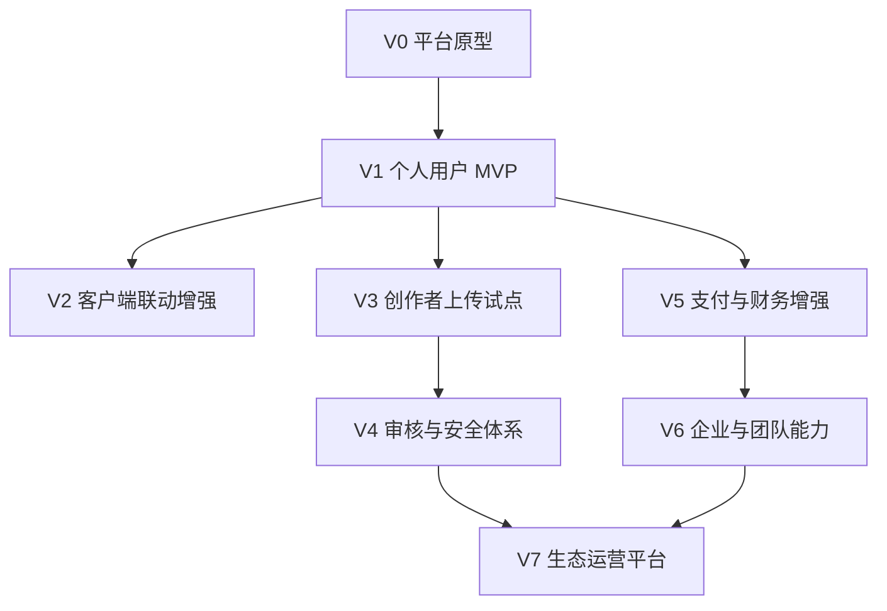

# 15. 平台迭代方案

## 1. 迭代原则

平台建设采用“小闭环优先、能力逐步增强”的路线。

第一阶段不追求完整商业平台，不引入企业、团队、复杂审核、财务结算、法律协议中心等重功能。先完成个人用户的基本市场能力，让平台具备可运行、可浏览、可下载、可订阅的基础。

后续迭代围绕以下原则推进：

- 先个人用户，后企业团队。
- 先平台自营内容，后开放创作者上传。
- 先简单订阅，后自动续费和复杂计费。
- 先人工管理，后流程化审核和自动扫描。
- 先下载分发，后客户端一键安装和自动更新。
- 先订单记录，后财务结算和收益分成。
- 先跑通业务，再补全合规、风控和治理。

## 2. 版本路线概览

| 阶段 | 名称 | 核心目标 |
|---|---|---|
| V0 | 平台原型 | 验证页面、模型、交互和管理流程 |
| V1 | 个人用户 MVP | 完成预览、下载、订阅基础闭环 |
| V2 | 客户端联动增强 | 完成客户端登录、同步、安装、更新 |
| V3 | 创作者上传试点 | 开放白名单开发者上传内容 |
| V4 | 审核与安全体系 | 增加自动校验、审核流、签名机制 |
| V5 | 支付与财务增强 | 完善支付、退款、结算和收入统计 |
| V6 | 企业与团队能力 | 增加企业空间、席位和团队订阅 |
| V7 | 生态运营平台 | 排行榜、推荐、活动、分销、数据分析 |

## 3. V0：平台原型

### 3.1 目标

快速验证产品结构和核心页面，不要求完整后端能力。

### 3.2 功能

- 市场首页原型。
- 内容列表原型。
- 内容详情原型。
- 登录注册原型。
- 个人中心原型。
- 后台资产录入原型。

### 3.3 产出

- 页面结构。
- 导航结构。
- 数据模型初稿。
- API 草案。
- 资产包展示规则。

### 3.4 不做

- 真实支付。
- 真实下载。
- 自动安装。
- 企业能力。
- 创作者中心。

## 4. V1：个人用户 MVP

### 4.1 目标

完成平台最小可运行版本。

个人用户可以浏览、预览、下载、订阅插件、技能、智能体和解决方案。

### 4.2 功能

- 注册登录。
- 市场浏览。
- 内容详情。
- 免费下载。
- 付费订阅。
- 订单记录。
- 我的订阅。
- 我的下载。
- 简单后台资产管理。

### 4.3 关键闭环

### 4.4 验收标准

- 用户可以完成注册登录。
- 用户可以查看四类资产。
- 免费资产可以下载。
- 付费资产订阅后可以下载。
- 个人中心可以看到订阅和下载记录。
- 后台可以手动发布内容。

## 5. V2：客户端联动增强

### 5.1 目标

让平台与 Cortana 客户端形成更紧密的使用体验。

### 5.2 功能

- 客户端登录平台账号。
- 客户端获取我的订阅。
- 客户端获取我的可下载内容。
- 客户端下载资产包。
- 客户端导入技能。
- 客户端导入智能体。
- 客户端安装插件。
- 客户端显示更新提醒。

### 5.3 暂不做

- 复杂回滚。
- 插件沙箱。
- 强制远程禁用。
- 多设备授权限制。

## 6. V3：创作者上传试点

### 6.1 目标

在可控范围内开放第三方内容供给。

### 6.2 策略

- 仅开放白名单创作者。
- 创作者先提交申请，由管理员手动开通。
- 上传后仍由平台人工审核。
- 收益结算可以先线下处理。

### 6.3 功能

- 创作者资料。
- 创建资产草稿。
- 上传资产包。
- 提交审核。
- 查看审核结果。
- 查看基础下载和订阅数据。

### 6.4 暂不做

- 自动结算。
- 自助提现。
- 复杂数据看板。
- 开放所有用户上传。

## 7. V4：审核与安全体系

### 7.1 目标

减少恶意插件和低质量内容风险。

### 7.2 功能

- 资产包结构校验。
- manifest 校验。
- 文件哈希计算。
- 插件权限声明。
- 技能提示词风险检查。
- 智能体工具权限检查。
- 审核流：提交、通过、驳回、退回修改。
- 平台签名。
- 下架和冻结版本。

### 7.3 说明

该阶段开始补齐安全和合规能力，但仍以实用为主，不追求一次性完成所有法务体系。

## 8. V5：支付与财务增强

### 8.1 目标

让平台从“可订阅”升级为“可经营”。

### 8.2 功能

- 正式支付渠道。
- 支付回调。
- 退款申请。
- 退款审核。
- 订单对账。
- 创作者收益统计。
- 平台抽成配置。
- 结算单生成。
- 手动提现审核。

### 8.3 暂不做

- 多渠道复杂对账。
- 自动税务处理。
- 全球化支付。
- 分销佣金。

## 9. V6：企业与团队能力

### 9.1 目标

从个人市场扩展到企业团队市场。

### 9.2 功能

- 企业空间。
- 企业成员管理。
- 角色管理。
- 席位管理。
- 团队订阅。
- 企业账单。
- 企业私有内容。
- 企业解决方案采购。

### 9.3 说明

企业能力复杂度较高，应在个人用户闭环稳定、订阅和资产体系成熟后再进入。

## 10. V7：生态运营平台

### 10.1 目标

提升平台规模化运营能力。

### 10.2 功能

- 榜单。
- 推荐算法。
- 运营活动。
- 优惠券。
- 促销订阅。
- 用户评价体系。
- 创作者等级。
- 数据分析。
- 增长漏斗。
- 内容质量评分。
- 分销和渠道合作。

## 11. 阶段依赖关系

## 12. 第一阶段优先级

### P0：必须完成

- 用户注册登录。
- 市场列表。
- 内容详情。
- 免费下载。
- 订阅。
- 我的订阅。
- 我的下载。
- 后台资产录入。

### P1：尽量完成

- 搜索。
- 分类筛选。
- 订单记录。
- 简单支付接入。
- 客户端获取可用资产。

### P2：可以延期

- 评论评分。
- 收藏。
- 优惠券。
- 自动续费。
- 复杂统计。
- 发票。
- 退款。

## 13. 第一阶段不引入的复杂度

为保证平台尽快运行，第一阶段明确不处理：

- 企业和团队。
- 创作者自由上传。
- 创作者收益结算。
- 自动审核扫描。
- 完整法律协议。
- 发票和税务。
- 风控系统。
- 复杂权限系统。
- 分销系统。
- 多支付渠道。

## 14. 总结

平台迭代路线应从“个人用户最小闭环”开始，先实现预览、下载和订阅。只要个人用户能完成从发现内容到获得内容的完整路径，平台就具备基础价值。

后续再逐步补齐客户端联动、创作者上传、审核安全、财务结算、企业团队和生态运营能力。
