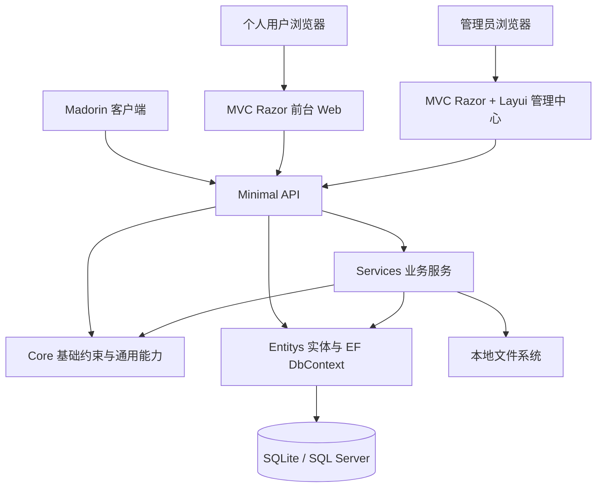

# 16. 第一阶段项目架构方案

## 1. 方案定位

本文只描述第一阶段个人用户 MVP 的项目架构方案，不创建代码项目。

第一阶段目标是做一个轻量、清晰、可发布、可扩展的运营平台，而不是一开始搭建过重的企业级工程。

核心原则：

- 不使用 Vue、React、Blazor 等重型前端框架。
- Web 页面使用 ASP.NET Core MVC + Razor。
- 管理后台前端框架使用 Layui。
- API 使用 Minimal API + Route Group。
- .NET 使用 10.0。
- 数据库先使用 SQLite。
- ORM 使用 EF Core，预留迁移 SQL Server。
- 插件包、技能包、智能体包、解决方案包前期直接放文件系统。
- 不做 Repository 层。
- 不做过度 Application / Domain / Infrastructure 固有分层。
- 使用更直观的项目命名，例如 `Entitys`、`Core`、`Api`、`Web`、`Admin`。
- 优先复用现有 Netor 脚手架 NuGet 包，避免重复制造基础代码。

## 2. 总体架构

第一阶段采用 **轻量模块化单体架构**。

不是微服务，也不是复杂 DDD 分层，而是按职责拆成少量清晰项目：



说明：

- `Api` 负责对外接口。
- `Web` 负责个人用户前台页面。
- `Admin` 负责后台管理页面。
- `Entitys` 负责实体、枚举、EF Core DbContext、数据库迁移。
- `Core` 负责通用基类、约束、分页、结果、扩展方法。
- `Services` 负责业务服务和流程编排。
- 文件包先存本地文件系统，后期再扩展云存储。

## 3. 技术选型

### 3.1 后端选型

| 类型 | 选型 | 说明 |
|---|---|---|
| .NET 版本 | .NET 10.0 | 本机环境已到 .NET 10，按最新 LTS 方案设计 |
| API | ASP.NET Core Minimal API | 轻量、AOT 友好、适合 API 数量不多的场景 |
| API 组织 | Route Group | 按功能分组：Auth、Market、Assets、Orders、Subscriptions、Downloads、Admin |
| Web 页面 | ASP.NET Core MVC + Razor | 小型平台更合适，不引入重型 SPA |
| 管理后台 UI | Layui | 原生、轻量、加载快，适合管理后台 |
| ORM | EF Core | SQLite 起步，后期迁移 SQL Server |
| 数据库 | SQLite | 第一阶段部署简单 |
| DI | .NET 内置 DI 容器 | `Microsoft.Extensions.DependencyInjection` |
| API 文档 | OpenAPI | 便于客户端和测试对接 |
| 文件存储 | 本地文件系统 | 前期插件不多，后期再扩展对象存储 |
| 日志 | Microsoft.Extensions.Logging | 后期可接 Serilog 或 OpenTelemetry |

### 3.2 Netor 脚手架复用

第一阶段开发必须优先复用现有脚手架项目中已经发布到 NuGet 的能力。

| 脚手架项目 | 平台用途 |
|---|---|
| `Netor.Database` | 实体基类、账号/角色/订单基础结构、DbContext 基类、SQLite / SQL Server 基础能力 |
| `Netor.Operates` | 管理后台结构参考、MVC + Razor + Layui 实现方式、LayuiHelpers、认证和后台初始化经验 |
| `Netor.Logging` | 后续 SQL Server 日志、RabbitMQ 日志扩展能力 |
| `Netor.Extensions` | 加密、JSON、枚举、字符串、金额、时间、集合等通用扩展 |

原则：

- 能引用 NuGet 包就引用 NuGet 包。
- 不复制脚手架源码到平台项目。
- `Core` 只补充平台缺失的基础约束，不重复 `Netor.Extensions` 已有功能。
- `Entitys` 优先继承或复用 `Netor.Database` 的基础实体和 DbContext 基类。
- `Admin` 优先参考 `Netor.Operates.Admin` 的目录结构和 Layui 使用方式。
- 日志第一阶段先用 Console，后续再接 `Netor.Logging`。

### 3.3 明确不选

第一阶段明确不使用：

- Vue。
- React。
- Blazor。
- 微服务。
- Repository 层。
- CQRS。
- MediatR。
- 复杂 DDD 分层。
- 独立前端构建体系。
- 对象存储。
- 消息队列。

原因：

- 项目规模小，API 数量不多。
- 前期插件数量不多。
- 重框架和过多项目会增加开发和维护成本。
- 先让平台跑起来，比一次性搭建复杂体系更重要。

## 4. 推荐解决方案结构

解决方案名称建议：

```text
Netor.Madorin.Platform.slnx
```

项目结构建议：

```text
Src/Netor.Madorin.Platform/
  Netor.Madorin.Platform.Api/
  Netor.Madorin.Platform.Web/
  Netor.Madorin.Platform.Admin/
  Netor.Madorin.Platform.Services/
  Netor.Madorin.Platform.Entitys/
  Netor.Madorin.Platform.Core/

Tests/Netor.Madorin.Platform/
  Netor.Madorin.Platform.Tests/
```

## 5. 项目职责

| 项目 | 类型 | 职责 |
|---|---|---|
| Netor.Madorin.Platform.Api | ASP.NET Core Minimal API | 对外 API，供 Web、Admin、Madorin 客户端调用 |
| Netor.Madorin.Platform.Web | ASP.NET Core MVC | 个人用户前台、市场、详情、登录注册、个人中心 |
| Netor.Madorin.Platform.Admin | ASP.NET Core MVC + Layui | 管理中心，资产维护、订单查看、订阅查看、用户查看 |
| Netor.Madorin.Platform.Services | Class Library | 业务服务、下载校验、订阅创建、订单处理、文件处理 |
| Netor.Madorin.Platform.Entitys | Class Library | 实体、枚举、EF Core DbContext、数据库迁移、实体配置 |
| Netor.Madorin.Platform.Core | Class Library | 通用基类、接口约束、分页、统一结果、异常、常量、扩展方法 |
| Netor.Madorin.Platform.Tests | Test | 关键服务和 API 的测试 |

## 6. 各项目内部结构

### 6.1 Netor.Madorin.Platform.Core

定位：基础约束和通用能力。

建议结构：

```text
Netor.Madorin.Platform.Core/
  Abstractions/
  Base/
  Constants/
  Exceptions/
  Extensions/
  Models/
  Options/
```

建议内容：

- `BaseEntity`。
- `IAuditableEntity`。
- `PagedRequest`。
- `PagedResult<T>`。
- `ApiResult<T>`。
- `PlatformException`。
- `FileStorageOptions`。
- `DatabaseOptions`。
- 通用常量。

复用要求：

- 不重复实现 `Netor.Extensions` 已有的字符串、枚举、加密、JSON、金额和时间扩展。
- Core 只保留平台确实需要的基础约束。

说明：

- `Core` 只做基础约束，不放具体业务。
- 不引用 Web、Api、Services。
- 不引用 EF Core Provider。

### 6.2 Netor.Madorin.Platform.Entitys

定位：实体库和数据存储。

建议结构：

```text
Netor.Madorin.Platform.Entitys/
  Entities/
    Users/
    Assets/
    Orders/
    Subscriptions/
    Downloads/
    Admins/
  Enums/
  Data/
    PlatformDbContext.cs
    Configurations/
    Migrations/
  DependencyInjection.cs
```

建议内容：

- 用户实体。
- 资产实体。
- 订单实体。
- 订阅实体。
- 下载记录实体。
- 管理员实体。
- EF Core DbContext。
- EF Core EntityTypeConfiguration。
- SQLite / SQL Server Provider 切换。
- 数据库迁移。

复用要求：

- 优先引用 `Netor.Database.Abstractions`。
- SQLite 阶段优先引用 `Netor.Database.SqlLiteDbContextAbstractions`。
- SQL Server 阶段再接入 `Netor.Database.SqlServerDbContextAbstractions`。
- 订单、账号、角色、系统设置等基础结构优先复用 Netor.Database 中已有基类。

说明：

- `Entitys` 是实体库，也是 EF Core 数据存储项目。
- 不单独建立 Repository。
- 业务服务可以直接使用 `PlatformDbContext`。
- EF Core 的 `DbContext` 就是工作单元。

### 6.3 Netor.Madorin.Platform.Services

定位：业务逻辑和流程编排。

建议结构：

```text
Netor.Madorin.Platform.Services/
  Auth/
  Users/
  Market/
  Assets/
  Orders/
  Subscriptions/
  Downloads/
  Admin/
  Files/
  Payments/
  DependencyInjection.cs
```

建议服务：

- `AuthService`。
- `UserService`。
- `MarketService`。
- `AssetService`。
- `OrderService`。
- `SubscriptionService`。
- `DownloadService`。
- `AdminAssetService`。
- `LocalFileService`。
- `MockPaymentService`。

说明：

- 服务直接使用 `PlatformDbContext`。
- 不增加 Repository。
- 支付第一阶段可模拟。
- 文件第一阶段走本地文件系统。
- 后期需要云存储时，只替换文件服务实现。

### 6.4 Netor.Madorin.Platform.Api

定位：轻量 API。

建议结构：

```text
Netor.Madorin.Platform.Api/
  Endpoints/
    AuthEndpoints.cs
    UserEndpoints.cs
    MarketEndpoints.cs
    AssetEndpoints.cs
    OrderEndpoints.cs
    SubscriptionEndpoints.cs
    DownloadEndpoints.cs
    AdminEndpoints.cs
  Models/
    Auth/
    Users/
    Market/
    Assets/
    Orders/
    Subscriptions/
    Downloads/
    Admin/
  Extensions/
  Program.cs
  appsettings.json
```

API 风格：

- Minimal API。
- Route Group。
- 每个功能一个 `MapXxxEndpoints` 扩展方法。
- 使用 `TypedResults` 或统一 `ApiResult<T>`。
- 开启 OpenAPI。
- API 模型放在 API 项目内即可，前期不单独建 Contracts 项目。

说明：

- API 数量不多，不需要 Controller。
- Minimal API 更轻量。
- 支持 AOT 友好发布。

### 6.5 Netor.Madorin.Platform.Web

定位：个人用户前台。

建议结构：

```text
Netor.Madorin.Platform.Web/
  Controllers/
    HomeController.cs
    MarketController.cs
    AccountController.cs
    UserCenterController.cs
  Views/
    Home/
    Market/
    Account/
    UserCenter/
    Shared/
  wwwroot/
    css/
    js/
    images/
  Program.cs
  appsettings.json
```

页面范围：

- 首页。
- 市场列表。
- 内容详情。
- 登录。
- 注册。
- 个人中心。
- 我的订阅。
- 我的下载。
- 我的订单。

前端方式：

- Razor 页面渲染。
- 原生 JavaScript。
- 少量 CSS。
- 不使用 Vue / React。

### 6.6 Netor.Madorin.Platform.Admin

定位：管理中心。

建议结构：

```text
Netor.Madorin.Platform.Admin/
  Controllers/
    DashboardController.cs
    AssetsController.cs
    CategoriesController.cs
    OrdersController.cs
    SubscriptionsController.cs
    UsersController.cs
    AccountController.cs
  Views/
    Dashboard/
    Assets/
    Categories/
    Orders/
    Subscriptions/
    Users/
    Account/
    Shared/
  wwwroot/
    layui/
    css/
    js/
  Program.cs
  appsettings.json
```

页面范围：

- 后台登录。
- 仪表盘。
- 资产管理。
- 分类管理。
- 订单管理。
- 订阅管理。
- 用户管理。

前端方式：

- MVC Razor。
- Layui。
- 原生 JavaScript。

复用要求：

- 参考 `Netor.Operates.Admin` 的 MVC 后台组织方式。
- 优先使用 `Netor.Operates.LayuiHelpers`。
- 管理后台认证配置可参考 `Netor.Operates.Admin` 的 Cookie Authentication 方案。
- 后台页面以表格、表单、弹层为主。

## 7. API 分组设计

第一阶段 API 不多，使用 Route Group 即可。

```text
/api/auth
/api/users
/api/market
/api/assets
/api/orders
/api/subscriptions
/api/downloads
/api/admin
```

### 7.1 Auth API

- 注册。
- 登录。
- 退出。
- 获取当前用户。

### 7.2 Market API

- 市场列表。
- 搜索。
- 分类。
- 资产详情。

### 7.3 Asset API

- 获取资产详情。
- 获取资产版本。
- 获取可下载文件。

### 7.4 Order API

- 创建订单。
- 支付订单。
- 我的订单。

### 7.5 Subscription API

- 我的订阅。
- 订阅资产。
- 取消订阅。

### 7.6 Download API

- 创建下载记录。
- 获取下载地址。

### 7.7 Admin API

- 管理员登录。
- 资产增删改查。
- 资产上架 / 下架。
- 分类管理。
- 订单查看。
- 订阅查看。
- 用户查看。

## 8. DI 容器设计

使用 .NET 内置 DI。

注册入口：

- `Netor.Madorin.Platform.Entitys/DependencyInjection.cs`
- `Netor.Madorin.Platform.Services/DependencyInjection.cs`

API / Web / Admin 启动时注册：

1. 配置项。
2. DbContext。
3. Services。
4. 认证授权。
5. MVC 或 Minimal API。
6. OpenAPI。

生命周期建议：

| 类型 | 生命周期 | 说明 |
|---|---|---|
| PlatformDbContext | Scoped | 每个请求一个 DbContext |
| AuthService | Scoped | 依赖 DbContext |
| MarketService | Scoped | 查询市场内容 |
| AssetService | Scoped | 资产管理 |
| OrderService | Scoped | 订单处理 |
| SubscriptionService | Scoped | 订阅处理 |
| DownloadService | Scoped | 下载校验和记录 |
| LocalFileService | Singleton / Scoped | 本地文件系统访问 |
| MockPaymentService | Scoped | 第一阶段模拟支付 |
| TimeProvider | Singleton | 时间抽象 |

## 9. 数据库与 EF Core

第一阶段：

- SQLite。
- EF Core。
- Code First。
- Migrations。

后续迁移：

- SQL Server。
- 保持实体模型不变。
- 调整 Provider 和连接字符串。
- 生成 SQL Server 迁移或迁移脚本。

数据库配置示例：

```json
{
  "Database": {
    "Provider": "Sqlite",
    "ConnectionString": "Data Source=Data/platform.db"
  }
}
```

后续切换：

```json
{
  "Database": {
    "Provider": "SqlServer",
    "ConnectionString": "Server=.;Database=MadorinPlatform;Trusted_Connection=True;TrustServerCertificate=True"
  }
}
```

## 10. 文件存储方案

第一阶段插件、技能、智能体、解决方案包直接放本地文件系统。

建议目录：

```text
Data/
  packages/
    plugins/
    skills/
    agents/
    solutions/
  images/
    icons/
    covers/
```

数据库只保存：

- 文件名。
- 相对路径。
- 文件大小。
- Sha256。
- ContentType。

后期扩展云存储时，只需要替换 `LocalFileService` 或新增云存储实现，不需要调整核心表结构。

## 11. 命名约定

为了更直观理解，第一阶段不使用过度抽象命名。

推荐命名：

| 目的 | 推荐名称 |
|---|---|
| 实体库 | `Netor.Madorin.Platform.Entitys` |
| 基础库 | `Netor.Madorin.Platform.Core` |
| 业务服务 | `Netor.Madorin.Platform.Services` |
| API | `Netor.Madorin.Platform.Api` |
| 前台 Web | `Netor.Madorin.Platform.Web` |
| 管理后台 | `Netor.Madorin.Platform.Admin` |

不推荐第一阶段使用：

- `Application`。
- `Domain`。
- `Infrastructure`。
- `Persistence`。
- `Contracts`。

这些命名容易把小项目引向过重分层。

## 12. AOT 与发布考虑

Minimal API 本身适合轻量发布，也更容易控制依赖。

第一阶段建议：

- API 项目保持轻量。
- 避免动态代理类库。
- 避免复杂反射扫描。
- 避免运行时插件式加载 API。
- EF Core 迁移和运行时模型需要注意 AOT 兼容性。

如果后续 API 要单独 AOT 发布，需要单独评估：

- EF Core Provider 的 AOT 支持情况。
- JSON 序列化源生成。
- OpenAPI 生成方式。
- 认证库是否兼容。

## 13. 总结

第一阶段平台不应做成重型企业架构。

推荐方案是：

- `.NET 10.0`。
- `Minimal API + Route Group`。
- `ASP.NET Core MVC + Razor`。
- `Layui` 管理后台。
- `EF Core + SQLite`。
- `Entitys` 作为实体和数据存储项目。
- `Core` 作为基础约束项目。
- `Services` 作为业务服务项目。
- 文件包先放本地文件系统。
- 不做 Repository。
- 不使用 Vue / React / Blazor。

这样既能保持结构清晰，又不会因为过度架构导致开发成本过高。
