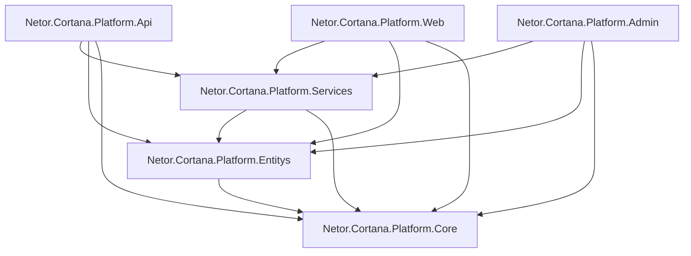

# 18. 第一阶段项目依赖关系与模块边界

## 1. 设计目标

本文定义第一阶段运营平台的项目依赖关系、模块边界和解耦规则。

本阶段目标不是做复杂 DDD，也不是拆出大量概念层，而是保持项目少、边界清楚、开发直接。

目标：

- 防止所有代码堆到一个 API 项目。
- 防止过度分层导致开发成本过高。
- 保证实体库、基础库、服务库、API、Web、Admin 责任明确。
- 支持 .NET DI 容器。
- 支持 Minimal API + Route Group。
- 支持 MVC Razor + Layui。
- 支持 EF Core + SQLite，后期迁移 SQL Server。
- 不引入 Repository 层。

## 2. 推荐项目依赖图



说明：

- `Api`、`Web`、`Admin` 是入口项目。
- `Services` 是业务服务项目。
- `Entitys` 是实体和 EF Core 数据存储项目。
- `Core` 是基础约束和通用能力项目。
- 不拆 `Application`、`Domain`、`Infrastructure`、`Persistence`、`Contracts`。

## 3. 项目依赖规则

### 3.1 允许依赖

| 项目 | 允许依赖 |
|---|---|
| Netor.Cortana.Platform.Api | Services、Entitys、Core |
| Netor.Cortana.Platform.Web | Services、Entitys、Core |
| Netor.Cortana.Platform.Admin | Services、Entitys、Core |
| Netor.Cortana.Platform.Services | Entitys、Core |
| Netor.Cortana.Platform.Entitys | Core |
| Netor.Cortana.Platform.Core | 无业务项目依赖 |

### 3.2 禁止依赖

- `Core` 不允许依赖任何业务项目。
- `Entitys` 不允许依赖 `Services`。
- `Services` 不允许依赖 `Api`、`Web`、`Admin`。
- `Api` 不直接写复杂业务逻辑。
- `Web` 不直接写复杂业务逻辑。
- `Admin` 不直接写复杂业务逻辑。
- 不创建 Repository 项目。
- 不创建 Contracts 项目。
- 不创建 Infrastructure 项目。
- 不创建 Persistence 项目。

## 4. 项目职责边界

### 4.1 Core

职责：

- 基础实体基类。
- 通用接口约束。
- 分页模型。
- 统一结果模型。
- 通用异常。
- 常量。
- 配置 Options。
- 扩展方法。

不负责：

- 用户业务。
- 资产业务。
- 订单业务。
- EF Core DbContext。
- 文件存储实现。

### 4.2 Entitys

职责：

- 数据实体。
- 枚举。
- EF Core DbContext。
- EntityTypeConfiguration。
- EF Core Migrations。
- SQLite / SQL Server Provider 注册。

不负责：

- 业务流程编排。
- 支付逻辑。
- 文件上传业务。
- API 路由。
- 页面渲染。

### 4.3 Services

职责：

- 注册登录。
- 市场查询。
- 资产管理。
- 订单创建。
- 模拟支付。
- 订阅创建。
- 下载权限校验。
- 下载记录。
- 本地文件存储。
- 管理后台业务。

说明：

- Services 可以直接注入 `PlatformDbContext`。
- 不使用 Repository。
- 不为每张表建立服务。
- 只按实际业务流程建立服务。

### 4.4 Api

职责：

- Minimal API。
- Route Group。
- OpenAPI。
- JWT 认证。
- 返回 JSON。
- 供 Web、Admin、Madorin 客户端调用。

不负责：

- 页面渲染。
- 复杂业务逻辑。
- 直接操作文件系统。

### 4.5 Web

职责：

- ASP.NET Core MVC。
- Razor 视图。
- 个人用户前台。
- 市场页。
- 详情页。
- 登录注册页。
- 个人中心。

前端方式：

- Razor。
- 原生 JavaScript。
- 少量 CSS。
- 不使用 Vue / React / Blazor。

### 4.6 Admin

职责：

- ASP.NET Core MVC。
- Razor 视图。
- Layui。
- 后台登录。
- 资产管理。
- 分类管理。
- 订单管理。
- 订阅管理。
- 用户管理。

前端方式：

- Layui 表格。
- Layui 表单。
- Layui 弹层。
- 原生 JavaScript。

## 5. 功能模块边界

第一阶段按实际功能拆分：

```text
Auth
Users
Market
Assets
Orders
Subscriptions
Downloads
Admin
Files
Payments
```

### 5.1 Auth

- 注册。
- 登录。
- 退出。
- Token 生成。
- 当前用户识别。

### 5.2 Users

- 用户资料。
- 个人中心。
- 用户状态。

### 5.3 Market

- 首页内容。
- 资产列表。
- 搜索。
- 分类筛选。
- 详情展示。

### 5.4 Assets

- 插件。
- 技能。
- 智能体。
- 解决方案。
- 资产版本。
- 资产文件。
- 上架 / 下架。

### 5.5 Orders

- 创建订单。
- 订单状态。
- 模拟支付。
- 我的订单。

### 5.6 Subscriptions

- 创建订阅。
- 查询订阅。
- 取消订阅。
- 判断资产访问权。

### 5.7 Downloads

- 下载权限校验。
- 生成下载记录。
- 返回本地文件下载地址。

### 5.8 Admin

- 管理员登录。
- 资产维护。
- 分类维护。
- 订单查看。
- 订阅查看。
- 用户查看。

### 5.9 Files

- 保存包文件。
- 保存图标。
- 保存封面。
- 获取文件路径。
- 计算 Sha256。

### 5.10 Payments

- 第一阶段模拟支付。
- 后续替换真实支付。

## 6. DI 注册边界

### 6.1 Entitys 注册

`Entitys` 项目提供：

- `AddPlatformDbContext(...)`。
- SQLite Provider 注册。
- SQL Server Provider 预留。

注册内容：

- `PlatformDbContext`。
- 数据库配置选项。

### 6.2 Services 注册

`Services` 项目提供：

- `AddPlatformServices(...)`。

注册内容：

- `AuthService`。
- `UserService`。
- `MarketService`。
- `AssetService`。
- `OrderService`。
- `SubscriptionService`。
- `DownloadService`。
- `AdminService`。
- `LocalFileService`。
- `MockPaymentService`。
- `TimeProvider`。

### 6.3 Api 注册

`Api` 项目注册：

- Minimal API。
- Route Groups。
- OpenAPI。
- Authentication。
- Authorization。
- CORS。
- ProblemDetails。
- `AddPlatformDbContext(...)`。
- `AddPlatformServices(...)`。

### 6.4 Web 注册

`Web` 项目注册：

- MVC。
- Session / Cookie 认证。
- `AddPlatformDbContext(...)`。
- `AddPlatformServices(...)`。

说明：

- Web 可以直接调用 Services 渲染页面。
- 如后续想完全前后端分离，也可以改为调用 Api。

### 6.5 Admin 注册

`Admin` 项目注册：

- MVC。
- Cookie 认证。
- Layui 静态资源。
- `AddPlatformDbContext(...)`。
- `AddPlatformServices(...)`。

说明：

- Admin 可以直接调用 Services。
- 不需要单独 Admin.Api。
- 如后续后台复杂，再考虑拆分。

## 7. API 路由分组

```text
/api/auth
/api/users
/api/market
/api/assets
/api/orders
/api/subscriptions
/api/downloads
/api/admin
```

每组一个文件：

```text
Endpoints/
  AuthEndpoints.cs
  UserEndpoints.cs
  MarketEndpoints.cs
  AssetEndpoints.cs
  OrderEndpoints.cs
  SubscriptionEndpoints.cs
  DownloadEndpoints.cs
  AdminEndpoints.cs
```

## 8. 数据访问规则

- 使用 EF Core DbContext。
- 不使用 Repository。
- 不使用 UnitOfWork 包装 DbContext。
- 简单查询直接在 Services 中完成。
- 复杂查询可以在 Services 内拆私有方法。
- 只有当查询明显复用时，再抽独立 Query Service。

理由：

- EF Core 已经提供 Unit of Work 和 Change Tracking。
- Repository 在当前项目中会增加样板代码。
- 第一阶段表不多，直接使用 DbContext 更高效。

## 9. 文件存储边界

第一阶段包文件直接放本地：

```text
Data/packages/plugins
Data/packages/skills
Data/packages/agents
Data/packages/solutions
Data/images/icons
Data/images/covers
```

`LocalFileService` 负责：

- 保存文件。
- 删除文件。
- 返回相对路径。
- 计算 Sha256。
- 获取下载流。

数据库保存相对路径，不保存绝对磁盘路径。

后续扩展对象存储时，新增服务实现即可。

## 10. 总结

第一阶段推荐依赖关系：

```text
Api/Web/Admin -> Services -> Entitys -> Core
```

这个结构比复杂分层更直接：

- 实体库就是 `Entitys`。
- 基础库就是 `Core`。
- 业务就是 `Services`。
- 页面就是 `Web` 和 `Admin`。
- API 就是 `Api`。

不做 Repository，不做重型前端，不做微服务，先保证平台快速跑通。
