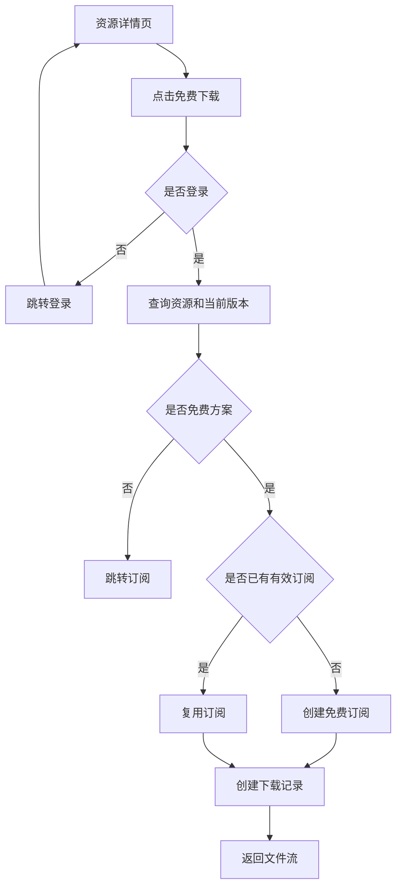
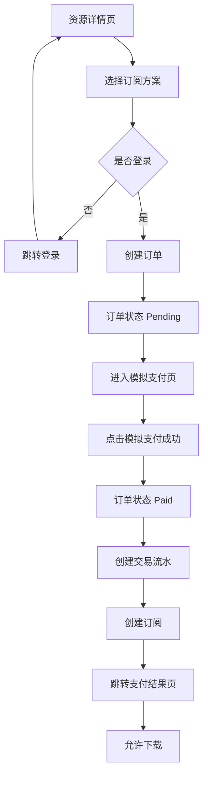
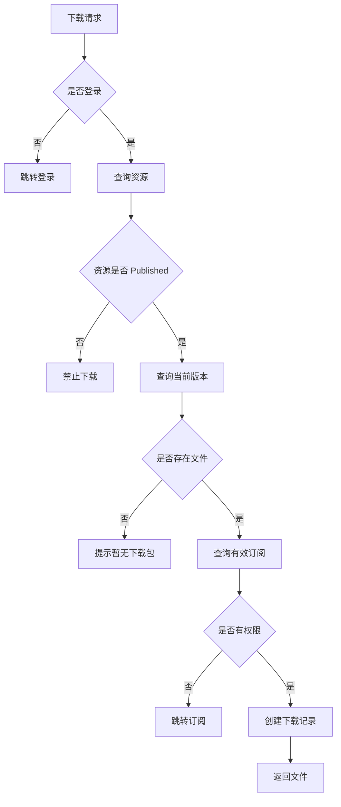

# 20. 个人用户前台 Web 与订阅下载方案

## 1. 方案定位

本文用于补充第一阶段个人用户 MVP 的前台 Web、订阅、订单和下载闭环设计。

第一阶段目标不是一次性完成完整商业平台，而是让普通个人用户可以通过浏览器完成：

1. 了解 Madorin 平台和能力市场。
2. 浏览插件、技能、智能体和解决方案。
3. 查看资源详情和版本信息。
4. 注册、登录和退出。
5. 免费获取资源。
6. 订阅付费资源。
7. 查看自己的订单、订阅和下载记录。
8. 下载资源包，后续由 Madorin 客户端导入或安装。

本阶段继续遵循现有项目原则：

- 使用 `Netor.Madorin.Platform.Web` 承载个人前台和官方网站页面。
- 使用 ASP.NET Core MVC + Razor。
- 不使用 Vue、React、Blazor。
- Web 可以直接调用 `Services` 渲染页面。
- 复杂业务逻辑放到 `Netor.Madorin.Platform.Services`。
- 文件下载通过服务校验后返回，不直接暴露磁盘路径。

## 2. 官网与个人前台是否合并

第一阶段建议 **官方网站和个人用户前台放在同一个项目**：

```text
Netor.Madorin.Platform.Web
```

原因：

- 官网首页、市场首页、登录注册、个人中心都是面向普通用户的公开 Web 入口。
- 第一阶段不需要拆出独立官网项目，避免项目数量过多。
- 当前架构已规划 `Web` 负责个人用户前台、市场、详情、登录注册和个人中心。
- 后续如果官网内容变重、需要独立部署或 SEO 运营，再拆出 `Netor.Madorin.Platform.Portal` 也不迟。

当前边界建议：

| 页面类型 | 所属项目 | 建议 Controller |
|---|---|---|
| 官网首页 | `Netor.Madorin.Platform.Web` | `HomeController` |
| 产品介绍 | `Netor.Madorin.Platform.Web` | `HomeController` |
| 市场首页 | `Netor.Madorin.Platform.Web` | `MarketController` |
| 资源列表 | `Netor.Madorin.Platform.Web` | `MarketController` |
| 资源详情 | `Netor.Madorin.Platform.Web` | `MarketController` |
| 登录注册 | `Netor.Madorin.Platform.Web` | `AccountController` |
| 个人中心 | `Netor.Madorin.Platform.Web` | `UserCenterController` |
| 订单支付 | `Netor.Madorin.Platform.Web` | `OrdersController` |
| 下载入口 | `Netor.Madorin.Platform.Web` | `DownloadsController` 或 `MarketController` |

## 3. 前台 Web 页面范围

### 3.1 第一阶段必须实现

```text
Home
  Index               官网首页 / 平台入口

Market
  Index               市场首页
  Assets              资源列表
  Details             资源详情

Account
  Login               登录
  Register            注册
  Logout              退出

UserCenter
  Index               个人中心首页
  Profile             个人资料
  Subscriptions       我的订阅
  Downloads           我的下载
  Orders              我的订单

Orders
  Confirm             确认订单
  Pay                 模拟支付
  Result              支付结果

Downloads
  Download            下载资源包
```

### 3.2 第一阶段可以简化

| 功能 | 第一阶段处理方式 |
|---|---|
| 官网内容 | 只做首页和基础介绍 |
| 产品介绍页 | 可先放首页区块，不单独建页面 |
| 文档帮助 | 先放外链或占位 |
| 评论评分 | 暂不实现 |
| 收藏 | 暂不实现 |
| 发票 | 暂不实现 |
| 退款 | 暂不实现 |
| 优惠券 | 暂不实现 |
| 自动续费 | 暂不实现 |
| 客户端一键安装 | 先提供下载包，安装联动放 V2 |

## 4. 页面功能设计

### 4.1 官网首页

路由建议：

```text
GET /
```

页面内容：

- 平台名称和简介。
- Madorin 能力市场说明。
- 四类资产入口：插件、技能、智能体、解决方案。
- 官方精选资源。
- 免费资源入口。
- 客户端下载入口。
- 登录 / 注册 / 进入个人中心入口。

数据来源：

- 推荐资源来自 `MarketService`。
- 客户端下载链接第一阶段可以来自配置或静态链接。

### 4.2 市场首页

路由建议：

```text
GET /market
```

页面内容：

- 分类导航。
- 推荐资源。
- 最新发布。
- 免费专区。
- 按类型快速入口。

### 4.3 资源列表

路由建议：

```text
GET /market/assets
```

查询参数：

```text
keyword
categoryId
type
pricing
sort
page
```

筛选项：

- 关键词。
- 类型：插件、技能、智能体、解决方案。
- 分类。
- 免费 / 付费。
- 最新 / 推荐 / 下载量。

展示字段：

- 图标。
- 名称。
- 简介。
- 类型。
- 作者。
- 分类。
- 是否免费。
- 下载量。
- 发布时间。

### 4.4 资源详情

路由建议：

```text
GET /market/assets/{slug}
```

页面内容：

- 名称。
- 图标和封面。
- 简介。
- 详细描述。
- 类型。
- 作者。
- 分类。
- 标签。
- 当前版本。
- 版本更新说明。
- 包大小。
- 价格方案。
- 下载量。
- 发布时间。
- 订阅状态提示。
- 下载或订阅按钮。

按钮规则：

| 用户状态 | 资源状态 | 按钮 |
|---|---|---|
| 未登录 | 免费资源 | 登录后下载 |
| 未登录 | 付费资源 | 登录后订阅 |
| 已登录 | 免费资源 | 免费下载 |
| 已登录 | 付费资源未订阅 | 立即订阅 |
| 已登录 | 付费资源已订阅 | 下载 |
| 已登录 | 订阅过期 | 续订 |

## 5. 账号与登录设计

第一阶段使用最简单的 Cookie 登录。

页面：

```text
GET  /account/login
POST /account/login
GET  /account/register
POST /account/register
POST /account/logout
```

登录方式：

- 用户名 / 邮箱 + 密码。

注册字段：

- 登录名。
- 邮箱。
- 手机号可选。
- 密码。
- 确认密码。

第一阶段不做：

- 短信验证码。
- 邮箱验证。
- OAuth 登录。
- MFA。
- 实名认证。

登录成功后：

- 写入 Cookie。
- 跳转来源页或个人中心。

未登录访问需要授权的页面时：

- 跳转 `/account/login`。
- 带 `returnUrl`。

## 6. 个人中心设计

### 6.1 个人中心首页

路由：

```text
GET /user
```

展示：

- 用户基础信息。
- 当前有效订阅数。
- 下载次数。
- 最近订单。
- 最近下载。
- 即将到期订阅。

### 6.2 我的订阅

路由：

```text
GET /user/subscriptions
```

展示字段：

- 资源名称。
- 资源类型。
- 订阅方案。
- 状态。
- 开始时间。
- 到期时间。
- 取消时间。
- 下载按钮。

操作：

- 下载。
- 取消订阅。
- 续订占位。

### 6.3 我的下载

路由：

```text
GET /user/downloads
```

展示字段：

- 资源名称。
- 版本号。
- 下载时间。
- IP。
- 重新下载按钮。

### 6.4 我的订单

路由：

```text
GET /user/orders
```

展示字段：

- 订单号。
- 标题。
- 资源名称。
- 方案名称。
- 金额。
- 支付状态。
- 订单状态。
- 创建时间。
- 支付时间。

## 7. 订阅、订单和下载业务规则

### 7.1 核心原则

下载不是单独能力，下载必须建立在授权判断之上。

授权来源：

- 免费资源自动创建免费订阅。
- 付费资源支付成功后创建订阅。
- 有效订阅允许下载。

建议统一规则：

```text
是否可下载 = 资源已上架 + 用户已登录 + 存在有效订阅 + 存在可下载版本
```

免费资源也创建 `Subscription`，这样 Web、Api 和客户端可以复用同一套授权判断。

### 7.2 免费资源下载流程



落库行为：

- 如果用户没有该资源的有效订阅，则创建：
  - `Subscription.Status = Active`
  - `PricingPlan.PlanType = Free`
  - `StartedAtUtc = now`
  - `ExpiresAtUtc` 可设为远期时间或约定免费订阅长期有效。
- 每次下载都创建 `DownloadRecord`。
- 增加 `Asset.DownloadCount`。

### 7.3 付费订阅流程



订单规则：

- 创建订单时保存：
  - 用户。
  - 资源。
  - 价格方案。
  - 金额。
  - 标题。
  - 状态。
- 第一阶段支付方式使用模拟支付。
- 支付成功后创建订阅。

订阅有效期规则：

| 方案类型 | 有效期 |
|---|---|
| Free | 长期有效或不设到期阻塞 |
| Monthly | 30 天 |
| Yearly | 365 天 |

如果后续支持自然月或自然年，再调整到日历周期。

### 7.4 下载权限校验流程



有效订阅判断：

- `Subscription.AccountId == 当前用户ID`
- `Subscription.AssetId == 资源ID`
- `Subscription.Status == Active`
- `ExpiresAtUtc > now`，或免费订阅按长期有效处理。

## 8. Services 设计

第一阶段建议在 `Netor.Madorin.Platform.Services` 中补充以下服务。

### 8.1 AuthService

职责：

- 注册用户。
- 校验用户名密码。
- 获取当前用户基础信息。

### 8.2 MarketService

职责：

- 获取首页推荐。
- 查询资源列表。
- 查询资源详情。
- 查询分类。
- 查询资源价格方案。

当前已有 `MarketService`，后续扩展即可。

### 8.3 OrderService

职责：

- 创建订阅订单。
- 查询订单详情。
- 查询我的订单。
- 标记订单支付成功。

### 8.4 MockPaymentService

职责：

- 模拟支付成功。
- 后续替换真实支付渠道。

第一阶段不接真实支付回调。

### 8.5 SubscriptionService

职责：

- 免费资源自动订阅。
- 支付成功后创建订阅。
- 查询我的订阅。
- 判断用户是否拥有资源有效权限。
- 取消订阅。

### 8.6 DownloadService

职责：

- 校验下载权限。
- 创建下载记录。
- 更新下载次数。
- 通过 `LocalFileService` 获取文件流。

### 8.7 LocalFileService

职责：

- 根据数据库相对路径解析文件。
- 检查文件是否存在。
- 打开文件流。
- 不向页面暴露真实绝对路径。

## 9. Controller 设计

### 9.1 HomeController

```text
GET /
GET /about
GET /download
```

职责：

- 官网首页。
- 平台介绍。
- 客户端下载入口。

### 9.2 MarketController

```text
GET  /market
GET  /market/assets
GET  /market/assets/{slug}
POST /market/assets/{id}/subscribe
POST /market/assets/{id}/download
```

职责：

- 市场首页。
- 资源列表。
- 资源详情。
- 发起订阅。
- 发起下载。

也可以将下载拆到 `DownloadsController`。

### 9.3 AccountController

```text
GET  /account/login
POST /account/login
GET  /account/register
POST /account/register
POST /account/logout
```

职责：

- 普通用户登录注册。
- Cookie 登录状态维护。

### 9.4 UserCenterController

```text
GET /user
GET /user/profile
GET /user/subscriptions
GET /user/downloads
GET /user/orders
POST /user/subscriptions/{id}/cancel
```

职责：

- 个人中心。
- 我的订阅。
- 我的下载。
- 我的订单。

### 9.5 OrdersController

```text
GET  /orders/confirm
POST /orders/create
GET  /orders/pay/{id}
POST /orders/pay/{id}
GET  /orders/result/{id}
```

职责：

- 订单确认。
- 创建订单。
- 模拟支付。
- 支付结果。

### 9.6 DownloadsController

```text
GET /downloads/{assetId}
GET /downloads/version/{versionId}
```

职责：

- 下载权限校验。
- 返回文件流。
- 记录下载行为。

## 10. API 与 Web 的关系

第一阶段 Web 可以直接调用 `Services`，不强制走 HTTP API。

原因：

- Web、Admin、Api 都在同一解决方案内。
- 直接调用 Services 更简单。
- 避免 Web 为了调用自己的 API 增加 HTTP 客户端复杂度。

Api 的主要职责是给 Madorin 客户端和后续外部调用使用。

建议关系：

```text
Web 页面 -> Services -> Entitys -> SQLite
Api 接口 -> Services -> Entitys -> SQLite
Admin 后台 -> Services / Entitys -> SQLite
```

需要保证：

- Web 和 Api 复用同一套业务服务。
- 下载、订阅、订单规则不要分别写两套。
- 客户端后续接入时复用 `SubscriptionService` 和 `DownloadService`。

## 11. 数据模型使用约定

### 11.1 Asset

用于表示插件、技能、智能体和解决方案。

关键字段：

- `Type`
- `Status`
- `Name`
- `Slug`
- `DeveloperName`
- `ShortDescription`
- `Description`
- `IconUrl`
- `CoverUrl`
- `CurrentVersionId`
- `DownloadCount`

### 11.2 AssetVersion

用于表示可下载版本。

关键字段：

- `AssetId`
- `VersionName`
- `ReleaseNotes`
- `ManifestJson`
- `PackageHash`
- `PackageSize`
- `FilePath`

### 11.3 PricingPlan

用于表示免费、月度、年度等方案。

关键字段：

- `AssetId`
- `Name`
- `PlanType`
- `Price`
- `Currency`
- `DurationDays`
- `IsActive`

### 11.4 Order

用于表示订阅订单。

关键字段：

- 用户 ID。
- 资源 ID。
- 价格方案 ID。
- 金额。
- 支付状态。
- 订单状态。
- 支付时间。

### 11.5 Subscription

用于表示用户拥有某个资源的授权。

关键字段：

- `AccountId`
- `AssetId`
- `PricingPlanId`
- `OrderId`
- `Status`
- `StartedAtUtc`
- `ExpiresAtUtc`
- `CanceledAtUtc`

### 11.6 DownloadRecord

用于表示下载记录。

关键字段：

- `AccountId`
- `AssetId`
- `AssetVersionId`
- `SubscriptionId`
- `IpAddress`
- `UserAgent`

## 12. 文件下载设计

第一阶段文件存储路径：

```text
Data/packages/plugins
Data/packages/skills
Data/packages/agents
Data/packages/solutions
```

数据库保存相对路径，例如：

```text
Data/packages/plugins/google-search/1.0.0/google-search.zip
```

下载时：

1. `DownloadService` 查询资源和版本。
2. 校验订阅权限。
3. 记录下载。
4. `LocalFileService` 根据相对路径打开文件。
5. Controller 返回 `FileStreamResult`。

安全要求：

- 不允许前端传任意文件路径。
- 不直接暴露服务器绝对路径。
- 路径必须来自数据库中的 `AssetVersion.FilePath`。
- 后续需要补充路径穿越防护和哈希校验。

## 13. 路由建议汇总

| 功能 | 路由 | 说明 |
|---|---|---|
| 官网首页 | `GET /` | 平台入口 |
| 市场首页 | `GET /market` | 市场推荐和分类 |
| 资源列表 | `GET /market/assets` | 搜索筛选 |
| 资源详情 | `GET /market/assets/{slug}` | 查看详情 |
| 登录 | `GET/POST /account/login` | 普通用户登录 |
| 注册 | `GET/POST /account/register` | 普通用户注册 |
| 退出 | `POST /account/logout` | 注销登录 |
| 个人中心 | `GET /user` | 用户概览 |
| 我的订阅 | `GET /user/subscriptions` | 订阅列表 |
| 我的下载 | `GET /user/downloads` | 下载记录 |
| 我的订单 | `GET /user/orders` | 订单列表 |
| 确认订单 | `GET /orders/confirm` | 订阅确认 |
| 创建订单 | `POST /orders/create` | 创建 Pending 订单 |
| 模拟支付 | `GET/POST /orders/pay/{id}` | 第一阶段支付 |
| 支付结果 | `GET /orders/result/{id}` | 支付结果展示 |
| 下载资源 | `GET /downloads/{assetId}` | 校验后下载 |

## 14. 第一阶段验收标准

### 14.1 Web 页面验收

- 用户可以打开首页。
- 用户可以进入市场首页。
- 用户可以搜索和筛选四类资源。
- 用户可以查看资源详情。
- 用户可以注册、登录和退出。
- 用户可以进入个人中心。
- 用户可以查看我的订单、我的订阅、我的下载。

### 14.2 免费下载验收

- 未登录用户点击免费下载会跳转登录。
- 登录用户点击免费资源下载会自动生成免费订阅。
- 下载成功后生成下载记录。
- 个人中心能看到对应订阅和下载记录。

### 14.3 付费订阅验收

- 登录用户可以选择付费方案。
- 系统可以创建待支付订单。
- 用户可以完成模拟支付。
- 支付成功后订单变为已支付。
- 支付成功后生成有效订阅。
- 有效订阅用户可以下载资源。
- 个人中心能看到订单、订阅和下载记录。

### 14.4 权限验收

- 未登录用户不能直接下载。
- 未订阅用户不能下载付费资源。
- 过期或取消订阅不能下载付费资源。
- 下架资源不能被新用户下载。

## 15. 第一阶段不做范围

- 真实支付渠道。
- 支付回调。
- 自动续费。
- 退款。
- 发票。
- 评论。
- 评分。
- 收藏。
- 举报。
- 创作者上传。
- 企业空间。
- 团队席位。
- 客户端一键安装。
- 插件签名校验。
- 自动安全扫描。
- 复杂审核流。
- 对象存储。
- CDN。

## 16. 推荐实施顺序

建议按以下顺序开发：

1. 扩展 `MarketService`，支持首页、列表、详情和价格方案查询。
2. 实现 `HomeController` 首页改造。
3. 实现 `MarketController` 和市场页面。
4. 实现 `AccountController`，完成普通用户登录注册。
5. 实现 `SubscriptionService`，先跑通免费订阅。
6. 实现 `DownloadService`，完成免费下载记录和文件返回。
7. 实现 `OrderService` 和 `MockPaymentService`。
8. 实现付费订阅和模拟支付。
9. 实现 `UserCenterController`。
10. 补齐个人中心页面。
11. 将相同规则复用到 `Api`，为客户端联动做准备。

## 17. 结论

第一阶段个人用户前台应以 `Netor.Madorin.Platform.Web` 为统一入口，把官网介绍、市场浏览、账号登录、个人中心、订单订阅和下载闭环放在一个 MVC 项目内完成。

业务复杂度集中在 `Services`：

```text
AuthService
MarketService
OrderService
MockPaymentService
SubscriptionService
DownloadService
LocalFileService
```

核心闭环是：

```text
浏览资源 -> 登录 -> 免费订阅或创建订单 -> 模拟支付 -> 生成订阅 -> 下载资源 -> 个人中心可见
```

先跑通这个闭环，再进入客户端同步、一键安装、真实支付、审核和创作者体系。
