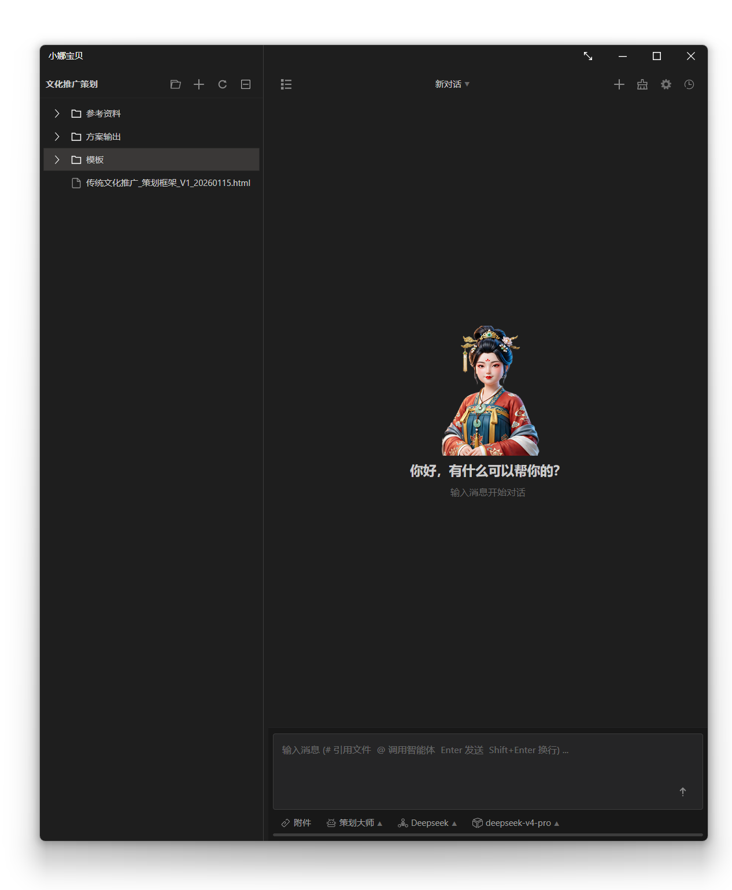

# Netor.Cortana

<div align="center">



**一个真正能帮你干活的 AI 助手。**

快速高效 · 简单轻便 · 隐私至上 · 完全离线 · 免费开源

[](#)
[](#)
[](#)
[](#许可证)

</div>

---

## 🦞 不只是聊天，是真正的生产力

> 市面上的 AI 助手千篇一律——套壳网页、花哨界面、月月订阅。
> Cortana 不一样。它是一只**完全手搓的免费开源大龙虾**，功能比那些收费的还强。

<div align="center">

<br/>
<sub>↑ 真实场景：AI 自主连接 8 台 Linux 服务器完成巡检，生成报告，发现安全风险并给出处置建议</sub>
</div>

<br/>

**它不是玩具，是真正帮你干活的工具：**

| 🎯 | 说到做到 |
|:--:|:--|
| 🤝 | **多智能体协作** — 输入 @ 调用子智能体，各自携带独立工具，主 Agent 自主编排 |
| 🔒 | **隐私至上** — 数据全部本地存储，不联网、不上传、不追踪，连自动更新都没有 |
| ⚡ | **快速高效** — Native AOT 编译，启动即用，没有运行时加载的等待 |
| 🪶 | **简单轻便** — 单文件部署，无需安装，拷贝即跑 |
| 🧠 | **自我进化** — 支持自我更新、自我学习，甚至自己给自己开发插件 |
| 🗣️ | **零代码扩展** — 不会写代码也能用语音指挥 AI 自动写插件、写技能、装能力 |
| 🔌 | **无限扩展** — Native 插件 + MCP 协议，想接什么就接什么 |
| 🎤 | **语音交互** — 唤醒词激活、语音识别、语音合成，全链路离线可用 |
| 🆓 | **完全免费** — 没有订阅、没有增值、没有套路，源码全部公开 |

---

## ✨ 功能一览

### 💬 智能对话

多模型接入、流式输出、Markdown 富文本渲染、上下文记忆、Agent 工具调用。不只是问答——它能理解你的意图，调用工具，完成真正的任务。

<div align="center">

<br/>
<sub>↑ 多会话管理：每个对话独立存储，随时切换和回溯</sub>
</div>

### 🤝 多智能体协作 <sup>v1.2.0 NEW</sup>

输入 `@` 即可调用子智能体——每个子智能体携带自己独立的插件和 MCP 工具，由主智能体自主编排调度。

- **`@服务器管理`** — 自动 SSH 连接服务器集群执行巡检
- **`@谷歌搜索`** — 联网搜索并汇总信息
- **`@文档助手`** — 基于搜索结果生成技术周报
- 一条消息中可同时 `@` 多个智能体，主 Agent 按需协调

每个子智能体可配置独立的 AI 厂商和模型——贵的模型做决策，便宜的模型跑批量，成本和效果两手抓。

### 🧬 零代码自我进化：让 AI 自己给自己加能力 <sup>NEW</sup>

这才是 Cortana 最能打的地方：**你不需要懂编程，不需要会写 C#，不需要知道什么是 AOT、MCP、进程隔离、协议定义。你只要知道自己想要什么，然后直接告诉它。**

它可以像一个真正的工作助理一样，自己分析需求、自己写代码、自己生成插件、自己编写技能、自己安装更新，把一次性的经验沉淀成以后可复用的能力。

> 普通 AI 助手只能回答问题；Cortana 可以在你的指挥下，给自己加工、升级、扩展，越用越顺手。

你可以直接这样说：

- “帮我写一个每天巡检服务器的插件。”
- “把我这个报表流程做成一个技能，以后一句话就能执行。”
- “我想接一个公司内部系统，你自己写个子进程插件去调用它。”
- “把刚才这套处理客户资料的步骤保存成通用工作流。”
- “给自己安装这个插件，启用到服务器管理智能体里。”

然后 Cortana 就可以继续往下干：

| 能力 | 说明 |
|:-----|:-----|
| **自动写 Native AOT 插件** | 根据你的自然语言需求生成高性能 AOT 插件，适合本地工具、系统能力、复杂业务集成 |
| **自动写子进程插件** | 需要隔离、需要调用外部程序、需要长期运行的任务，可以自动开发成独立进程插件 |
| **自动编写技能** | 把日常工作流程、标准操作、提示词经验沉淀为可复用技能，下一次直接调用 |
| **自动安装插件和技能** | 不只是生成文件，还能帮助完成安装、启用、配置和验证 |
| **自动更新自己** | 发现能力不够，就补插件；发现流程重复，就写技能；发现工具不好用，就改进工具 |
| **语音驱动开发** | 不打字也能扩展系统，直接通过语音描述目标，让 AI 助理自己动手实现 |

这意味着 Cortana 不只是“给程序员用的 AI 编程工具”，而是可以变成**完全不懂编程的人也能驾驭的超强工作助理**。

老板、运营、财务、客服、运维、文员、小白用户，都不需要学习编程语言，也不需要理解项目结构。只要能把需求说清楚，就可以让它把重复工作自动化，把内部流程工具化，把个人经验技能化。

过去扩展一个软件，需要懂代码、懂构建、懂部署、懂插件接口；现在你只需要一句话：

> “这个功能我想要，你帮自己做出来。”

这就是 Cortana 的核心野心：**让 AI 不再只是工具，而是一个能自我学习、自我升级、自我扩展的数字员工。**


### Ollama 本地协议代理：把国产大模型直接送进 Copilot <sup>NEW</sup>

Cortana 内置了一个 **Ollama 本地协议代理**，可以把你已经配置好的国产模型、企业模型、私有 API 模型，直接伪装成本机 Ollama 模型暴露出去。

<div align="center">
<table>
<tr>
<td><br/><sub>↑ 托盘菜单中快速打开 AI 代理配置</sub></td>
<td><br/><sub>↑ AI 代理配置：端口、厂商、协议版本、并发与上下文监控</sub></td>
</tr>
</table>
</div>

这意味着：

> 不安装任何第三方 VSCode 插件，不修改 VSCode 一句代码，不修改 Visual Studio 一句代码，就能让支持 Ollama 本地协议的编辑器和工具，把网络 API 当成本地模型来调用。

这不是又造一个 IDE，也不是再写一个半成品编辑器。Cortana 选择更狠的一条路：**直接接管模型入口，把现有最成熟的编辑器能力全部释放出来。**

| 能力 | 说明 |
|:-----|:-----|
| **接入 GitHub Copilot 工作流** | 将国产模型通过 `http://localhost:11434` 暴露为 Ollama 模型，让兼容本地模型的 Copilot/编辑器能力直接调用 |
| **保留原生编辑体验** | 继续使用 VSCode / Visual Studio 原有的代码补全、代码编辑、文档书写、工作计划执行能力，不牺牲编辑器生态 |
| **不装插件，不改代码** | 不需要额外开发 IDE，不需要侵入编辑器，不需要魔改 VSCode 或 Visual Studio |
| **本地协议，网络算力** | 表面上是本地 Ollama 模型，背后可以是任意兼容 OpenAI API 的云端/国产/私有模型 |
| **模型自由选择** | 打破“软件只能使用官方指定模型”的限制，用户自己决定用什么模型、接哪家厂商、花多少钱 |
| **成本自由控制** | 不再为了高端模型能力被迫购买固定月费会员，可以按需接入国产大模型、企业 API 或自建服务 |
| **编辑器友好** | 对外暴露标准 Ollama 接口，VSCode、Visual Studio 以及其他支持 Ollama 的第三方工具都可以像调用本地模型一样调用它 |

过去，很多 AI 编程工具把模型入口锁死：想用高级模型，就得买会员；想用国产模型，就得等官方适配；想用私有模型，就得写插件、改配置、忍受半残废体验。

Cortana 的方案是：**不跟编辑器抢饭碗，不重复造轮子，只做模型自由的入口。**

编辑器继续做它最擅长的事情：

- 原生代码编辑
- 智能代码生成
- 多文件上下文理解
- 文档编写
- 工作计划拆解
- 任务执行
- 项目级辅助开发

Cortana 负责把你想用的模型送进去。

只要第三方工具支持 Ollama 本地协议，它看到的就是：

```text
http://localhost:11434
```

它以为自己在调用本地模型，实际上 Cortana 可以把请求转发到：

- 国产大模型 API
- 企业内部模型网关
- 私有化部署模型
- OpenAI-compatible 服务
- 任何你已经在 Cortana 中配置好的 AI 厂商

这套能力的意义很简单：**模型不该被软件绑架，编辑器也不该被模型平台绑架。**

Cortana 把模型选择权还给用户，把成本控制权还给用户，也把国产模型接入主流开发工作流的门槛直接打穿。
### 🎤 语音能力

<div align="center">

<br/>
<sub>↑ 语音唤醒后的聆听状态，支持自定义唤醒欢迎语</sub>
</div>

- **关键词唤醒** — 默认唤醒词"白小月"、"白小娜"，支持自定义（编辑 `sherpa_models/KWS/keywords.txt`）
- **语音识别 (STT)** — Sherpa-ONNX 驱动，完全离线
- **语音合成 (TTS)** — 自然流畅的中英文语音输出
- 全链路本地运行，不经过任何云端服务

### 🗂️ 工作台

<div align="center">

<br/>
<sub>↑ 内置工作台：文件管理、技能脚本、服务器运维一站式操作</sub>
</div>

### 🔌 插件与工具

<div align="center">

<br/>
<sub>↑ 工具管理：为智能体启用/禁用插件工具和 MCP 服务器工具</sub>
</div>

### ⚙️ 灵活配置

<div align="center">
<table>
<tr>
<td><br/><sub>模型管理：接入多家 AI 厂商，一键刷新远程模型</sub></td>
</tr>
<tr>
<td><br/><sub>系统设置：对话历史、网络端口、语音合成等全面可调</sub></td>
</tr>
</table>
</div>

---

## 🏗️ 技术架构

| 组件 | 技术 |
|:-----|:-----|
| 运行时 | .NET 10 + Native AOT |
| 主 UI | Avalonia 12 |
| AI 编排 | Microsoft.Extensions.AI · Microsoft.Agents（多智能体协作） |
| MCP | ModelContextProtocol 1.2.0 |
| 语音 | Sherpa-ONNX（全链路离线） |
| 数据存储 | SQLite（纯 ADO.NET，AOT 安全） |
| 日志 | Serilog |
| 插件体系 | Native AOT 插件 + MCP 协议 |

### 扩展通道

| 通道 | 状态 | 说明 |
|:-----|:----:|:-----|
| **Native** | ✅ 推荐 | NativeHost 子进程承载，进程级隔离，支持 C/C++/Rust/C# AOT |
| **MCP** | ✅ 推荐 | stdio / SSE / streamable-http 连接外部工具服务 |
| Dotnet | 🔄 兼容 | 旧托管插件体系，仅用于历史兼容，不建议新开发使用 |

本项目集成了多种 AI 和语音模型，用于实现智能对话、语音唤醒、语音识别和语音合成等功能。由于模型文件体积较大（通常超过 100MB），**这些模型文件未上传到 GitHub 仓库**，需要在首次运行前手动下载并放置到指定目录。

### 模型类型

| 模型类型 | 功能说明 | 典型文件大小 | 存储位置 |
|---------|---------|-------------|---------|
| **音视频模型** | 处理音频和视频流的多模态模型 | 200MB - 500MB | `Res/models/multimodal/` |
| **音频模型** | 音频特征提取和处理 | 100MB - 300MB | `Res/models/audio/` |
| **关键词唤醒模型 (KWS)** | 检测"Hey Cortana"等唤醒词 | 50MB - 150MB | `Res/models/kws/` |
| **语音转文本模型 (STT)** | 将语音转换为文字 | 100MB - 400MB | `Res/models/stt/` |
| **文本转语音模型 (TTS)** | 将文字合成为语音（如 Kokoro） | 150MB - 500MB | `Res/models/tts/` |
| **语音合成模型** | 高级语音合成和音色定制 | 200MB - 600MB | `Res/models/synthesis/` |

### 如何获取模型文件

1. **从官方渠道下载**
   - 访问 [Sherpa-ONNX 模型库](https://github.com/k2-fsa/sherpa-onnx-models)
   - 访问 [Kokoro TTS 模型](https://huggingface.co/hexgrad/Kokoro-82M)
   - 访问 [其他 ONNX 模型资源](https://onnx.ai/modelzoo.html)

2. **放置到项目目录**
   ```
   Netor.Cortana/
   └── Res/
       └── models/
           ├── kws/           # 关键词唤醒模型
           ├── stt/           # 语音识别模型
           ├── tts/           # 语音合成模型
           ├── audio/         # 音频处理模型
           ├── synthesis/     # 语音合成模型
           └── multimodal/    # 多模态模型
   ```

3. **配置模型路径**
   - 在 `appsettings.json` 或用户配置文件中指定模型路径
   - 首次运行时程序会自动检测缺失的模型并提示下载

### 模型文件说明

- **`.onnx`** - ONNX 格式的模型文件（主要使用格式）
- **`.tar.bz2`** - 压缩的模型包，需要解压后使用
- **`.pb`** - TensorFlow 格式的模型文件（部分场景使用）

> ⚠️ **注意**: 由于模型文件较大，建议使用 Git LFS 管理或单独下载。仓库中的 `.gitignore` 已配置排除这些大文件。

### 推荐模型组合

| 使用场景 | 推荐模型 | 下载地址 |
|---------|---------|---------|
| 中文语音识别 | Sherpa-ONNX Chinese ASR | [链接](https://github.com/k2-fsa/sherpa-onnx-models) |
| 英语语音识别 | Sherpa-ONNX English ASR | [链接](https://github.com/k2-fsa/sherpa-onnx-models) |
| 关键词唤醒 | KWS Model (Hey Cortana) | [链接](https://github.com/k2-fsa/sherpa-onnx-models) |
| 语音合成 (中文) | Kokoro Chinese TTS | [HuggingFace](https://huggingface.co/hexgrad/Kokoro-82M) |
| 语音合成 (英文) | Kokoro English TTS | [HuggingFace](https://huggingface.co/hexgrad/Kokoro-82M) |


## 快速开始

### 环境要求

- Windows 10/11 x64
- .NET 10 SDK
- PowerShell 7

### 构建

```powershell
dotnet build .\Netor.Cortana.slnx
```

### 运行

运行当前主项目：

```powershell
dotnet run --project .\Src\Netor.Cortana.AvaloniaUI\Netor.Cortana.AvaloniaUI.csproj
```

运行旧界面版本，仅用于兼容验证或历史参考：

```powershell
dotnet run --project .\Src\Netor.Cortana\Netor.Cortana.csproj
```

### 发布

仓库当前使用多个专用发布脚本，输出目录统一位于 Realases。

```powershell
# 发布当前主项目 AvaloniaUI
.\avaloniaui.publish.ps1

# 仅从 Realases/AvaloniaUI 打包 zip 和 sha256
.\avaloniaui.package.ps1

# 仅创建 GitHub Release，消费现有 zip / sha256 / RELEASE.md
.\github.release.ps1 -Tag v1.1.6-r2

# 发布旧 WinForms 项目链路
.\cortana.publish.ps1

# 一键发布旧主程序链路 + NativeHost + NativeTestPlugin
.\publish.ps1

# 打包并推送插件开发相关 NuGet 包
.\plugin.publish.ps1
```

常见输出目录：

- Realases/Cortana
- Realases/AvaloniaUI
- Realases/Nupkgs

推荐拆分流程：先运行 avaloniaui.publish.ps1 生成目录产物，再运行 avaloniaui.package.ps1 生成 zip 和 sha256，最后按需运行 github.release.ps1 发布到 GitHub。

完整说明见 [Docs/AvaloniaUI-编译打包发布流程.md](Docs/AvaloniaUI-编译打包发布流程.md)。

## 项目目录结构

```
Netor.Cortana/                          # Git 仓库根目录
└── Src/Netor.Cortana/                  # 解决方案根目录
    ├── Netor.Cortana.slnx              # 解决方案文件
    ├── publish.ps1                     # 旧主程序链路一键发布
    ├── cortana.publish.ps1             # 旧 WinForms 项目发布
    ├── avaloniaui.publish.ps1          # 当前主项目 AvaloniaUI 发布
    ├── plugin.publish.ps1              # 插件开发包 NuGet 发布
    │
    ├── Src/                            # 源代码
    │   ├── Netor.Cortana.AvaloniaUI/   # 🏠 当前主项目 UI（Avalonia 12，Release 走 AOT）
    │   ├── Netor.Cortana/              #    遗留 UI 项目（WinForms + WinFormedge）
    │   ├── Netor.Cortana.AI/           # 🤖 AI 编排、模型接入、Agent 能力
    │   ├── Netor.Cortana.Voice/        # 🎤 语音能力（KWS/STT/TTS）
    │   ├── Netor.Cortana.Networks/     # 🌐 网络接口与 WebSocket 服务
    │   ├── Netor.Cortana.Plugin/       # 🔌 插件加载、通道路由、运行时管理
    │   ├── Netor.Cortana.Entitys/      # 📦 数据实体、SQLite 与配置持久化
    │   ├── KokoroAudition/             # 🎵 TTS 相关实验工程
    │   └── Plugins/                    # 🧩 插件基础设施与开发包
    │       ├── Netor.Cortana.NativeHost/           # Native 插件宿主子进程
    │       ├── Netor.Cortana.Plugin.Native/        # Native 插件开发包
    │       ├── Netor.Cortana.Plugin.Native.Generator/ # Native 插件源码生成器
    │       ├── Netor.Cortana.Plugin.Native.Debugger/  # Native 插件调试工具
    │       ├── Netor.Cortana.Plugin.Process/       # Process 插件开发包
    │       └── Netor.Cortana.Plugin.Process.Generator/ # Process 插件源码生成器
    │
    ├── Samples/                        # 📝 示例插件
    │   ├── SamplePlugins/              #    Dotnet 示例插件
    │   ├── NativeTestPlugin/           #    Native AOT 示例插件
    │   └── ReminderPlugin/             #    提醒事项插件样例
    │
    ├── Realases/                       # 📦 发布输出
    ├── Docs/                           # 📚 项目文档
    ├── Res/                            # 🎨 资源文件（图标等）
    └── .github/                        # GitHub/CI 配置
```

## 📍 项目定位

- **Netor.Cortana.AvaloniaUI** — 当前主项目，默认的开发、调试、发布和验收入口
- **Netor.Cortana** — 旧 WinForms 宿主，保留在仓库中用于历史参考，不再维护
- 插件体系以 **Native + Process + MCP** 为主；旧 Dotnet 通道已退场
- 如果文档与实际不一致，以 AvaloniaUI 为准

## 插件系统

Cortana 当前推荐三条扩展路线：Native、Process 和 MCP。旧 Dotnet 通道已经退场，不再作为可开发或可部署的插件模式。

| 通道 | 运行方式 | 适用场景 | 隔离级别 |
|------|---------|---------|---------|
| Native | NativeHost 子进程 + NativeLibrary | C/C++/Rust/C# AOT、高性能计算、高隔离 | 进程级（崩溃隔离） |
| MCP | Model Context Protocol 客户端 | 远程服务集成、跨语言工具 | 进程级/网络级 |
| Process | 子进程 + stdio NDJSON 协议 | 需要完整 JIT 生态、跨语言可执行程序接入 | 进程级（崩溃隔离） |

### 本地插件目录结构

本地插件部署在 .cortana/plugins 目录下。当前建议的新本地插件以 Native 或 Process 模式为主；plugin.json 用于声明本地插件。MCP 通道通过 UI 和数据库配置，不使用 plugin.json 部署。

```
.cortana/plugins/
└── my-native-plugin/
    ├── plugin.json          # 插件清单（必需）
    └── MyNativeLib.dll      # AOT 原生 DLL
```

### plugin.json 清单文件

```json
{
  "id": "com.example.my-plugin",
  "name": "我的插件",
  "version": "1.0.0",
  "description": "插件描述",
  "runtime": "native",
  "libraryName": "MyNativeLib.dll",
  "minHostVersion": "1.0.0"
}
```

- 新插件默认按 Native 或 Process 字段组织。
- MCP 通道不通过 plugin.json 注册，而是通过设置界面或数据库记录配置连接信息。

> 详细的插件开发指南请参阅：
> - [Docs/plugin-native.md](Docs/plugin-native.md) — Native 原生插件开发
> - [Docs/plugin-mcp.md](Docs/plugin-mcp.md) — MCP 服务器集成

## 文档索引

| 文档 | 说明 |
|------|------|
| [Docs/release-notes/v1.2.0/RELEASE.md](Docs/release-notes/v1.2.0/RELEASE.md) | **v1.2.0 发布说明 — @智能体 多智能体协作** |
| [Docs/plugin-native.md](Docs/plugin-native.md) | Native 原生插件开发指南 |
| [Docs/plugin-mcp.md](Docs/plugin-mcp.md) | MCP 服务器集成指南 |
| [Docs/websocket-api.md](Docs/websocket-api.md) | WebSocket 接入协议与消息格式 |
| [Docs/class-reference.md](Docs/class-reference.md) | 核心类文件说明 |

## 📄 许可证

本项目采用 MIT 许可证开源，可自由使用、修改和分发。

---

<div align="center">

**Netor.Cortana** — 你的私人 AI 助手，不联网、不收费、不套路。

用它干活，靠谱。🦞

</div>
