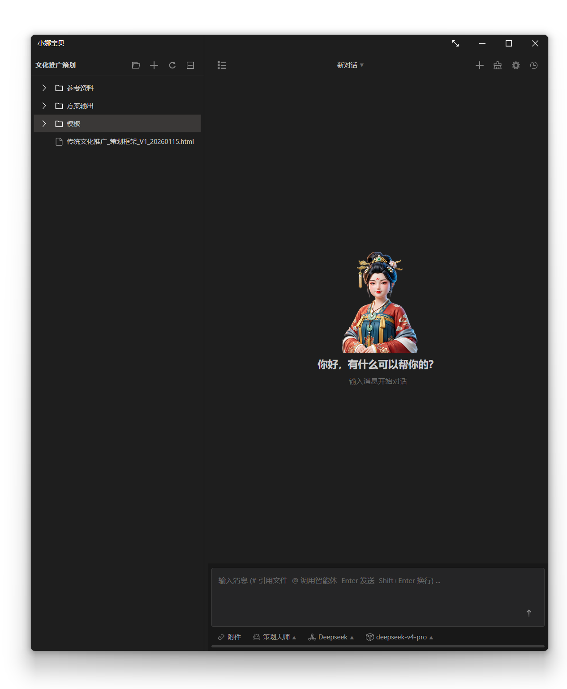

# Netor.Madorin

<div align="center">



**一人公司的 AI 团队。**

创业者 · 独立开发者 · 小团队 · 本地优先 · 插件扩展 · 多模型兼容

[](https://dotnet.microsoft.com/)
[](https://avaloniaui.net/)
[](https://learn.microsoft.com/dotnet/core/deploying/native-aot/)
[](#许可证)

</div>

---

## Madorin 是什么

Madorin 不是又一个聊天窗口。

它面向创业者、独立开发者、自由职业者和小团队，把 AI 智能体组织成岗位，把插件和技能变成工具，把会议结论推进到工作流。

你负责定目标，Madorin 负责调团队。

> **一个人，也能带起技术、市场、客服、策划和运营。**

---

## 它解决什么问题

很多 AI 工具只会回答问题。真正做事时，还是要你自己拆任务、查资料、切软件、写脚本、改文件、整理文档、跟进进度。

Madorin 解决的是另一件事：

> **把一个业务目标，变成一组岗位、一场会议、一条工作流和最终交付物。**

| 你要做的事 | Madorin 的方式 |
| --- | --- |
| 上线一个产品 | 技术、策划、运营智能体一起拆计划、排风险、生成执行清单。 |
| 做一轮营销 | 市场智能体写内容、客服智能体准备话术、运营智能体安排节奏。 |
| 维护客户 | 客服智能体整理问题，记忆插件沉淀反馈，工作流继续追踪。 |
| 开专家会议 | 多个智能体从不同岗位讨论、表决，最后生成方案和文档。 |
| 扩展新能力 | 通过插件、技能、MCP 和资源中心给 AI 团队加工具。 |
| 换模型或接私有模型 | 多模型配置和 Ollama 兼容代理，把模型选择权留给你。 |

---

## 核心概念

| 概念 | 在 Madorin 里意味着什么 |
| --- | --- |
| 你 | CEO，负责目标、方向和最终判断。 |
| 智能体 | 岗位，例如技术、市场、客服、策划、运营。 |
| 会议模式 | 多个岗位讨论、补充风险、表决并形成方案。 |
| 工作流 | 把方案继续推进成文档、脚本、清单和下一步动作。 |
| 插件 | AI 员工能调用的工具，例如搜索、文件、Office、服务器、脚本。 |
| 技能 | 可复用的方法、流程和提示词。 |
| 资源中心 | 给一人团队补充岗位、技能、插件和解决方案。 |
| 多模型 | 不同岗位可以使用不同模型，不被单一平台锁住。 |

---

## 当前能力

### 1. 一人团队

Madorin 支持 `@智能体` 调用。每个智能体都可以配置独立模型、提示词、插件工具、MCP 工具和工作职责。

你可以让不同智能体分别负责：

- 技术开发、服务器维护、日志排查和脚本编写。
- 市场内容、视频脚本、获客方案和发布节奏。
- 客户服务、问题整理、话术生成和反馈沉淀。
- 产品策划、风险分析、路线设计和文档输出。
- 运营管理、任务拆解、优先级和进度追踪。

这不是一个 AI 在硬撑，而是一组岗位在协作。

### 2. 会议到方案

会议模式适合需要判断的问题：产品上线、技术选型、营销方案、客户危机、服务器故障、版本规划。

多个专家智能体可以围绕同一个议题讨论、反驳、补充风险，最后整理成结论、纪要和执行方案。

### 3. 工作流交付

对话给你灵感，会议给你方案，工作流负责继续推进。

Madorin 的工作流面向真实交付：拆步骤、调插件、写文件、生成脚本、整理清单、记录过程，并把下一步继续往前推。

### 4. 插件和技能

只会聊天的 AI 是顾问，会用工具的 AI 才像员工。

Madorin 当前推荐三条扩展路线：

| 通道 | 适合什么 | 亮点 |
| --- | --- | --- |
| Native | C/C++/Rust/C# AOT、高性能本地能力 | NativeHost 子进程承载，崩溃隔离。 |
| Process | 跨语言可执行程序、需要完整运行时生态的工具 | stdio NDJSON 协议，Generator 自动生成入口、调试器和 `plugin.json`。 |
| MCP | 外部工具服务、远程系统、标准化工具生态 | 支持 stdio / SSE / streamable-http。 |

Process 插件协议当前包含四个宿主方法：

- `get_info`：读取插件元数据、工具列表、能力声明和设置 schema。
- `init`：注入数据目录、工作区目录、插件目录、PluginBus 端点与扩展配置。
- `invoke`：按工具名分发调用，每次调用创建独立 DI scope。
- `destroy`：停止后台服务并释放插件进程资源。

Process 插件运行时会注册 `PluginSettings`、`PluginSettingsAccessor`、`ProcessPluginRuntimeContext`、文件日志和用户工具类；插件也可以通过 `Configure(IServiceCollection, PluginSettings)` 或旧版 `Configure(IServiceCollection)` 扩展 DI。实现了 `IHostedService` / `IHostedLifecycleService` 的后台服务会在 `init` 后启动，在 `destroy` 或进程退出时按生命周期停止。

MCP 服务配置存储在主程序数据库中，可在运行时测试连接、保存配置、启用/禁用、断开/重连，并绑定到指定智能体。运行时会把已连接 MCP Server 的工具适配为 AI 可调用工具，断线后由宿主执行重连。

本地插件默认部署到用户数据目录下的全局插件目录：

```text
{UserDataDirectory}/plugins/
```

工作区下的 `.cortana/plugins/` 仍保留为历史兼容路径，但当前代码已标记为废弃；运行时统一使用 `UserPluginsDirectory` / `PluginDirectory`。

仓库里已经维护了一批真实插件工程：

- `Cortana.Plugins.Bt`：宝塔面板运维工具。
- `Cortana.Plugins.GoogleSearch`：谷歌搜索。
- `Cortana.Plugins.Memory`：记忆引擎。
- `Cortana.Plugins.Office`：Word / Excel / PowerPoint 文档工具。
- `Cortana.Plugins.Reminder`：定时提醒。
- `Cortana.Plugins.ScriptRunner`：C# 脚本运行器。
- `Cortana.Plugins.Ssh`：SSH 远程操作。
- `Cortana.Plugins.StandardTest`：Process 插件标准能力验证。
- `Cortana.Plugins.Voice.Kws.Sherpa` / `Voice.Stt.Sherpa` / `Voice.Tts.Melo`：语音唤醒、识别和合成插件。
- `Cortana.Plugins.WsBridge`：WebSocket 中转。
- `Cortana.Plugins.ApplicationLauncher` / `WindowManagement`：本地应用与窗口管理。
- `DesktopPet`：桌宠与 Live2D/GLTF 相关实验模块。

### 5. 多模型和 Ollama 兼容代理

Madorin 不把你锁在单一模型里。当前代码注册了 OpenAI 兼容、Azure OpenAI、Ollama、Anthropic、Deepseek、Gemini、阿里云、智谱 GLM 和 Custom 等模型驱动，国产模型、企业网关、私有 API 都可以接入。

它内置 Ollama 本地协议代理：

```text
http://localhost:11434
```

外部工具以为自己在调用本地 Ollama，实际请求由 Madorin 转发到你配置的模型。

支持端点包括：

- `GET /api/version`
- `GET /api/tags`
- `POST /api/chat`
- `POST /api/generate`
- `POST /api/show`
- `GET/POST /api/ps`
- `GET /v1/models`
- `POST /v1/chat/completions`

这意味着你可以把 Madorin 配置好的模型送进 VS Code、Visual Studio 或其他支持 Ollama/OpenAI-compatible 的工具链。

### 6. 本地数据和工具链诊断

Madorin 使用 SQLite 持久化会话、配置、工作区和结构化消息内容。普通文本、function call、function result、工具结果和生成资源都可以通过 `ContentsJson` 恢复。

应用商店模块连接运营平台 API，可浏览、登录、同步和安装插件、技能、智能体与方案资源；安装目标由 `AssetType` 分流到用户数据目录下的 `plugins`、`skills`、`agents`、`solutions` 等目录。

AI trace 开启后默认写入当前工作区：

```text
.cortana/logs/ai-traces
```

也可以通过 `CORTANA_AI_TRACE_DIR` 指定目录；没有工作区上下文时会回退到程序目录下的 `logs/ai-traces`。开关来自系统设置 `AI.Trace.Enabled` 或环境变量 `CORTANA_AI_TRACE_ENABLED`。

可用于诊断：

- orphan tool message
- missing tool response
- tool message 不相邻
- assistant tool_calls 与 tool result 的 callId 映射
- 请求、响应、流式片段、异常堆栈

### 7. WebSocket 接入

Madorin 内置轻量 WebSocket 服务，当前聊天、插件事件、长期记忆供应和模型能力控制面统一走 PluginBus。

端点常量定义在 `Src/Netor.Cortana.Entitys/CortanaWsEndpoints.cs`。

| 项 | 当前值 |
| --- | --- |
| WebSocket 端点 | `/internal` |
| 协议 | `cortana.plugin-bus` |
| 协议版本 | `1.3.0` |
| 主要 topic | `conversation`、`memory`、`model`、`plugin`、`workflow`、`meeting` |

默认端口：

```text
52841
```

这让 Madorin 不只是桌面软件，也可以成为其他程序背后的 AI 对话与任务服务。

### 8. 语音能力

语音基础设施位于 `Src/Netor.Cortana.Voice`，当前主要语音能力以插件包形式提供：

- KWS：关键词唤醒
- STT：语音识别
- TTS：语音合成

对应插件工程位于：

```text
Plugins/Src/Cortana.Plugins.Voice.Kws.Sherpa/
Plugins/Src/Cortana.Plugins.Voice.Stt.Sherpa/
Plugins/Src/Cortana.Plugins.Voice.Tts.Melo/
```

UI 主程序发布时不再携带 `Src/sherpa_models/`；该目录可作为本地历史模型目录保留，KWS/STT/TTS 模型和原生运行时由对应语音插件包携带。

---

## 最近版本

| 版本 | 进化点 |
| --- | --- |
| v1.3.9 | 多品牌发布配置收口、应用商店与运营平台接入、Process 插件宿主生命周期和语音插件化整理。 |
| v1.3.7 | 长期记忆默认注入、插件整理、实时过程卡片与发布说明补齐。 |
| v1.3.6 | 插件能力授权、宿主模型能力、system.notice 临时系统信息协议。 |
| v1.3.5 | 全局插件管理、插件管理页重构、MCP 展示/重连/智能体绑定和短工具名治理。 |
| v1.3.3 | 工具历史重排修复、AI 全量调试日志、工具协议诊断。 |
| v1.3.1 | Ollama 本地协议代理，把远程模型伪装成本地模型。 |
| v1.2.9 | reasoning / function call 能力位，修复 OpenAI 兼容工具链断裂。 |
| v1.2.7 | 文件工具返回结果统一结构化，AI 更容易稳定解析。 |
| v1.2.6 | 用途级模型路由、结构化聊天历史、工具上下文恢复。 |
| v1.2.0 | `@智能体` 多智能体协作。 |

发布说明位于 `Docs/release-notes/`。

---

## 技术架构

| 模块 | 说明 |
| --- | --- |
| `Src/Netor.Cortana.UI` | 当前主程序，Avalonia UI、系统设置、托盘、工作区、历史面板、代理窗口。 |
| `Src/Netor.Cortana.AI` | AI 编排、模型接入、Agent、聊天历史组装、工具链协议处理、AI trace。 |
| `Src/Netor.Cortana.Entitys` | 实体、SQLite 数据库、系统设置、事件参数、共享常量。 |
| `Src/Netor.Cortana.Plugin` | 插件加载、本地插件通道、MCP 接入、内置文件工具等。 |
| `Src/Netor.Cortana.Networks` | WebSocket 服务、Ollama/OpenAI 兼容代理网络层。 |
| `Src/Netor.Cortana.Store` | 应用商店、平台账号会话、资源安装、更新检查和平台 API 地址接入。 |
| `Src/Netor.Cortana.Voice` | 语音基础设施，具体 KWS/STT/TTS 能力由插件包提供。 |
| `Src/Netor.Cortana.Platform` | 运营平台 API、Web、Admin、核心服务和实体模型。 |
| `Src/Plugins` | Native/Process 插件 SDK、NativeHost、源码生成器、调试器。 |
| `Plugins/Src` | 随仓库维护的实际插件工程。 |

| 类型 | 技术 |
| --- | --- |
| 运行时 | .NET 10 |
| UI | Avalonia 12 |
| 发布 | Native AOT、Self-contained、win-x64 |
| AI | Microsoft.Extensions.AI、Microsoft.Agents.AI、Netor.Anthropic / Netor.Agents.AI.Anthropic |
| MCP | ModelContextProtocol 1.3.0 / ModelContextProtocol.AspNetCore 1.4.0 |
| 数据 | 主程序 SQLite；平台侧 EF Core + SQL Server / SQLite |
| 存储 | 平台资源包支持本地安装，平台服务侧支持 S3 包存储。 |
| 事件 | Netor.EventHub |
| 日志 | Microsoft.Extensions.Logging + Serilog File |
| 语音 | Sherpa-ONNX / Melo TTS 插件 |

---

## 快速开始

### 环境要求

- Windows 10/11 x64
- .NET 10 SDK
- PowerShell 7
- 如需创建 GitHub Release：GitHub CLI (`gh`) 并完成登录

### 构建

```powershell
dotnet build .\Netor.Cortana.slnx
```

### 运行主程序

```powershell
dotnet run --project .\Src\Netor.Cortana.UI\Netor.Cortana.UI.csproj
```

### 发布 UI + NativeHost

```powershell
.\Build\ui.publish.ps1
```

输出目录：

```text
Realases/Cortana
```

该脚本会发布：

- `Src/Netor.Cortana.UI/Netor.Cortana.UI.csproj`
- `Src/Plugins/Netor.Cortana.NativeHost/Netor.Cortana.NativeHost.csproj`

### 打包 zip 和 SHA256

```powershell
.\Build\ui.package.ps1
```

默认生成：

```text
Realases/Netor.Cortana-v{Version}-win-x64.zip
Realases/Netor.Cortana-v{Version}-win-x64.sha256
```

### 创建 GitHub Release

```powershell
.\Build\github.release.ps1 -Tag v1.3.9
```

该脚本只处理 tag、release notes 和资产上传，不执行 publish，也不自动修改版本号。默认会按 tag 查找 `Docs/release-notes/v{Version}/RELEASE.md`，并上传 `Realases/{BrandPackageName}-v{Version}-win-x64.zip` 与 `.sha256`；当前仓库已归档的发布说明到 `v1.3.7`，使用 `v1.3.9` 发布前需要先补充 `Docs/release-notes/v1.3.9/RELEASE.md`，或通过 `-NotesFile` 指定已有说明文件。

### 多品牌发布

```powershell
.\Build\ui.brand.publish.ps1 -BrandConfigPath brands\madorin.json -UseVsWhereFix
```

品牌配置位于 `Build/brands/`，脚本会临时写入 `AppBranding.cs`，发布后自动恢复。`brands/madorin.json` 的发布目录为 `Realases/Madorin`；直接调用 `ui.publish.ps1` 时默认目录仍是 `Realases/Cortana`。需要同时打包时追加 `-Package`。

### 平台发布

```powershell
.\Build\Platfrom.ps1
```

该脚本发布平台侧 `Admin`、`Api`、`Web` 三个项目到 `Realases/Admin`、`Realases/Api`、`Realases/Web`，默认目标运行时为 `linux-x64`。

### 插件包发布

```powershell
.\Build\plugin.publish.ps1
```

该脚本扫描 `Src\Plugins` 下可打包的插件 SDK 项目，递增 `Src\Plugins\Directory.Build.props` 版本后执行 `dotnet pack`，默认会推送到配置的 NuGet 源。当前插件 SDK 公共版本为 `1.1.1`。仅本地验证时使用：

```powershell
.\Build\plugin.publish.ps1 -SkipPush
```

### 插件运行包发布

仓库内插件运行包使用项目根目录下的专用脚本单独发布，例如：

```powershell
.\Plugins\Src\Cortana.Plugins.Voice.Tts.Melo\publish-voice-tts-melo.ps1
```

单插件脚本会递增当前项目 `<Version>`，同步 `Startup.cs` / `plugin.json` 中的插件版本，执行 `dotnet publish`，并把发布目录递归打包到 `Plugins\Releases\{PluginName}.v{Version}.zip`。仅验证版本和输出路径时使用：

```powershell
.\Plugins\Src\Cortana.Plugins.Voice.Tts.Melo\publish-voice-tts-melo.ps1 -DryRun
```

保留的 `.\Plugins\publish.ps1` 只是批量调度入口，会逐个调用各插件项目根目录下的 `publish-*.ps1`，不再承载具体发布逻辑。

---

## 当前目录结构

```text
Netor.Madorin/
├── Netor.Cortana.slnx
├── README.md
├── Build/
│   ├── Platfrom.ps1
│   ├── ui.brand.publish.ps1
│   ├── ui.publish.ps1
│   ├── ui.package.ps1
│   ├── github.release.ps1
│   └── plugin.publish.ps1
├── Docs/
│   ├── release-notes/
│   └── 系统流程与规划/
├── Plugins/
│   ├── Cortana.Plugins.slnx
│   ├── docs/
│   └── Src/
│       ├── Cortana.Plugins.Bt/
│       ├── Cortana.Plugins.GoogleSearch/
│       ├── Cortana.Plugins.Memory/
│       ├── Cortana.Plugins.Office/
│       ├── Cortana.Plugins.Reminder/
│       ├── Cortana.Plugins.ScriptRunner/
│       ├── Cortana.Plugins.Ssh/
│       ├── Cortana.Plugins.StandardTest/
│       ├── Cortana.Plugins.Voice.Kws.Sherpa/
│       ├── Cortana.Plugins.Voice.Stt.Sherpa/
│       ├── Cortana.Plugins.Voice.Tts.Melo/
│       ├── Cortana.Plugins.WindowManagement/
│       ├── Cortana.Plugins.WsBridge/
│       └── DesktopPet/
├── Realases/
├── Res/
├── skills/
├── Src/
│   ├── Netor.Cortana.Platform/
│   │   ├── Netor.Cortana.Platform.Admin/
│   │   ├── Netor.Cortana.Platform.Api/
│   │   ├── Netor.Cortana.Platform.Core/
│   │   ├── Netor.Cortana.Platform.Entitys/
│   │   ├── Netor.Cortana.Platform.Services/
│   │   └── Netor.Cortana.Platform.Web/
│   ├── Plugins/
│   ├── Netor.Cortana.AI/
│   ├── Netor.Cortana.Entitys/
│   ├── Netor.Cortana.Networks/
│   ├── Netor.Cortana.Plugin/
│   ├── Netor.Cortana.Store/
│   ├── Netor.Cortana.UI/
│   ├── Netor.Cortana.Voice/
│   └── sherpa_models/
└── Tests/
    ├── Netor.Cortana.AI.Tests/
    ├── Netor.Cortana.Entitys.Tests/
    ├── Netor.Cortana.MeetingMode.Tests/
    ├── Netor.Cortana.Networks.Tests/
    ├── Netor.Cortana.Plugin.Process.Tests/
    ├── Netor.Cortana.Plugin.Tests/
    ├── Netor.Cortana.Platform/
    └── Netor.Cortana.Store/
```

---

## 常用文档

| 文档 | 说明 |
| --- | --- |
| `Docs/release-notes/v1.3.7/RELEASE.md` | 长期记忆默认注入、插件整理、实时过程卡片。 |
| `Docs/release-notes/v1.3.6/RELEASE.md` | 插件授权、宿主模型能力、长期记忆默认注入与 system.notice。 |
| `Docs/release-notes/v1.3.5/RELEASE.md` | 全局插件、插件管理页、MCP 管理和 DeepSeek reasoning 回放。 |
| `Docs/release-notes/v1.3.3/RELEASE.md` | AI 工具链协议修复与 trace。 |
| `Docs/release-notes/v1.3.1/RELEASE.md` | Ollama 本地协议代理。 |
| `Docs/release-notes/v1.2.9/RELEASE.md` | reasoning / function call 能力位与工具链修复。 |
| `Docs/系统流程与规划/UI-编译打包发布流程.md` | UI 编译、打包、发布流程。 |
| `Docs/系统流程与规划/websocket-api.md` | WebSocket 接入协议。 |
| `Src/Plugins/Netor.Cortana.Plugin.Process/README.md` | Process 插件运行时、配置注入和本地调试。 |
| `Src/Plugins/Netor.Cortana.Plugin.Process.Generator/README.md` | Process 插件 Source Generator、生成产物和诊断。 |
| `Plugins/docs/参考文档/plugin-native.md` | Native 插件开发。 |
| `Plugins/docs/参考文档/plugin-mcp.md` | MCP 插件/服务接入。 |
| `Plugins/docs/参考文档/native-plugin-dev-guide.md` | Native 插件开发细节。 |

---

## 注意事项

- 当前主线项目是 `Src/Netor.Cortana.UI`。
- 当前代码版本以 `Src/Netor.Cortana.UI/Netor.Cortana.UI.csproj` 中的 `<Version>` 为准；当前为 **1.3.9**。
- 插件 SDK 包版本以 `Src/Plugins/Directory.Build.props` 中的 `<Version>` 为准；当前为 **1.1.1**。
- 发布输出目录拼写沿用历史路径 `Realases/`，不要误改为 `Releases/`。
- 语音模型不再随 UI 主程序发布；`Src/sherpa_models/` 可作为本地历史模型目录保留，KWS/STT/TTS 模型由对应语音插件包携带。
- 旧发布脚本仍保留在 `Build/` 中用于历史链路，不推荐新流程使用。

---

## 许可证

插件 SDK 包元数据使用 MIT 许可证声明；仓库根目录当前未包含独立 `LICENSE` 文件，正式分发前请以发布包或仓库后续补充的许可证文件为准。

---

<div align="center">

**Netor.Madorin** — 一人公司的 AI 团队。

</div>
