# Netor.Madorin（马得令）

<div align="center">

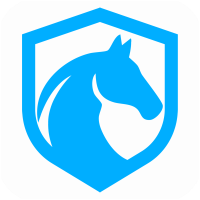

## **不是聊天工具，是你的 AI 公司**

### 一个人，带起完整团队 | 技术 · 市场 · 客服 · 策划 · 运营

**创业者 · 独立开发者 · 小团队 · 自由职业者专属**


[立即下载](#快速开始) · [查看演示](#核心功能展示) · [对比竞品](#与市面产品对比) · [插件生态](#插件体系真正的行业革命)

</div>

---

## 🎯 你遇到的真实问题

**市面上的 AI 工具只会聊天，真正做事还得靠你自己：**

- ❌ ChatGPT/Claude 只能一问一答，没法记住项目上下文
- ❌ 每次切换任务都要重新解释背景，效率极低
- ❌ 想让 AI 操作文件、调接口、查服务器？对不起，它只会给你代码让你自己跑
- ❌ 多个任务并行？只能开十几个标签页自己来回切
- ❌ 技术问题找技术 AI，营销问题找营销 AI，团队协作靠人肉转述
- ❌ 数据存在云端，担心隐私泄露，想用本地模型又配置复杂

**创业者和独立开发者最痛的是：钱不够雇团队，一个人要干五个人的活。**

---

## ✨ Madorin 给你的答案

> **把 AI 从"顾问"升级成"员工"，从"聊天窗口"升级成"公司"。**

### 不是工具，是团队

Madorin 不是又一个聊天界面，而是一套完整的 **AI 员工编制系统**：


| 你说           | Madorin 干                                                                  |
| ------------ | -------------------------------------------------------------------------- |
| "策划一个新产品发布"  | 🧠 策划智能体拆方案 → 💼 市场智能体写推广内容 → 👨‍💻 技术智能体准备落地页 → 👔 运营智能体排节奏 → 📋 生成完整执行清单 |
| "服务器 CPU 爆了" | 👨‍💻 技术智能体 SSH 登录查日志 → 🔍 定位问题进程 → 📊 生成监控报告 → 💡 给出优化方案                  |
| "竞品发新功能了"    | 🔎 调研智能体爬竞品官网 → 📊 分析智能体对比差异 → 💼 市场智能体写应对方案 → 📋 输出决策报告                   |
| "需要一篇技术文档"   | 👨‍💻 技术智能体读代码 → ✍️ 文档智能体写初稿 → 👔 审核智能体查错 → 📝 输出完稿                        |


**不用你来回切换，不用你转述需求，AI 团队自己开会、分工、执行、交付。**

### 三大核心能力，解决行业痛点

#### 🏢 **会议模式** — 市面独一无二的多 AI 讨论功能

让 AI 团队开会讨论，而不是你一个人问一百遍：

- 📋 **需求评审**：产品经理提需求 → 技术评估可行性 → UX 提交互方案 → 团队投票决策
- 🐛 **故障诊断**：运维报告现象 → 后端分析日志 → 前端排查接口 → DBA 查数据库 → 多角度定位根因
- 📊 **方案决策**：三个 AI 各自独立提方案 → 评审团逐个质询 → 团队投票 → 输出最优解

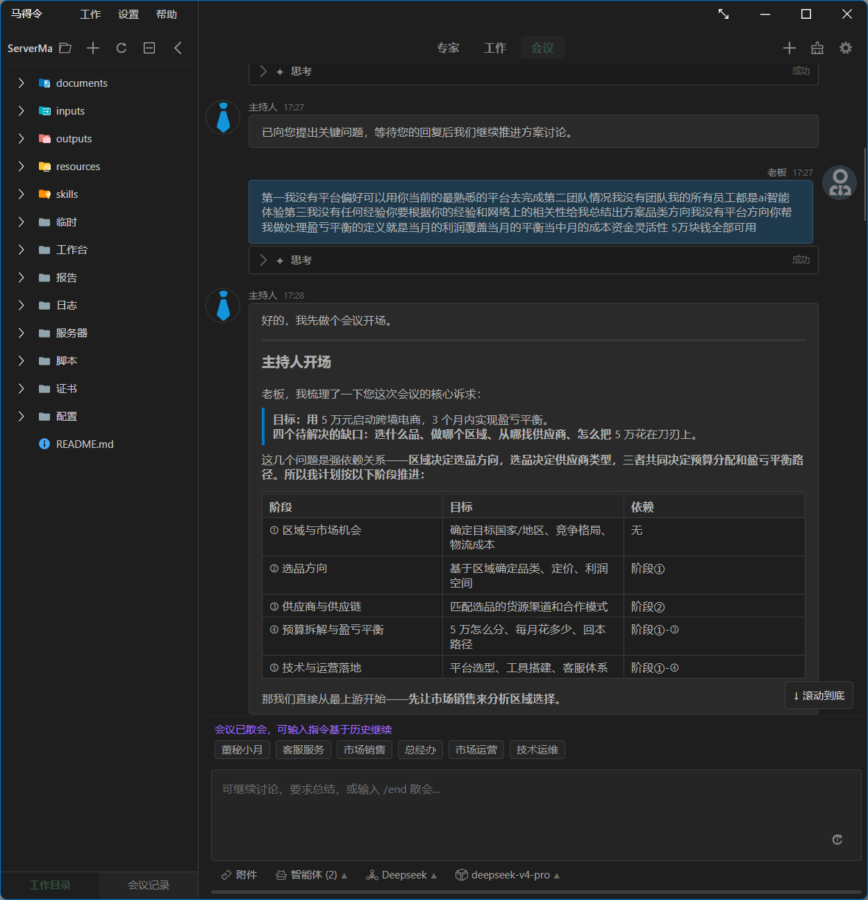

*会议模式：AI 团队自主讨论、投票决策，你只需要看结果*

**其他产品只能一对一问答，Madorin 让 AI 之间协作，质量和效率都是降维打击。**

#### 🔌 **插件体系** — 真正的行业革命（详见后文）

市面上的"插件"都是玩具，Madorin 的插件体系是**企业级底座**：

- **三通道架构**：Native（C# 原生）+ Process（独立进程）+ MCP（外部服务）全覆盖
- **插件集群**：事件总线 + 集群授权 + 跨插件协作，可搭建企业自有插件生态
- **工作技能 vs 全局技能**：不同智能体用不同插件，权限隔离，安全可控
- **插件绑定管理**：哪个智能体能用什么模型、调用哪些插件，全部可配置
- **增强记忆插件**：行业领先的长期记忆系统，真正"记住"你的项目（详见后文）

**竞品的插件只是"给 AI 加几个函数"，Madorin 的插件体系可以承载整个企业的业务流程。**

#### 🧠 **增强记忆系统** — 行业最完整的长期记忆实现

不是简单的"上下文缓存"，而是真正的**知识沉淀与召回系统**：

- **全模式覆盖**：对话、专家、工作、会议四大模式的记忆全打通
- **多维度抽取**：观察 → 片段 → 抽象 → 关联，四层处理管道
- **智能召回**：根据当前任务自动召回相关记忆，不需要手动搜索
- **事件链路**：实时事件 + 历史回放双通道，重启也不丢记忆

**为什么行业领先？**

- ✅ 市面上的记忆系统只是"向量数据库 + RAG"，Madorin 是**完整的知识管理工作流**
- ✅ 其他产品记忆孤立在单次对话，Madorin 跨会话、跨模式、跨智能体共享
- ✅ 竞品重启就失忆，Madorin 的双通道机制（实时 + 历史回放）确保记忆永久化
- ✅ 基于自研基座深度集成，不是"插件"级别的附加功能，而是**系统级能力**

**案例**：你三个月前和技术智能体讨论过数据库优化方案，今天换个市场智能体问"我们的技术架构是什么"，它能从记忆中召回那次讨论，直接给答案。

---

## 📊 与市面产品对比


| 维度         | Madorin         | ChatGPT/Claude | Coze/扣子      | Dify         | AutoGPT      |
| ---------- | --------------- | -------------- | ------------ | ------------ | ------------ |
| **多智能体协作** | ✅ 会议模式独创        | ❌ 单一助手         | ⚠️ 工作流串联，无协作 | ⚠️ 工作流串联，无协作 | ⚠️ 单一自主循环    |
| **插件体系深度** | ✅ 三通道 + 集群 + 授权 | ❌ 简单函数调用       | ⚠️ 工具库，无集群   | ⚠️ 工具库，无集群   | ⚠️ 简单插件      |
| **长期记忆系统** | ✅ 四层处理 + 双通道    | ❌ 仅会话级缓存       | ⚠️ 知识库，无事件链  | ⚠️ 知识库，无事件链  | ❌ 无持久化记忆     |
| **数据隐私**   | ✅ 本地存储 SQLite   | ❌ 云端存储         | ❌ 云端存储       | ✅ 可自部署       | ✅ 本地运行       |
| **模型灵活性**  | ✅ 多厂商混用         | ❌ 仅自家模型        | ✅ 多模型支持      | ✅ 多模型支持      | ⚠️ 主要 OpenAI |
| **插件授权管理** | ✅ 细粒度权限控制       | ❌ 无            | ❌ 无          | ❌ 无          | ❌ 无          |
| **二次开发能力** | ✅ WebSocket API | ❌ 无            | ⚠️ API 有限    | ✅ 开源可改       | ✅ 开源可改       |
| **企业插件集群** | ✅ 事件总线 + 集群授权   | ❌ 无            | ❌ 无          | ❌ 无          | ❌ 无          |
| **工作区隔离**  | ✅ 工作区 + 工作区插件   | ❌ 无            | ⚠️ 应用空间      | ⚠️ 应用空间      | ❌ 无          |
| **本地优先设计** | ✅ 零云依赖          | ❌ 必须联网         | ❌ 必须联网       | ⚠️ 可离线但功能受限  | ✅ 可本地运行      |


### 🎯 Madorin 的四大核心差异

1. **会议模式** — 市面上独一无二的多 AI 讨论功能，其他产品只能单线程对话
2. **企业级插件体系** — 不是简单的"函数调用"，而是完整的集群化底座
3. **增强记忆系统** — 行业最完整的长期记忆实现，不是简单的向量检索
4. **本地优先 + 数据隐私** — SQLite 本地存储，核心数据不上云

---

## 🎬 核心功能展示

### 1. 专家模式 — 多智能体并行协作

创建多个专业智能体，每个专注自己的领域，自动分工协作：

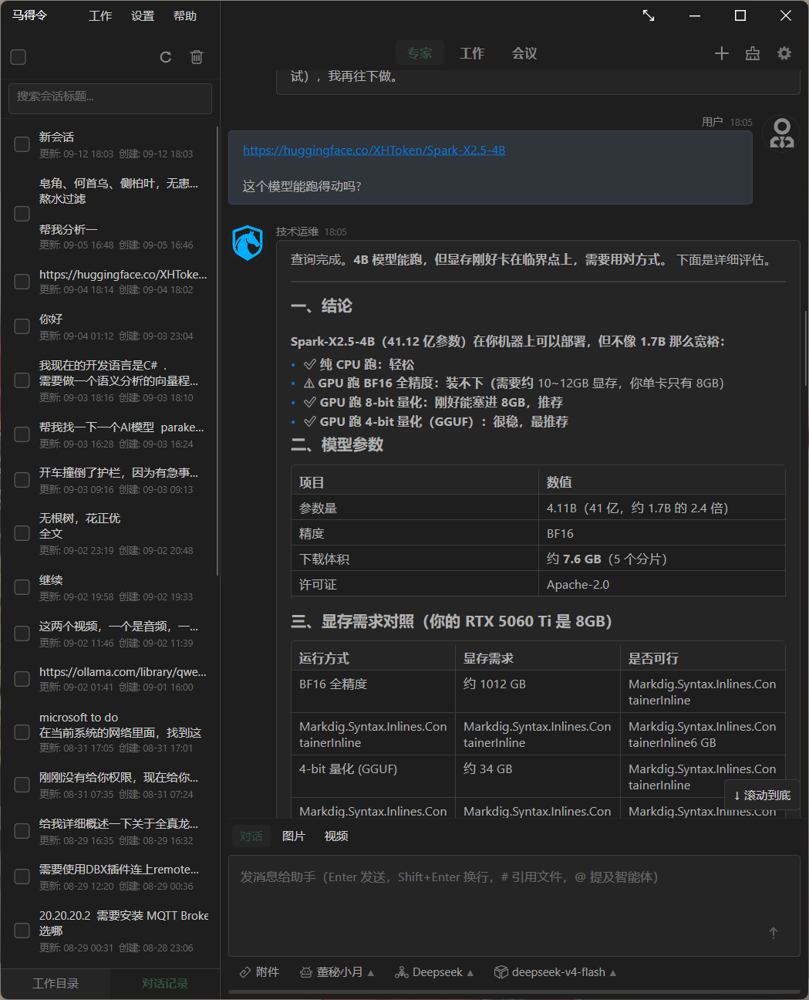

*专家模式：技术、市场、运营智能体同时工作，并行处理复杂任务*

**典型场景**：

- 📋 **产品规划**：产品经理拆需求 + UX 设计界面 + 技术评估工期 + 运营定推广策略
- 🐛 **问题诊断**：前端查接口 + 后端查日志 + DBA 查数据库 + 运维查服务器，多角度定位
- 📊 **竞品分析**：市场调研竞品功能 + 技术分析实现难度 + 运营评估市场反馈

**核心优势**：不用你来回切换，不用你转述需求，AI 团队自己分工执行。

---

### 2. 会议模式 — AI 团队开会讨论（独创功能）

让 AI 团队自己开会讨论，而不是你一个人问一百遍：


*会议模式：多个 AI 围绕同一问题展开讨论、质询、投票*

**会议流程**：

1. 📋 **主持人**发起议题（你或指定的 AI）
2. 💬 **参会智能体**依次发言，表达观点
3. 🔄 **自由讨论**阶段，AI 之间互相质询、补充
4. ✅ **投票决策**，多数意见自动形成决议
5. 📝 **会议纪要**自动生成，包含讨论过程和最终决策

**实际案例**：


| 会议主题    | 参会智能体         | 讨论焦点                | 决策结果                                    |
| ------- | ------------- | ------------------- | --------------------------------------- |
| 数据库迁移方案 | 架构师、DBA、后端、运维 | MySQL vs PostgreSQL | 投票选 PostgreSQL，理由：更好的 JSON 支持 + 成熟的迁移工具 |
| 新功能优先级  | 产品、技术、市场、客服   | 三个功能排期              | 技术评估工期 + 市场评估需求强度 + 客服反馈用户呼声 → 确定优先级    |
| 性能优化方案  | 前端、后端、DBA     | 瓶颈定位                | 前端排除接口慢 + 后端确认数据库慢 + DBA 找到缺索引 → 优化方案确定 |


**为什么独创？**  
市面上所有产品都是"你问 AI 答"的单线程模式，Madorin 让 AI 之间协作讨论，质量和效率都是降维打击。

---

### 3. 工作模式 — 项目管理与任务执行

把大项目拆成任务清单，分配给不同智能体，自动执行和交付：

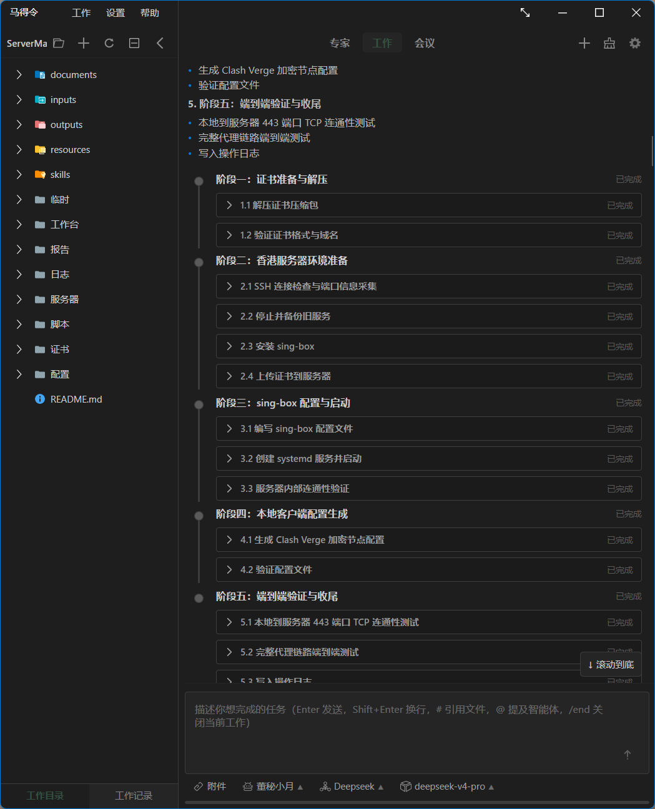

*工作模式：项目经理智能体拆任务，技术、文档、测试智能体分别执行*

**工作流程**：

1. 📋 **项目经理智能体**接收需求，拆解成任务树
2. 👥 **分配任务**给对应智能体（技术、文档、测试等）
3. ⚙️ **并行执行**，每个智能体独立完成任务
4. 📊 **进度跟踪**，实时汇总各任务状态
5. 📦 **交付成果**，生成完整项目报告

**典型场景**：

- 🚀 **新功能开发**：需求分析 → 技术设计 → 编码实现 → 单元测试 → 文档编写 → 部署上线
- 📝 **内容生产**：选题策划 → 资料收集 → 内容撰写 → 校对润色 → 排版发布
- 🔄 **流程自动化**：数据导入 → 清洗转换 → 质量检查 → 入库确认 → 通知相关人

**核心能力**：

- ✅ 自动拆解复杂项目
- ✅ 智能分配任务
- ✅ 并行执行提速
- ✅ 进度实时可见
- ✅ 成果自动交付

---

### 4. 智能体员工管理 — 你的 AI 团队编制

像管理真实团队一样，配置每个智能体的能力、权限和工具：

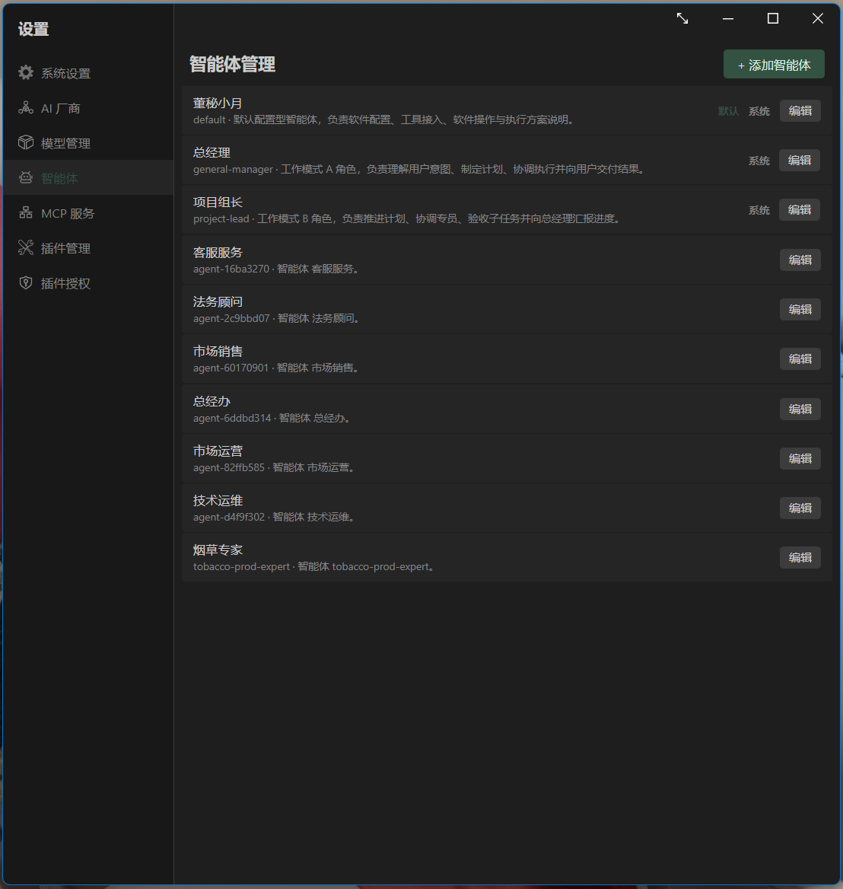

*智能体员工管理：配置智能体的模型、插件、技能和权限*

**配置能力**：

- 🧠 **选择模型**：不同岗位用不同模型（技术用 Claude，营销用 GPT-4，客服用本地 Llama）
- 🔌 **绑定插件**：技术智能体能调 SSH 插件，市场智能体不能
- 📋 **分配技能**：工作技能（仅当前智能体）vs 全局技能（所有智能体）
- 🔒 **权限控制**：哪些智能体能调用哪些 API、访问哪些数据
- 💾 **记忆管理**：是否允许该智能体产生长期记忆

**实际案例**：

- 技术智能体：Claude Opus + SSH 插件 + 代码审查技能 + 服务器访问权限
- 市场智能体：GPT-4 + 网页抓取插件 + 文案写作技能 + 无服务器权限
- 客服智能体：本地 Llama 3.1 + CRM 插件 + 工单处理技能 + 用户数据读取权限

**为什么重要？**  
不是所有 AI 都该有所有权限，细粒度控制确保安全和成本优化。

---

### 5. 插件管理 — 扩展 AI 的实际能力

插件让 AI 从"只会说"变成"真能干"：

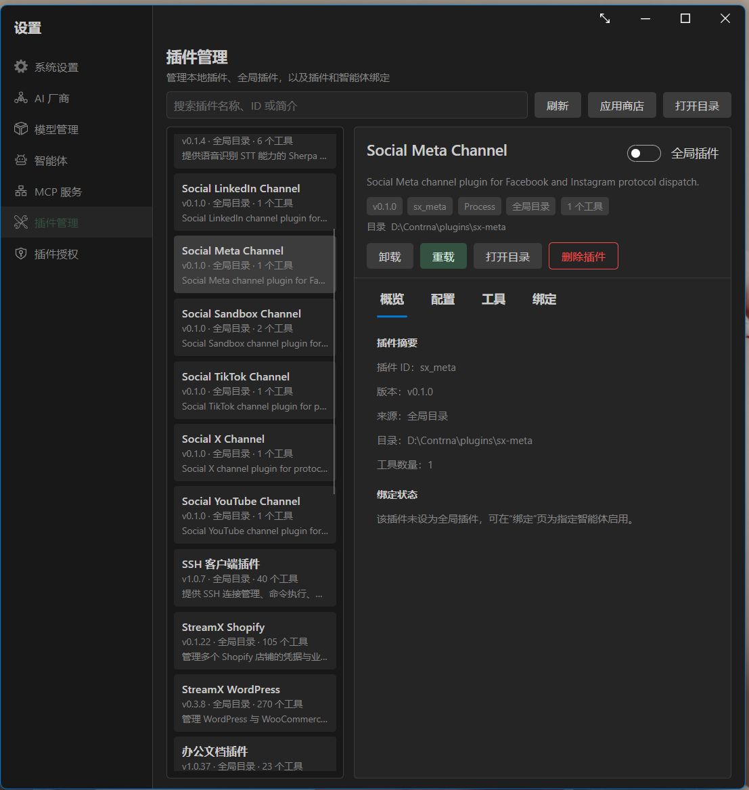

*插件管理：Native、Process、MCP 三类插件，全局插件 vs 工作区插件*

**三类插件通道**：

- 🔵 **Native 插件**：C# 原生插件，性能最高，适合高频调用（如文件操作、数据库查询）
- 🟢 **Process 插件**：独立进程插件，隔离性强，适合长时间运行（如本地服务器、后台任务）
- 🟣 **MCP 插件**：外部服务接入，适合云服务集成（如 GitHub、Slack、数据库）

**已内置插件**：

- 📁 **文件操作**：读写文件、目录管理、批量处理
- 🔐 **SSH/服务器**：远程执行命令、日志查询、进程管理
- 🌐 **网页抓取**：爬虫、内容提取、监控变化
- 💾 **数据库**：SQL 查询、数据导入导出、备份恢复
- 🧠 **增强记忆**：长期记忆系统（详见后文）
- 🔔 **通知推送**：邮件、企业微信、Slack
- 📊 **数据分析**：Excel 处理、图表生成、报表制作

**插件开发**：提供完整 SDK，支持 C#、Python、Node.js 开发自定义插件（详见后文）。

---

### 6. 插件授权管理 — 细粒度权限控制

不是所有智能体都该用所有插件，安全和成本需要精细控制：

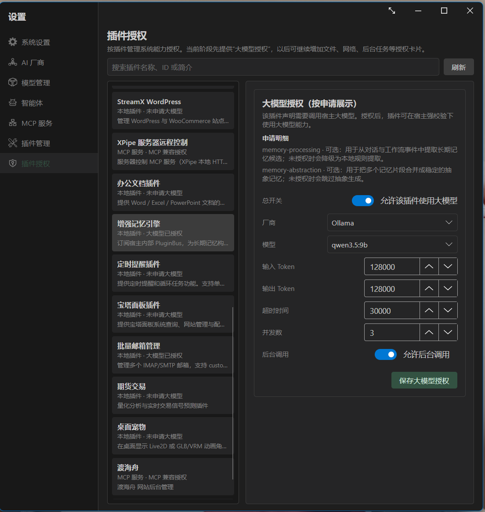

*插件授权管理：控制哪些智能体能使用哪些插件*

**授权维度**：

- 👤 **按智能体授权**：技术智能体能用 SSH，市场智能体不能
- 🔌 **按插件授权**：敏感插件（如数据库写入）只授权给特定智能体
- 🌍 **全局插件 vs 工作区插件**：全局插件所有智能体可见，工作区插件仅当前项目可用
- 🧠 **模型能力绑定**：某个插件只对特定模型开放（如 Claude 专用插件）

**实际场景**：

- 🔒 **数据安全**：生产环境数据库插件只授权给 DBA 智能体和运维智能体
- 💰 **成本控制**：昂贵的云服务插件（如 GPU 计算）只授权给特定任务
- 🎯 **职责分明**：客服智能体只能读用户数据，不能写；技术智能体能读写服务器配置

---

### 7. AI 模型管理 — 多厂商混用

不绑定单一模型厂商，根据任务选择最合适的模型：

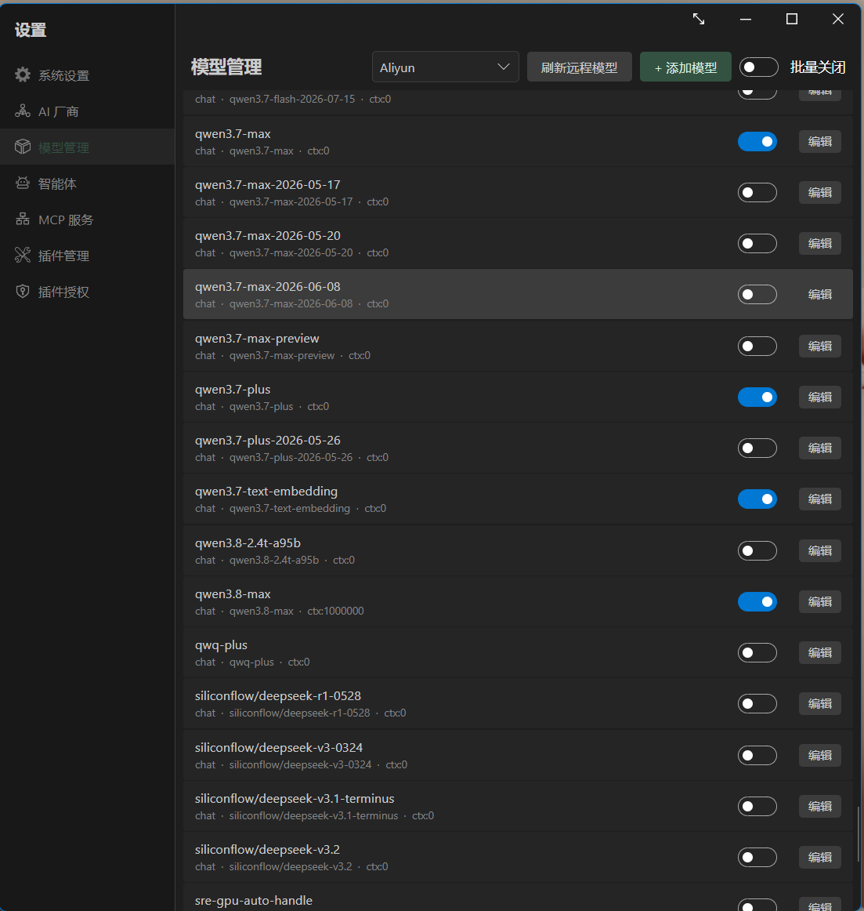

*AI 模型管理：支持 OpenAI、Anthropic、Azure、本地模型等多种厂商*

**支持模型厂商**：

- 🤖 **OpenAI**：GPT-4、GPT-3.5、o1 系列
- 🧠 **Anthropic**：Claude Opus、Sonnet、Haiku
- ☁️ **Azure OpenAI**：企业级 GPT 部署
- 🏠 **本地模型**：Ollama、LM Studio、本地 Llama
- 🌏 **国内厂商**：通义千问、文心一言、讯飞星火（通过兼容 API）

**混用策略**：

- 💼 **营销文案**：GPT-4（创意强）
- 👨‍💻 **代码审查**：Claude Opus（代码理解强）
- 💬 **客服对话**：本地 Llama（成本低、隐私好）
- 📊 **数据分析**：o1（推理强）
- 📝 **文档翻译**：Claude Haiku（速度快、成本低）

**成本优化**：根据任务复杂度自动选择模型，简单任务用便宜模型，复杂任务用强模型。

---

### 8. MCP 管理 — 接入外部服务

通过 MCP（Model Context Protocol）标准接入外部服务和 API：

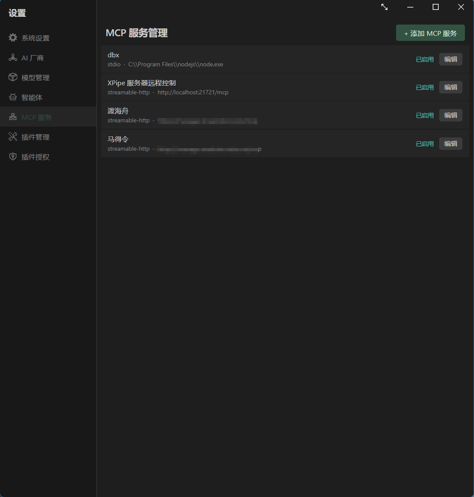

*MCP 管理：接入 GitHub、数据库、云服务等外部资源*

**MCP 优势**：

- 🔌 **标准协议**：基于 Anthropic MCP 标准，兼容生态内所有工具
- 🌐 **云服务集成**：GitHub、GitLab、Jira、Notion、Google Drive
- 💾 **数据库连接**：PostgreSQL、MySQL、MongoDB、Redis
- 📡 **企业系统**：CRM、ERP、OA 系统通过 API 接入
- 🔒 **安全隔离**：MCP 服务独立进程，崩溃不影响主程序

**典型场景**：

- 📋 **项目管理**：AI 自动创建 Jira 工单、更新 GitHub Issue
- 💬 **团队协作**：AI 自动发送 Slack 通知、回复企业微信
- 📊 **数据分析**：AI 直接查询生产数据库，生成报表
- 📝 **文档管理**：AI 读取 Notion 文档，自动同步到内部知识库

---

### 9. 应用商店 — 一键扩展能力

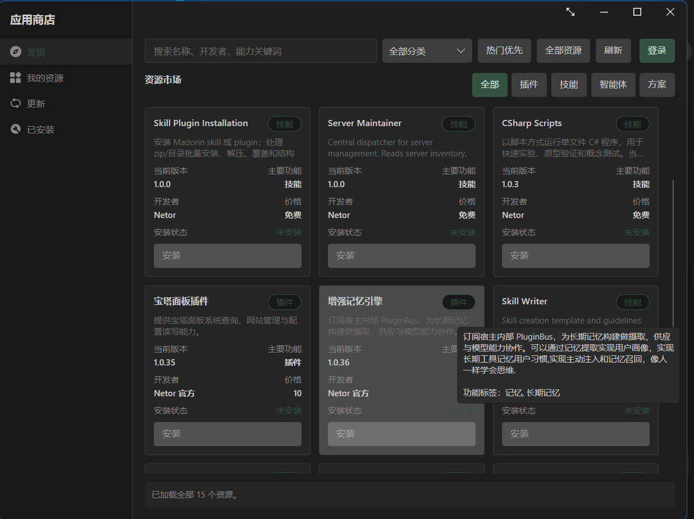

*应用商店：浏览、搜索、安装插件和智能体模板*

**商店内容**（规划中）：

- 🔌 **插件市场**：官方插件 + 社区插件，一键安装
- 👤 **智能体模板**：预配置的行业智能体（技术、市场、客服等）
- 📋 **技能库**：可复用的技能包（代码审查、文案写作、数据分析等）
- 🎨 **主题皮肤**：界面主题定制

**未来规划**：

- 📦 插件版本管理和自动更新
- ⭐ 插件评分和评论系统
- 💰 商业插件市场（开发者变现）

---

### 10. 系统设置 — 完全可控

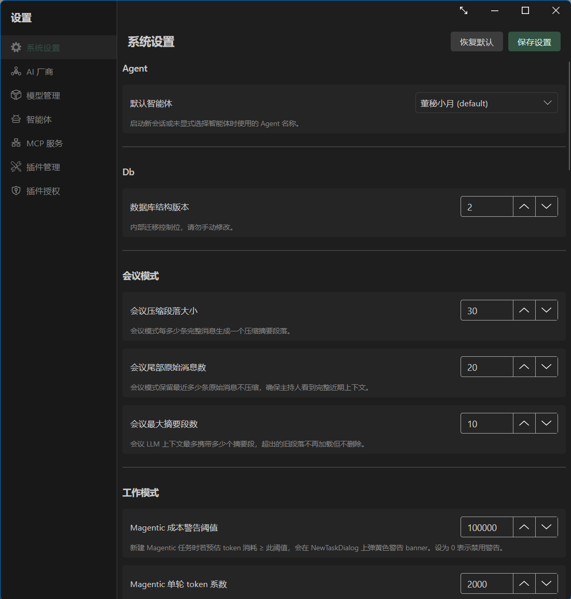

*系统设置：完整的配置中心，从界面到数据全面掌控*

**核心设置**：

- 🎨 **界面配置**：主题、字体、布局自定义
- 💾 **数据管理**：数据库位置、备份策略、清理规则
- 🔒 **隐私控制**：数据本地化、记忆开关、日志级别
- 🌐 **网络配置**：代理设置、超时时间、并发控制
- 📁 **工作区管理**：多工作区切换、工作区级插件隔离
- 🔑 **API 密钥**：模型厂商 API 密钥统一管理

**本地优先设计**：

- ✅ 所有数据存储在本地 SQLite 数据库
- ✅ API 密钥加密存储，不上传云端
- ✅ 对话记录、记忆数据完全本地化
- ✅ 可选的云同步功能，默认关闭

---

### 11. 桌面宠物 — 可爱的 AI 伴侣

Madorin 不只是工具，还能变身桌面宠物，随时陪伴你的工作：

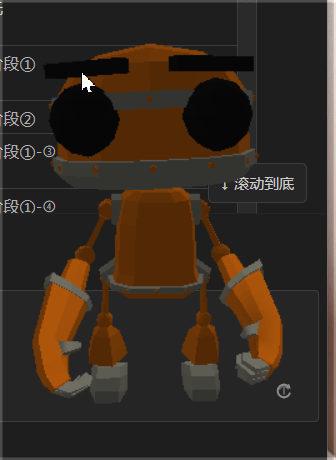

*桌面宠物：在桌面上活动的 AI 伴侣，随时响应你的需求*

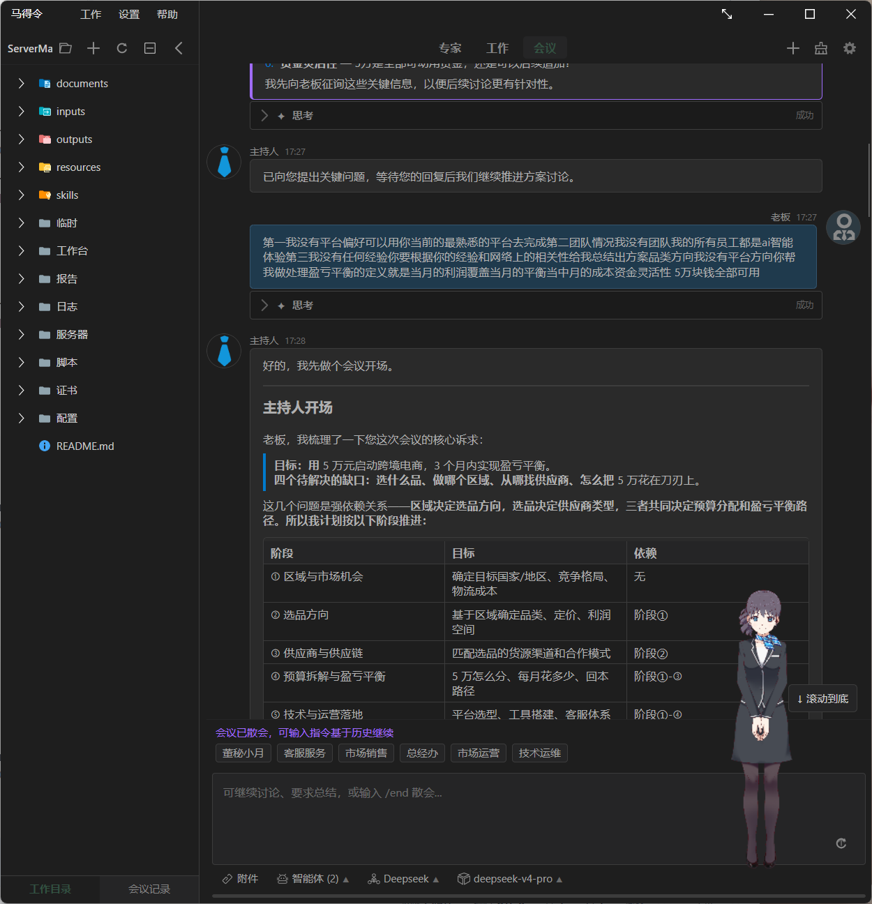

*多种形态：从科技感机器人到可爱角色，总有一款适合你*

**核心特性**：

- 🎨 **多种模型可选**：内置多个宠物模型，科技风、可爱风任你选择
- 🔄 **随意更换**：右键菜单轻松切换宠物外观，支持自定义模型
- 💬 **随时交互**：点击宠物即可对话，无需打开主界面
- 🎭 **智能动画**：根据工作状态展示不同动作和表情
- 📌 **桌面置顶**：始终显示在最前，不会被其他窗口遮挡
- ⚙️ **完全可控**：透明度、大小、位置随心调节

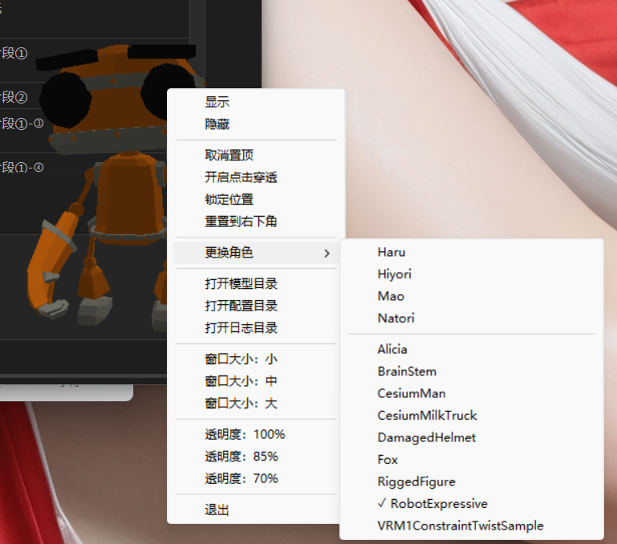

*丰富的模型库：从机械风格到动漫角色，满足不同审美需求*

**使用场景**：

- 📝 工作时有个 AI 伴侣在旁边，随时可以提问
- 🎯 提醒待办事项和重要任务
- 💡 主动推送相关建议和知识点
- 🎮 工作之余的趣味互动

---

### 12. AI 厂商管理 — 快速配置指南

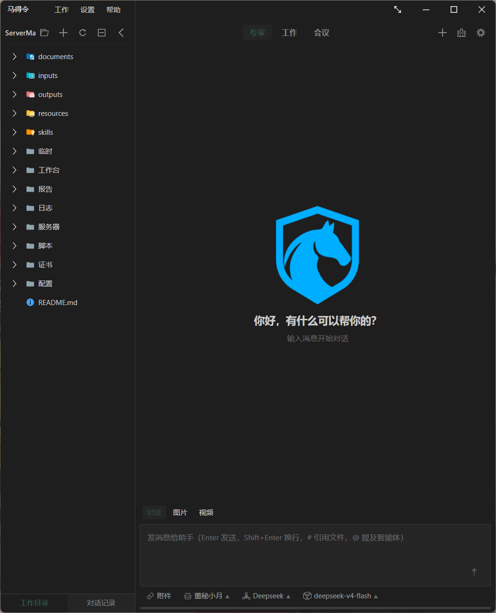

*AI 厂商管理：快速配置多个模型厂商的 API 密钥和端点*

**快速接入**：

- 🔑 **API 密钥管理**：统一管理所有厂商的密钥，加密存储
- 🌐 **自定义端点**：支持私有化部署和国内镜像
- 🔄 **自动检测**：一键测试连接，自动发现可用模型
- 💰 **成本跟踪**：记录各厂商用量，帮助优化成本

**配置模板**：

- 📋 预置主流厂商配置（OpenAI、Anthropic、Azure）
- 🏠 本地模型配置模板（Ollama、LM Studio）
- 🌏 国内厂商配置模板（阿里、百度、讯飞）

---

## 🔌 插件体系：真正的行业革命

> **这不是简单的"给 AI 加几个函数"，而是企业级插件集群底座**

市面上所有 AI 产品的"插件"都只是玩具级实现——简单的函数调用封装。Madorin 的插件体系是**从底层架构设计的企业级解决方案**，可以承载整个公司的业务流程自动化。

### 为什么 Madorin 的插件体系是行业领先？

#### 📊 竞品对比


| 能力维度        | Madorin                 | ChatGPT Plugins | Coze 工具       | Dify 工具       | AutoGPT Plugins |
| ----------- | ----------------------- | --------------- | ------------- | ------------- | --------------- |
| **插件通道**    | 3 种（Native/Process/MCP） | 1 种（HTTP API）   | 1 种（HTTP API） | 1 种（HTTP API） | 1 种（Python）     |
| **进程隔离**    | ✅ Process 插件独立进程        | ❌ 云端运行          | ❌ 云端运行        | ⚠️ 容器隔离       | ❌ 同进程           |
| **企业插件集群**  | ✅ 事件总线 + 集群授权           | ❌ 无             | ❌ 无           | ❌ 无           | ❌ 无             |
| **细粒度授权**   | ✅ 智能体级 + 插件级            | ❌ 用户级           | ❌ 应用级         | ❌ 应用级         | ❌ 无             |
| **工作技能隔离**  | ✅ 工作区 + 全局双层            | ❌ 无             | ❌ 无           | ❌ 无           | ❌ 无             |
| **跨插件协作**   | ✅ 事件总线通信                | ❌ 无             | ❌ 无           | ❌ 无           | ❌ 无             |
| **插件生命周期**  | ✅ 完整生命周期管理              | ⚠️ 有限           | ⚠️ 有限         | ⚠️ 有限         | ❌ 无             |
| **本地高性能插件** | ✅ Native C# 插件          | ❌ 必须 HTTP       | ❌ 必须 HTTP     | ⚠️ Python 容器  | ✅ Python 本地     |


---

### 🎯 三通道插件架构

Madorin 提供三种插件通道，覆盖从高性能本地调用到云服务集成的全场景：

#### 1️⃣ **Native 插件** — C# 原生插件

**技术特性**：

- 🚀 **零序列化开销**：直接内存调用，性能极致
- 🔒 **类型安全**：编译期检查，运行期零异常
- 🧩 **深度集成**：可访问宿主所有能力（数据库、UI、内存）

**适用场景**：

- 🔥 **高频调用**：每秒调用上千次的场景（如实时监控、日志处理）
- 💾 **数据密集**：大量数据处理（如文件批量操作、数据库迁移）
- 🎯 **核心能力**：增强记忆系统、工作流引擎等基础设施

**开发体验**：

```csharp
[PluginMetadata(
    Id = "file-manager",
    Name = "文件管理器",
    Version = "1.0.0"
)]
public class FileManagerPlugin : NativePluginBase
{
    [PluginFunction(Description = "读取文件内容")]
    public async Task<string> ReadFile(string path) 
    {
        // 直接调用 .NET API，零开销
        return await File.ReadAllTextAsync(path);
    }
}
```

**内置 Native 插件**：

- 📁 文件系统（File）
- 💾 数据库操作（Database）
- 🧠 增强记忆（EnhancedMemory）
- 🔄 工作流引擎（Workflow）
- 📊 数据处理（DataProcessor）

---

#### 2️⃣ **Process 插件** — 独立进程插件

**技术特性**：

- 🛡️ **进程隔离**：插件崩溃不影响主程序
- ⚡ **长时运行**：适合后台服务、定时任务
- 🌐 **跨语言**：支持 Python、Node.js、Go、Rust 等任意语言
- 📡 **双向通信**：WebSocket 实时通信 + JSON-RPC 协议

**适用场景**：

- 🔧 **第三方工具集成**：调用 Python 脚本、Node.js 工具链
- 🌐 **本地服务**：启动本地 Web 服务、数据库代理
- ⏱️ **长时任务**：视频转码、大数据处理、机器学习推理
- 🔒 **沙箱隔离**：不受信任的插件代码

**开发体验**：

```python
# Python Process 插件示例
from madorin_plugin import ProcessPluginBase

class DataAnalyzer(ProcessPluginBase):
    def __init__(self):
        super().__init__(
            id="data-analyzer",
            name="数据分析器",
            version="1.0.0"
        )
    
    async def analyze_csv(self, file_path: str):
        # 使用 pandas 进行数据分析
        import pandas as pd
        df = pd.read_csv(file_path)
        return df.describe().to_dict()
```

**通信机制**：

- 📨 **请求-响应**：主程序调用插件函数，等待返回
- 📡 **事件推送**：插件主动向主程序推送事件
- 🔄 **双向调用**：插件可以反向调用主程序能力

**内置 Process 插件**：

- 🐍 Python Runner（执行 Python 脚本）
- 📦 Node.js Runner（执行 Node.js 脚本）
- 🌐 Local Server（本地 HTTP 服务器）

---

#### 3️⃣ **MCP 插件** — 外部服务集成

**技术特性**：

- 🔌 **标准协议**：基于 Anthropic MCP 标准，兼容生态工具
- ☁️ **云服务集成**：无缝接入 SaaS 服务和云 API
- 🔄 **热更新**：MCP 服务更新无需重启主程序
- 🌍 **远程服务**：支持通过网络访问远程 MCP 服务器

**适用场景**：

- 📋 **项目管理**：GitHub、GitLab、Jira、Trello
- 💬 **团队协作**：Slack、Microsoft Teams、企业微信
- 💾 **数据存储**：PostgreSQL、MySQL、MongoDB、Redis
- 📊 **商业系统**：CRM、ERP、OA、财务系统

**配置示例**：

```json
{
  "mcpServers": {
    "github": {
      "command": "npx",
      "args": ["-y", "@modelcontextprotocol/server-github"],
      "env": {
        "GITHUB_TOKEN": "your-token"
      }
    },
    "database": {
      "command": "mcp-server-postgres",
      "args": ["--connection-string", "postgresql://..."]
    }
  }
}
```

**已支持的 MCP 服务**：

- 🐙 GitHub（仓库管理、Issue、PR）
- 💾 PostgreSQL/MySQL/SQLite（数据库查询）
- 📝 Notion（文档管理）
- 🔍 Google Drive（文件存储）
- 更多服务持续接入中...

---

### 🏢 企业插件集群 — 独创能力

这是 Madorin 真正拉开与竞品差距的核心技术：**插件不是孤立的工具，而是可以相互协作的集群系统**。

#### 核心能力 1：事件总线（EventHub）

**问题场景**：

- 文件监控插件发现配置文件变更 → 需要通知部署插件重启服务
- 数据库插件检测到数据异常 → 需要通知告警插件发送邮件
- 代码审查插件发现安全漏洞 → 需要通知工单插件创建 Issue

**传统方案的问题**：

- ❌ 插件之间无法通信，只能通过 AI 转述
- ❌ 需要人工串联流程，效率低下
- ❌ 无法实现自动化响应

**Madorin 的解决方案**：

```csharp
// 文件监控插件发布事件
await EventHub.PublishAsync("config.changed", new {
    File = "appsettings.json",
    Timestamp = DateTime.Now
});

// 部署插件订阅事件
EventHub.Subscribe("config.changed", async (data) => {
    // 自动重启服务
    await RestartService();
});
```

**技术架构**：

- 📡 **发布-订阅模式**：插件发布事件，其他插件订阅响应
- 🔄 **异步处理**：事件处理不阻塞主流程
- 🎯 **主题路由**：支持通配符订阅（如 `data.*` 匹配所有数据事件）
- 💾 **事件持久化**：重要事件可持久化，重启后回放

**实际案例**：


| 场景            | 事件链路                                               | 自动化效果           |
| ------------- | -------------------------------------------------- | --------------- |
| **CI/CD 流水线** | 代码推送 → 触发构建 → 测试通过 → 自动部署 → 通知团队                   | 5 个插件协作，全程无人工介入 |
| **监控告警**      | 监控插件检测异常 → 日志插件收集现场 → 分析插件定位根因 → 告警插件通知 → 工单插件创建任务 | 从发现到处理全自动       |
| **数据同步**      | CRM 插件检测客户更新 → 数据插件同步到仓库 → 分析插件更新报表 → 通知插件推送销售     | 多系统数据实时同步       |


---

#### 核心能力 2：集群授权管理

**问题场景**：

- 公司有 10 个开发团队，每个团队需要不同的插件权限
- 生产环境插件只能给运维团队用，开发团队不能碰
- 某些敏感插件（如财务数据）只能特定人员使用

**传统方案的问题**：

- ❌ 要么所有人用所有插件（不安全）
- ❌ 要么手动配置每个人的权限（管理地狱）

**Madorin 的解决方案**：

```yaml
# 插件集群授权配置
clusters:
  - name: "生产运维集群"
    plugins:
      - ssh-manager
      - deployment-tool
      - database-admin
    authorized_agents:
      - "运维智能体"
      - "DBA智能体"
    
  - name: "开发测试集群"
    plugins:
      - code-review
      - test-runner
      - local-database
    authorized_agents:
      - "技术智能体"
      - "测试智能体"
```

**授权维度**：

1. **按智能体授权**：技术智能体能用 SSH，客服智能体不能
2. **按插件功能授权**：数据库插件的"读"权限全开，"写"权限只给 DBA
3. **按工作区授权**：生产工作区的插件和开发工作区完全隔离
4. **按时间授权**：临时授权某插件 24 小时，到期自动回收

**企业级特性**：

- 🔐 **权限继承**：集群权限 → 工作区权限 → 智能体权限，三层继承
- 📋 **审计日志**：所有插件调用记录，谁、何时、调用了什么
- 🚨 **实时撤销**：发现异常立即撤销权限，已调用的操作可回滚
- 👥 **团队管理**：支持团队级权限配置，新成员自动继承

---

#### 核心能力 3：工作技能 vs 全局技能

**问题场景**：

- 你有 10 个项目，每个项目的技术栈不同
- 前端项目需要 React 技能，后端项目需要 .NET 技能
- 但你不想技术智能体在前端项目里也能看到 .NET 技能（混乱）

**传统方案的问题**：

- ❌ 所有技能全局可见，智能体容易混淆
- ❌ 或者为每个项目创建独立智能体（管理爆炸）

**Madorin 的解决方案**：

```
技能层级：
├── 全局技能（Global Skills）
│   ├── 代码审查技能
│   ├── 文档写作技能
│   └── 通用调试技能
│
└── 工作区技能（Workspace Skills）
    ├── 项目 A（React 前端）
    │   ├── React 开发技能
    │   ├── TypeScript 技能
    │   └── 前端测试技能
    │
    └── 项目 B（.NET 后端）
        ├── .NET Core 技能
        ├── SQL Server 技能
        └── 后端测试技能
```

**实际效果**：

- ✅ 技术智能体在项目 A 只看到 React 相关技能
- ✅ 切换到项目 B 自动切换到 .NET 相关技能
- ✅ 全局技能（如代码审查）在所有项目都可用

**配置示例**：

```json
{
  "workspace": "react-frontend-project",
  "skills": {
    "global": [
      "code-review",
      "documentation",
      "debugging"
    ],
    "workspace": [
      "react-development",
      "typescript",
      "frontend-testing",
      "webpack-config"
    ]
  }
}
```

---

#### 核心能力 4：插件绑定管理

**问题场景**：

- 技术智能体用 Claude Opus（代码能力强）
- 市场智能体用 GPT-4（创意强）
- 但某些插件（如代码执行）只适合 Claude，不适合 GPT-4

**传统方案的问题**：

- ❌ 所有模型都能调所有插件（容易出错）
- ❌ 或者手动在提示词里限制（不可靠）

**Madorin 的解决方案**：

```json
{
  "plugin_bindings": {
    "code-executor": {
      "allowed_models": ["claude-opus", "claude-sonnet"],
      "blocked_models": ["gpt-4", "gpt-3.5"],
      "reason": "代码执行需要 Claude 的代码理解能力"
    },
    "creative-writer": {
      "allowed_models": ["gpt-4", "claude-opus"],
      "blocked_models": ["claude-haiku"],
      "reason": "创意写作需要强模型"
    }
  }
}
```

**绑定维度**：

1. **模型能力绑定**：某插件只对特定模型开放
2. **智能体角色绑定**：某插件只对特定角色开放（如 DBA 智能体）
3. **工作区环境绑定**：生产环境插件和开发环境插件隔离

**实际效果**：

- ✅ 代码执行插件：只允许 Claude 调用（代码理解强）
- ✅ 数据库写入插件：只允许 DBA 智能体调用（安全）
- ✅ 生产部署插件：只在生产工作区可用（隔离）

---

### 🎯 插件体系解决的行业痛点

#### 痛点 1：AI 只会说，不会干

**竞品现状**：

- ChatGPT：只能写 Shell 命令，不能直接执行
- Claude：给你一段代码，你自己去运行
- Coze/Dify：提供简单的 HTTP 调用，无法操作本地资源

**Madorin 解决方案**：

- ✅ SSH 插件：直接登录服务器执行命令
- ✅ 文件插件：直接读写本地文件
- ✅ 数据库插件：直接执行 SQL 查询
- ✅ 部署插件：直接触发 CI/CD 流水线

**从"顾问"到"员工"，真正能干活。**

---

#### 痛点 2：插件之间无法协作

**竞品现状**：

- 插件 A 和插件 B 互相不知道对方存在
- 需要 AI 手动调用插件 A，拿到结果，再调用插件 B
- 流程长、易出错、效率低

**Madorin 解决方案**：

- ✅ 事件总线：插件 A 发布事件，插件 B 自动响应
- ✅ 跨插件协作：监控插件检测异常 → 日志插件收集现场 → 告警插件发送通知
- ✅ 自动化流水线：5 个插件串联，全程无人工

**从"工具集"到"工作流"，自动化执行。**

---

#### 痛点 3：权限控制粗糙，企业不敢用

**竞品现状**：

- 要么所有人用所有插件（不安全）
- 要么完全不开放插件（无法发挥价值）
- 无法实现细粒度权限控制

**Madorin 解决方案**：

- ✅ 插件集群授权：按团队、按角色、按环境分配权限
- ✅ 功能级授权：数据库插件"读"权限全开，"写"权限只给 DBA
- ✅ 审计日志：谁、何时、调用了什么，全程可追溯
- ✅ 实时撤销：发现异常立即撤销权限

**企业级安全设计，敢在生产环境用。**

---

#### 痛点 4：技能混淆，智能体容易出错

**竞品现状**：

- 所有技能全局可见，前端项目也能看到后端技能
- 智能体容易混淆，给 React 项目推荐 .NET 方案
- 或者为每个项目创建独立智能体（管理爆炸）

**Madorin 解决方案**：

- ✅ 工作区技能：前端项目只看到前端技能，后端项目只看到后端技能
- ✅ 全局技能：通用技能（如代码审查）在所有项目可用
- ✅ 自动切换：切换工作区自动切换技能集

**智能体更专注，答案更准确。**

---

#### 痛点 5：无法搭建企业自有插件生态

**竞品现状**：

- 只能用官方插件，无法深度定制
- 或者开源可改，但需要自己维护整个系统
- 无法在现有基础上搭建企业插件生态

**Madorin 解决方案**：

- ✅ 三通道架构：Native（性能）+ Process（隔离）+ MCP（生态）全覆盖
- ✅ 插件集群：基于事件总线，可搭建企业级插件集群
- ✅ 开发 SDK：提供完整开发工具链，支持 C#/Python/Node.js
- ✅ 热更新：插件更新无需重启系统

**从"用工具"到"建生态"，企业自主可控。**

---

### 🛠️ 插件开发指南

Madorin 提供完整的插件开发工具链，支持多语言、多场景：

#### Native 插件开发（C#）

**1. 安装开发包**：

```bash
dotnet add package Netor.Madorin.Plugin.Native
```

**2. 创建插件类**：

```csharp
using Netor.Madorin.Plugin.Native;

[PluginMetadata(
    Id = "my-plugin",
    Name = "我的插件",
    Version = "1.0.0",
    Description = "这是一个示例插件"
)]
public class MyPlugin : NativePluginBase
{
    [PluginFunction(Description = "执行某个操作")]
    public async Task[[ORCA_RICH_MD:a2211d95651618aeb4d2c158c735253f:inline-html:%3Cstring%3E]] DoSomething(string input)
    {
        // 插件逻辑
        return $"处理结果: {input}";
    }
    
    [PluginFunction(Description = "发布事件示例")]
    public async Task PublishEvent()
    {

        // 通过事件总线发布事件
        await EventHub.PublishAsync("my-plugin.event", new {
            Message = "Hello from plugin",
            Timestamp = DateTime.Now
        });
    }
}
```

**3. 编译打包**：

```bash
dotnet build -c Release
# 生成 .dll 文件，放入 Plugins 目录
```

---

#### Process 插件开发（Python）

**1. 安装开发包**：

```bash
pip install madorin-plugin-sdk
```

**2. 创建插件**：

```python
from madorin_plugin import ProcessPluginBase

class MyProcessPlugin(ProcessPluginBase):
    def __init__(self):
        super().__init__(
            id="my-process-plugin",
            name="我的进程插件",
            version="1.0.0",
            description="这是一个 Python 进程插件"
        )
    
    async def process_data(self, data: dict):
        """处理数据"""
        # 插件逻辑
        result = await self.call_host_function("get_config")
        return {"status": "ok", "result": result}
    
    async def on_event(self, event_name: str, event_data: dict):
        """响应事件"""
        if event_name == "data.updated":
            # 处理数据更新事件
            await self.process_data(event_data)

# 启动插件
if __name__ == "__main__":
    plugin = MyProcessPlugin()
    plugin.run()
```

**3. 配置启动**：

```json
{
  "plugin": {
    "type": "process",
    "command": "python",
    "args": ["my_plugin.py"],
    "workingDirectory": "./plugins/my-process-plugin"
  }
}
```

---

#### MCP 插件接入

**直接使用现有 MCP 服务**：

```json
{
  "mcpServers": {
    "my-service": {
      "command": "node",
      "args": ["path/to/mcp-server.js"],

      "env": {
        "API_KEY": "your-api-key"
      }
    }
  }
}
```

**支持标准 MCP 生态**，无需额外开发。

---

## 🧠 增强记忆系统：行业最完整的长期记忆实现

> **不是简单的"向量数据库 + RAG"，而是完整的知识管理工作流**

市面上 99% 的 AI 产品声称有"记忆功能"，但实际只是把对话存到向量数据库里，然后用 RAG 检索。这种方案有三大致命问题：

1. ❌ **只记对话，不记知识**：存的是原始对话，不是提炼的知识点
2. ❌ **检索靠关键词，容易漏**：相关记忆因为关键词不匹配而检索不到
3. ❌ **跨会话失忆**：重启软件、切换项目就丢记忆

**Madorin 的增强记忆系统从底层架构就不同**，是完整的四层知识管理工作流：

### 📊 四层记忆处理管道

```
原始对话
    ↓
【第一层：观察层】- 实时捕获关键信息
    ↓ 提取实体、事件、决策
【第二层：片段层】- 结构化存储
    ↓ 关联分析、去重合并
【第三层：抽象层】- 知识提炼
    ↓ 概念抽取、规律总结
【第四层：关联层】- 知识图谱
```

---

### 🎯 核心能力详解

#### 能力 1：全模式覆盖

不同工作模式的记忆全打通：


| 模式       | 记忆内容           | 应用场景                               |
| -------- | -------------- | ---------------------------------- |
| **对话模式** | 用户偏好、历史问答、反馈意见 | 你三个月前说过"不喜欢用 Redux"，今天推荐方案时会记得     |
| **专家模式** | 技术决策、方案对比、团队共识 | 上次技术会议决定用 PostgreSQL，今天设计数据库时会基于这个 |
| **工作模式** | 项目进度、任务依赖、交付物  | 记得上个迭代的遗留问题，这次迭代会主动关注              |
| **会议模式** | 讨论记录、投票结果、行动计划 | 上次会议的决议，后续执行会自动对齐                  |


**跨模式召回**：

- 对话模式中提到的技术偏好 → 专家模式讨论方案时会考虑
- 会议模式的决议 → 工作模式执行任务时会遵循
- 工作模式的进度 → 对话模式汇报时会引用

---

#### 能力 2：智能观察者（Observer）

**传统方案**：把整段对话扔进向量数据库

**Madorin 方案**：实时提取关键信息，结构化存储

```csharp
// 观察者自动提取的结构化片段
{
  "type": "decision",
  "content": "项目采用 PostgreSQL 作为主数据库",
  "context": {
    "project": "电商平台",
    "reason": "需要复杂查询和事务支持",
    "alternatives": ["MySQL", "MongoDB"],
    "decided_at": "2026-09-12"
  },
  "entities": ["PostgreSQL", "电商平台"],
  "relations": [
    {"from": "电商平台", "type": "uses", "to": "PostgreSQL"}
  ]
}
```

**提取的信息类型**：

- 📌 **决策记录**：技术选型、方案决策、优先级判断
- 👤 **用户偏好**：喜欢的库、不喜欢的模式、代码风格
- 📋 **任务信息**：待办事项、截止日期、责任人
- 🔗 **关联关系**：项目依赖、模块关联、人员协作
- 📊 **项目状态**：进度、风险、遗留问题

---

#### 能力 3：智能关联与去重

**场景 1：相同内容多次提及**

- 第 1 天：「项目要用 PostgreSQL」
- 第 3 天：「数据库我们定了用 PostgreSQL」
- 第 5 天：「记得咱们用的是 PostgreSQL」

**传统方案**：存储 3 条记录，检索时可能召回 3 次
**Madorin 方案**：识别为同一决策，合并为 1 条，标记"多次确认"

---

**场景 2：知识演进**

- 第 1 天：「暂定用 MySQL」
- 第 3 天：「改成 PostgreSQL 了，MySQL 不支持复杂查询」

**传统方案**：两条记录都存着，召回时会冲突
**Madorin 方案**：标记第一条为"已废弃"，第二条为"当前有效"，并记录演进原因

---

#### 能力 4：多层次检索

**L1 - 语义检索**（向量相似度）：

- 查询："数据库选型"
- 召回："项目采用 PostgreSQL"

**L2 - 实体检索**（知识图谱）：

- 查询包含实体："电商平台"
- 召回所有与"电商平台"相关的记忆（技术栈、团队、进度）

**L3 - 关系检索**（图遍历）：

- 查询："电商平台用了什么技术"
- 遍历图："电商平台 → uses → PostgreSQL/Redis/Nginx"

**L4 - 时序检索**（时间线）：

- 查询："最近一周的决策"
- 按时间倒序召回

**L5 - 上下文检索**（工作区隔离）：

- 当前在"电商项目"工作区
- 自动过滤，只召回该项目的记忆

---

#### 能力 5：工作区隔离

每个项目的记忆完全隔离：

```
工作区：电商平台
├── 记忆：使用 PostgreSQL
├── 记忆：Redis 做缓存
└── 记忆：Nginx 反向代理

工作区：内部管理系统
├── 记忆：使用 MySQL
├── 记忆：简单 CRUD
└── 记忆：无需缓存
```

**实际效果**：

- ✅ 在电商项目聊天，只会召回电商项目的记忆
- ✅ 切换到管理系统，自动切换到管理系统的记忆
- ✅ 全局记忆（如用户偏好）在所有项目可见

---

#### 能力 6：自动知识提炼

**场景**：10 次对话中都提到了 PostgreSQL 的某个特性

**传统方案**：10 条记录，每次都可能召回多条

**Madorin 方案**：自动提炼为知识点

```json
{
  "type": "knowledge",
  "content": "PostgreSQL 的 JSONB 类型在项目中用于存储商品属性",
  "evidence_count": 10,
  "confidence": 0.95,
  "derived_from": ["conv-123", "conv-456", "..."],
  "first_mentioned": "2026-08-01",
  "last_confirmed": "2026-09-12"
}
```

**提炼的知识类型**：

- 🎯 **最佳实践**：团队反复使用的模式
- ⚠️ **教训总结**：踩过的坑和解决方案
- 🔧 **工具偏好**：经常用的库和工具
- 📋 **规范约定**：代码风格、命名规则

---

### 📊 与竞品的记忆能力对比

| 能力维度 | Madorin | ChatGPT Memory | Claude Projects | Coze 知识库 |
| --- | --- | --- | --- | --- |
| **记忆粒度** | 结构化片段（实体/关系/决策） | 自然语言句子 | 自然语言句子 | 文档块 |
| **知识提炼** | ✅ 四层管道自动提炼 | ❌ 存原始对话 | ❌ 存原始对话 | ❌ 存原始文档 |
| **关联关系** | ✅ 知识图谱 | ❌ 无 | ❌ 无 | ⚠️ 简单标签 |
| **跨会话记忆** | ✅ 永久保存 | ✅ 永久保存 | ⚠️ 项目级 | ✅ 永久保存 |
| **工作区隔离** | ✅ 多项目隔离 | ❌ 全局共享 | ⚠️ 一个项目一个上下文 | ❌ 手动管理 |
| **知识演进** | ✅ 标记废弃/更新 | ❌ 新旧混存 | ❌ 新旧混存 | ❌ 手动删除 |
| **多模式协同** | ✅ 对话/专家/工作/会议全打通 | ❌ 仅对话 | ❌ 仅对话 | ❌ 仅知识库 |
| **实体识别** | ✅ 自动提取项目/技术/人员 | ⚠️ 有限 | ⚠️ 有限 | ❌ 无 |
| **时序检索** | ✅ 按时间线查询 | ❌ 无 | ❌ 无 | ❌ 无 |
| **决策追溯** | ✅ 记录决策原因和演进 | ❌ 无 | ❌ 无 | ❌ 无 |
| **本地存储** | ✅ SQLite 本地 | ❌ 云端 | ❌ 云端 | ❌ 云端 |

---

### 🎬 实际使用案例

#### 案例 1：技术决策追溯

**第 1 天对话**：

- 用户："我们要做个电商平台，用什么数据库好？"
- AI："建议 PostgreSQL，支持复杂查询和事务"
- 用户："好的，就用 PostgreSQL"

**系统记忆记录**：

```json
{
  "type": "decision",
  "content": "电商平台项目采用 PostgreSQL",
  "reason": "需要复杂查询和事务支持",
  "decided_at": "2026-09-01"
}
```

---

**第 30 天对话**：

- 用户："为什么当初选了 PostgreSQL？"
- AI："30 天前我们讨论时，您提到需要复杂查询和事务支持，所以选了 PostgreSQL 而不是 MySQL"

✅ **决策原因、时间、背景全部召回**

---

#### 案例 2：知识演进

**第 1 周**：

- 用户："暂定用 Vuex 做状态管理"

**第 2 周**：

- 用户："Vuex 太繁琐了，改用 Pinia"

**第 3 周对话**：

- 用户："状态管理用什么来着？"
- AI："您在第 2 周决定用 Pinia，替代了最初的 Vuex 方案，原因是 Vuex 太繁琐"

✅ **知识演进全程可追溯**

---

#### 案例 3：跨模式协同

**会议模式决议**：

- 技术智能体、产品智能体、设计智能体讨论后决定
- API 设计采用 RESTful 风格
- 投票结果：3 票赞成，0 票反对

**工作模式执行**：

- 技术智能体开始编写 API
- 自动遵循会议决议，使用 RESTful 风格
- 无需再次询问或确认

✅ **会议决议 → 执行任务，全程无缝**

---

#### 案例 4：项目隔离

**电商项目**：

- 使用 PostgreSQL + Redis
- 微服务架构
- Docker 部署

**内部管理系统**：

- 使用 MySQL
- 单体应用
- 直接部署

**在电商项目聊天**：

- AI 推荐方案时会考虑 PostgreSQL 和微服务
- 不会提到 MySQL 或单体应用

**切换到管理系统**：

- AI 自动切换上下文
- 推荐方案基于 MySQL 和单体应用

✅ **不同项目的记忆完全隔离，不会混淆**

---

### 🔧 增强记忆配置

```json
{
  "enhancedMemory": {
    "enabled": true,
    "storage": {
      "type": "sqlite",
      "path": "./data/memory.db"
    },
    "observer": {
      "extractEntities": true,
      "extractRelations": true,
      "autoSummarize": true
    },
    "retrieval": {
      "maxResults": 10,
      "semanticWeight": 0.4,
      "entityWeight": 0.3,
      "timeWeight": 0.2,
      "contextWeight": 0.1
    },
    "workspaceIsolation": true,
    "knowledgeRefinement": {
      "enabled": true,
      "minEvidenceCount": 3,
      "confidenceThreshold": 0.8
    }
  }
}
```

---

## 🌐 WebSocket API：打通企业系统的桥梁

> **不只是"AI 软件"，更是"AI 中台"**

### 为什么需要 WebSocket API？

#### 痛点 1：AI 能力孤立，无法融入现有系统

**用户现状**：

- 公司有 CRM、ERP、OA、IM 等多个系统
- 员工要用 AI，必须切换到 AI 软件
- AI 的能力无法在现有系统中使用

**Madorin 解决方案**：

- ✅ 通过 WebSocket API，把 AI 能力输出到任何系统
- ✅ 员工在企业微信聊天，背后调用 Madorin AI
- ✅ CRM 系统里点个按钮，AI 自动生成客户报告

---

#### 痛点 2：无法自动化，AI 必须人工操作

**用户现状**：

- 每天早上手动打开 AI 软件，问"昨天的数据怎么样"
- 客户咨询时，手动复制问题到 AI，再复制答案回去
- 无法实现"客户咨询自动回复""定时生成报表"

**Madorin 解决方案**：

- ✅ 通过 WebSocket API，外部系统可以调用 AI
- ✅ 客户咨询 → 自动调用 AI → 自动回复
- ✅ 定时任务 → 调用 AI → 自动生成报表并发送

---

#### 痛点 3：AI 对接成本高，每个系统都要重新集成

**用户现状**：

- 对接 ChatGPT：写一套代码
- 对接 Claude：又要写一套
- 对接内部 AI：再写一套

**Madorin 解决方案**：

- ✅ 统一 WebSocket API，对接一次，所有 AI 能力都能用
- ✅ 支持多模型切换，无需修改代码
- ✅ 支持插件调用、记忆检索、工作流执行

---

### 🎯 WebSocket API 核心能力

#### 能力 1：完整的 AI 能力输出

**可调用的能力**：

```typescript
// 1. 基础对话
{
  "type": "chat",
  "agentId": "tech-agent",
  "message": "帮我写一个排序算法"
}

// 2. 插件调用
{
  "type": "execute_plugin",
  "pluginId": "database",
  "function": "query",
  "params": {"sql": "SELECT * FROM users"}
}

// 3. 记忆检索
{
  "type": "search_memory",
  "query": "数据库选型",
  "workspaceId": "ecommerce-project"
}

// 4. 工作流执行
{
  "type": "run_workflow",
  "workflowId": "daily-report",
  "params": {"date": "2026-09-12"}
}

// 5. 创建任务
{
  "type": "create_task",
  "title": "实现用户登录功能",
  "assignee": "tech-agent",
  "deadline": "2026-09-15"
}

// 6. 会议模式
{
  "type": "start_meeting",
  "topic": "技术方案讨论",
  "participants": ["tech-agent", "product-agent", "design-agent"]
}
```

---

#### 能力 2：实时流式响应

**支持两种响应模式**：

**模式 1：等待完整结果**

```javascript
// 请求
ws.send(JSON.stringify({
  type: "chat",
  message: "写一个排序算法",
  stream: false
}));

// 响应（一次性返回）
{
  "type": "response",
  "content": "这是完整的排序算法代码...",
  "status": "completed"
}
```

**模式 2：流式返回（实时打字效果）**

```javascript
// 请求
ws.send(JSON.stringify({
  type: "chat",
  message: "写一个排序算法",
  stream: true
}));

// 响应（多次推送）
{"type": "delta", "content": "这"}
{"type": "delta", "content": "是"}
{"type": "delta", "content": "排"}
{"type": "delta", "content": "序"}
...
{"type": "completed", "totalTokens": 1523}
```

---

#### 能力 3：双向通信

**不只是"调用 AI"，AI 也可以"调用外部系统"**：

```javascript
// AI 可以主动向外部系统发送请求
{
  "type": "request",
  "action": "get_user_info",
  "params": {"userId": 12345}
}

// 外部系统响应
{
  "type": "response",
  "data": {
    "name": "张三",
    "email": "zhangsan@example.com"
  }
}
```

**应用场景**：

- AI 需要查询实时数据（库存、订单）
- AI 需要调用外部服务（发送邮件、推送通知）
- AI 需要确认操作（"是否删除这条记录？"）

---

#### 能力 4：会话管理

**支持多会话并发**：

```javascript
// 会话 1：和技术智能体聊天
ws.send({
  sessionId: "session-tech-001",
  type: "chat",
  agentId: "tech-agent",
  message: "帮我优化数据库查询"
});

// 会话 2：和市场智能体聊天
ws.send({
  sessionId: "session-market-001",
  type: "chat",
  agentId: "market-agent",
  message: "帮我写个营销文案"
});

// 两个会话互不干扰，独立上下文
```

---

### 🛠️ 集成示例

#### 示例 1：企业微信机器人

```python
import asyncio
import websockets
import json

class WeChatBot:
    def __init__(self):
        self.ws = None
    
    async def connect_madorin(self):
        # 连接 Madorin WebSocket API

        self.ws = await websockets.connect("ws://localhost:5000/api/ws")
    
    async def handle_wechat_message(self, user_message):
        # 收到企业微信消息，转发给 Madorin AI
        request = {
            "type": "chat",
            "agentId": "customer-service-agent",
            "message": user_message,
            "stream": True
        }
        await self.ws.send(json.dumps(request))
        
        # 接收流式响应
        response_text = ""
        async for message in self.ws:
            data = json.loads(message)
            if data["type"] == "delta":
                response_text += data["content"]
            elif data["type"] == "completed":
                break
        
        # 回复到企业微信
        await self.send_to_wechat(response_text)

# 用户在企业微信问："最近的销售数据怎么样？"
# AI 自动调用 CRM 插件查询，生成报表，回复到企业微信
```

---

#### 示例 2：CRM 系统集成

```javascript
// 前端：CRM 系统的"AI 生成客户报告"按钮
async function generateCustomerReport(customerId) {
  const ws = new WebSocket('ws://localhost:5000/api/ws');
  
  ws.onopen = () => {
    ws.send(JSON.stringify({
      type: "run_workflow",
      workflowId: "customer-report",
      params: { customerId: customerId }
    }));
  };
  
  ws.onmessage = (event) => {
    const data = JSON.parse(event.data);
    if (data.type === "completed") {
      // 报告生成完成，显示在 CRM 界面
      showReport(data.result);
    }
  };
}

// 点击按钮 → AI 自动：
// 1. 查询客户信息（调用数据库插件）
// 2. 分析历史订单（调用分析插件）
// 3. 生成报告（AI 能力）
// 4. 返回结果（显示在 CRM）
```

---

#### 示例 3：定时任务自动化

```python
import schedule
import asyncio
import websockets

async def daily_report():
    async with websockets.connect("ws://localhost:5000/api/ws") as ws:
        # 每天早上 9 点生成日报
        await ws.send(json.dumps({
            "type": "run_workflow",
            "workflowId": "daily-report",
            "params": {"date": "today"}
        }))
        
        response = await ws.recv()
        report = json.loads(response)
        
        # 发送到企业邮箱
        send_email("team@company.com", "每日数据报告", report["content"])

# 定时任务：每天早上 9 点
schedule.every().day.at("09:00").do(lambda: asyncio.run(daily_report()))

# 完全自动化，无需人工操作
```

---

#### 示例 4：客服自动回复

```javascript
// 电商网站客服系统
const ws = new WebSocket('ws://localhost:5000/api/ws');

// 客户咨询："这个商品什么时候发货？"

onCustomerMessage(orderId, message) {
  ws.send(JSON.stringify({
    type: "chat",
    agentId: "customer-service-agent",
    message: message,
    context: {
      orderId: orderId,
      // AI 可以调用插件查询订单信息
      enablePlugins: ["order-query", "logistics-query"]
    }
  }));
  
  ws.onmessage = (event) => {
    const data = JSON.parse(event.data);
    if (data.type === "completed") {
      // 自动回复客户
      sendToCustomer(data.content);
    }
  };
}

// AI 自动：
// 1. 调用订单查询插件，获取订单信息
// 2. 调用物流查询插件，获取物流状态
// 3. 生成回复："您的订单预计明天送达，当前在配送中"
// 4. 自动发送给客户
```

---

### 🔒 安全机制

#### 1. 认证鉴权

```javascript
// 连接时提供 API Key
const ws = new WebSocket('ws://localhost:5000/api/ws', {
  headers: {
    'Authorization': 'Bearer your-api-key'
  }
});

// 支持的认证方式：
// - API Key
// - JWT Token
// - OAuth 2.0
```

#### 2. 权限控制

```json
{
  "apiKey": "key-12345",
  "permissions": {
    "chat": true,
    "executePlugin": ["database", "file"],  // 只能调用这两个插件
    "runWorkflow": true,
    "createTask": false  // 不能创建任务
  }
}
```

#### 3. 速率限制

```json
{
  "rateLimit": {
    "requests": 100,      // 每分钟最多 100 次请求
    "tokens": 100000      // 每小时最多 10 万 Token
  }
}
```

---

### 📊 WebSocket API vs 竞品对比


| 能力维度       | Madorin WebSocket | ChatGPT API | Claude API | Coze API   |
| ---------- | ----------------- | ----------- | ---------- | ---------- |
| **通信方式**   | WebSocket 双向      | HTTP 单向     | HTTP 单向    | HTTP 单向    |
| **流式响应**   | ✅ 真实流式            | ⚠️ SSE 单向流  | ⚠️ SSE 单向流 | ⚠️ SSE 单向流 |
| **插件调用**   | ✅ 本地 + 远程         | ⚠️ 仅云端      | ⚠️ 仅云端     | ⚠️ 仅云端     |
| **记忆检索**   | ✅ 支持              | ❌ 无         | ⚠️ 有限      | ⚠️ 有限      |
| **工作流执行**  | ✅ 支持              | ❌ 无         | ❌ 无        | ⚠️ 有限      |
| **多智能体协作** | ✅ 支持              | ❌ 无         | ❌ 无        | ❌ 无        |
| **会议模式**   | ✅ 支持              | ❌ 无         | ❌ 无        | ❌ 无        |
| **双向调用**   | ✅ AI 可调外部系统       | ❌ 单向        | ❌ 单向       | ❌ 单向       |
| **本地部署**   | ✅ 完全本地            | ❌ 云端        | ❌ 云端       | ❌ 云端       |
| **数据隐私**   | ✅ 数据不出本地          | ❌ 上传云端      | ❌ 上传云端     | ❌ 上传云端     |


---

### 🎯 适用场景总结


| 场景             | 解决方案                     | 价值           |
| -------------- | ------------------------ | ------------ |
| **IM 系统接入**    | 企业微信/钉钉/Slack 接入 Madorin | 员工在常用工具里用 AI |
| **CRM/ERP 集成** | 在业务系统里调用 AI 能力           | 提升业务流程效率     |


| **自动化任务** | 定时报表、自动回复、监控告警 | 人力成本降低 80% |
| **多系统联动** | 跨系统数据流转和业务协同 | 打破数据孤岛 |
| **客服系统** | 智能客服自动回复 | 响应速度提升 10 倍 |
| **开发工具链** | IDE 插件、CI/CD 集成 | 开发效率提升 |

---

## 🎯 核心竞争力总结

### 为什么选择 Madorin？

#### 1. 🏢 不是工具，是团队


| 对比维度     | 传统 AI 助手 | Madorin  |
| -------- | -------- | -------- |
| **角色定位** | 一个助手     | 一个公司     |
| **工作方式** | 你问它答     | 多智能体协作   |
| **决策模式** | 给建议      | 开会讨论+投票  |
| **执行能力** | 只会说      | 真能干活（插件） |


---

#### 2. 🔌 插件体系是真正的护城河

**三通道架构**（行业唯一）：

- Native：性能极致（零序列化）
- Process：安全隔离（独立进程）
- MCP：生态接入（标准协议）

**企业插件集群**（行业独创）：

- 事件总线：插件之间协作
- 集群授权：企业级权限控制
- 工作技能：项目级技能隔离
- 插件绑定：模型-插件精准匹配

**数据对比**：

- ChatGPT Plugins：1 种通道，无协作，无权限控制
- Coze 工具：1 种通道，无协作，应用级权限
- **Madorin：3 种通道 + 事件总线 + 三层授权 + 技能隔离**

---

#### 3. 🧠 增强记忆系统是行业标杆

**不是"向量数据库 + RAG"，而是完整的知识管理工作流**：

**四层管道**：

1. 观察层：实时提取结构化片段
2. 片段层：去重合并、关联分析
3. 抽象层：知识提炼、规律总结
4. 关联层：知识图谱、关系推理

**核心差异**：

- 竞品：存原始对话，靠关键词检索
- **Madorin：存结构化知识，靠图谱关联**

**实际效果**：

- ✅ 跨会话记忆：重启不失忆
- ✅ 工作区隔离：不同项目不混淆
- ✅ 知识演进：决策可追溯
- ✅ 多模式协同：会议决议 → 工作执行

---

#### 4. 🌐 WebSocket API 打通企业系统

**不只是"AI 软件"，更是"AI 中台"**：

**能力输出**：

- 对话能力
- 插件调用
- 记忆检索
- 工作流执行
- 多智能体协作

**实际应用**：

- 企业微信接入 AI
- CRM 系统集成 AI
- 定时任务自动化
- 客服自动回复
- 多系统联动

**对比竞品**：

- ChatGPT/Claude：HTTP API，单向，只能调 AI
- **Madorin：WebSocket，双向，AI 也能调外部系统**

---

#### 5. 🔒 本地优先，数据自主可控


| 数据类型    | 存储位置      | 隐私保护  |
| ------- | --------- | ----- |
| 对话记录    | SQLite 本地 | 不上云   |
| 增强记忆    | SQLite 本地 | 不上云   |
| 工作区数据   | 本地文件      | 不上云   |
| 插件数据    | 本地/自建     | 可选    |
| AI 模型调用 | 云端 API    | 仅推理请求 |


**企业价值**：

- ✅ 敏感数据不泄露（客户信息、财务数据）
- ✅ 知识产权自主（代码、方案、决策）
- ✅ 合规无风险（金融、医疗、政务）
- ✅ 断网也能用（本地插件、本地记忆）

---

### 💡 Madorin 适合谁？

#### 👨‍💼 创业者/独立开发者

- **痛点**：一个人当三个人用，啥都要做
- **方案**：专家模式 = 技术+产品+市场三个智能体帮你
- **效果**：1 个人 = 1 支团队

#### 🏢 小型团队（5-20 人）

- **痛点**：人手不够，外包不靠谱，招人成本高
- **方案**：10 个智能体 = 10 个虚拟员工，成本是真人的 1/10
- **效果**：5 人团队干 20 人的活

#### 🔒 隐私敏感用户

- **痛点**：不敢把客户数据、财务数据、代码上传到云端
- **方案**：本地存储 + 自建插件 + 数据不出本地
- **效果**：AI 能力 + 数据自主可控

#### 🏭 企业数字化转型

- **痛点**：有 CRM/ERP/OA，但系统孤立，AI 无法融入
- **方案**：WebSocket API + 插件集群 + 企业授权
- **效果**：AI 成为企业中台，打通所有系统

#### 🛠️ 开发者/技术团队

- **痛点**：需要 AI 辅助开发，但通用 AI 不够专业
- **方案**：工作技能 + 代码插件 + 项目隔离
- **效果**：每个项目都有专属 AI 团队

---

## 🚀 快速开始

### 1. 下载安装

**Windows**：

- 下载安装包：[Madorin-Setup.exe](https://github.com/netor-ai/madorin/releases)
- 双击安装，无需配置

**macOS**（开发中）：

- `brew install madorin`

**Linux**（开发中）：

- `snap install madorin`

---

### 2. 配置 AI 模型

**第一步：添加 AI 厂商**

打开"设置" → "AI 厂商管理"，添加你的 API Key：

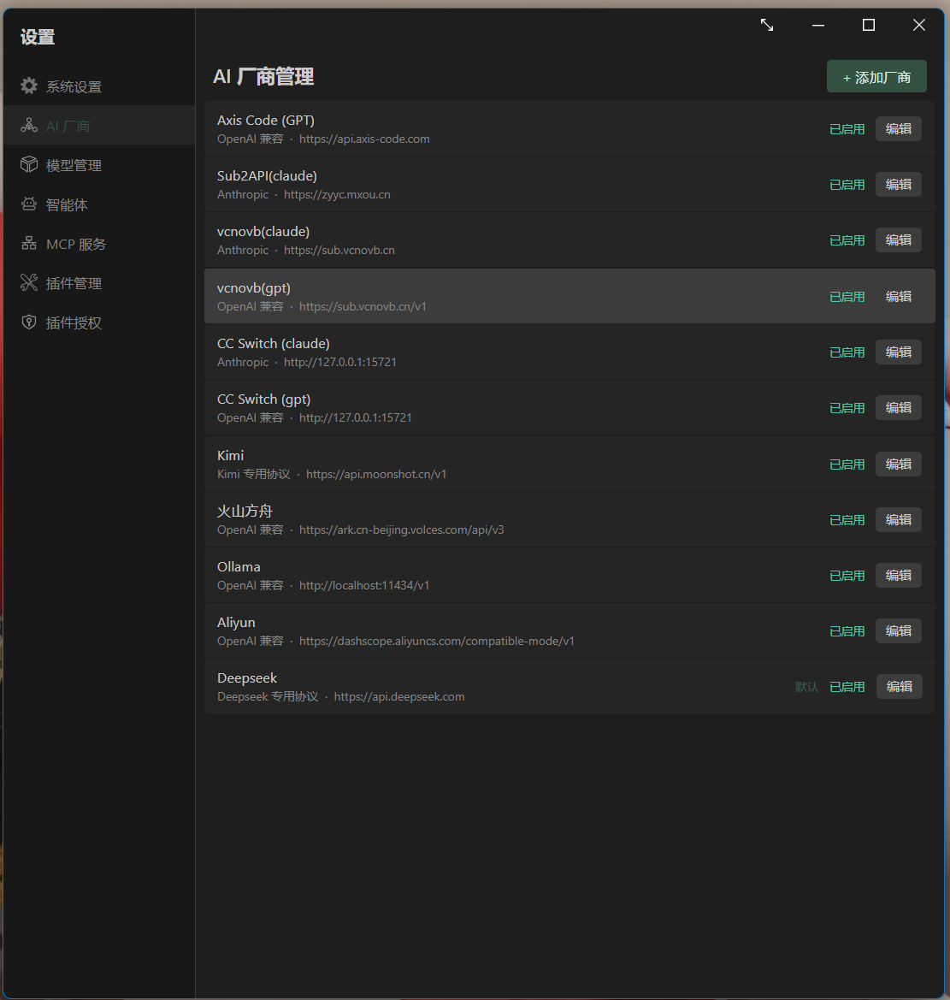

*支持的厂商：OpenAI、Anthropic、阿里云、百度、讯飞等*

---

**第二步：配置模型**

打开"AI 模型管理"，为不同智能体分配合适的模型：


*推荐配置：*

- 技术智能体：Claude Opus（代码能力强）
- 市场智能体：GPT-4（创意强）
- 客服智能体：国产模型（便宜）

---

### 3. 创建第一个智能体

打开"智能体管理"，点击"新建智能体"：


**快速配置**：

- 名称：技术助手
- 角色：技术专家
- 模型：Claude Opus
- 插件：文件、代码、数据库

---

### 4. 开始使用

#### 对话模式

直接和智能体聊天：

```
你：帮我写一个快速排序算法
AI：[生成代码]
```

#### 专家模式

让多个智能体讨论：

```
你：我要做个电商网站，技术栈怎么选？
技术智能体：建议 Next.js + PostgreSQL
产品智能体：建议加上推荐系统
市场智能体：建议支持多语言
```


---

#### 工作模式

创建任务，让 AI 执行：

```
任务：实现用户登录功能
智能体：[自动拆分子任务] → [调用代码插件] → [生成代码] → [交付]
```


---

#### 会议模式

开 AI 团队会议：

```
议题：技术方案讨论
参与者：技术、产品、设计智能体

讨论 → 每个智能体发表观点 → 投票决定 → 形成决议
```


---

## 🔧 核心配置

### 插件管理

**安装插件**：


*内置插件：文件、数据库、代码、网络、Office*

---

**插件授权**：


*三层授权：全局 → 智能体 → 项目*

---

### MCP 服务

**接入外部服务**：


*支持标准 MCP 协议，接入 GitHub、Slack、数据库等*

---

### 应用商店

**扩展生态**：


*下载社区插件、智能体模板、工作流*

---

### 系统设置

**完全可控**：


*数据存储、网络代理、日志级别、性能优化*

---

## 🛣️ 产品路线图

### ✅ v1.3 当前版本（2026.09）

#### 核心功能

- ✅ 四种工作模式（对话/专家/工作/会议）
- ✅ 多智能体协作
- ✅ 插件体系（Native/Process/MCP）
- ✅ 增强记忆系统
- ✅ WebSocket API
- ✅ 工作区隔离

#### 插件生态

- ✅ 文件操作插件
- ✅ 数据库插件（SQLite/MySQL/PostgreSQL）
- ✅ 代码插件（执行、分析、重构）
- ✅ 网络插件（HTTP 请求）
- ✅ Office 插件（Excel/Word/PDF）

#### 企业能力

- ✅ 插件集群
- ✅ 事件总线
- ✅ 三层授权
- ✅ 技能隔离

---

### 🚧 v1.4 开发中（2026.10）

#### 工作流引擎

- 🚧 可视化流程设计器
- 🚧 条件分支、循环、并行
- 🚧 定时触发、事件触发
- 🚧 流程模板市场

#### 知识库增强

- 🚧 文档导入（Word/PDF/Markdown）
- 🚧 知识卡片可视化
- 🚧 知识图谱浏览器
- 🚧 自动知识提炼优化

#### 协作功能

- 🚧 团队工作区
- 🚧 智能体共享
- 🚧 插件共享
- 🚧 任务协作

---

### 🎯 v1.5 规划中（2026.11）

#### 多模态支持

- 🎯 图片理解（识图、OCR）
- 🎯 语音对话（语音输入/输出）
- 🎯 视频分析（视频内容理解）
- 🎯 文档解析（复杂 PDF、扫描件）

#### 企业集成

- 🎯 企业微信机器人
- 🎯 钉钉机器人
- 🎯 Slack 集成
- 🎯 飞书集成

#### 私有化部署

- 🎯 Docker 镜像
- 🎯 K8s 部署
- 🎯 多租户支持
- 🎯 企业 SSO

---

### 🌟 v2.0 愿景（2027.Q1）

#### AI Agent 网络

- 🌟 智能体市场（买卖智能体）
- 🌟 跨用户协作（智能体可以"雇佣"其他用户的智能体）
- 🌟 智能体自主学习（从工作中学习优化）

#### 开放生态

- 🌟 插件 SDK 2.0（支持更多语言）
- 🌟 智能体 SDK（用代码定义智能体）
- 🌟 工作流市场（买卖自动化流程）
- 🌟 企业应用商店

#### 商业智能

- 🌟 决策分析（基于历史数据）
- 🌟 风险预测（项目风险评估）
- 🌟 资源优化（成本分析）

---

## 📚 技术文档

### 开发文档

- [插件开发指南](./Docs/插件开发指南.md)
- [Native 插件开发](./Docs/Native插件开发.md)
- [Process 插件开发](./Docs/Process插件开发.md)
- [MCP 服务接入](./Docs/MCP服务接入.md)
- [WebSocket API 文档](./Docs/WebSocketAPI.md)

### 架构文档

- [整体架构设计](./Docs/架构设计.md)
- [插件体系架构](./Docs/插件体系架构.md)
- [增强记忆系统](./Docs/增强记忆系统.md)
- [多智能体协作](./Docs/多智能体协作.md)

### 使用教程

- [快速上手指南](./Docs/快速上手.md)
- [工作模式详解](./Docs/工作模式详解.md)
- [会议模式详解](./Docs/会议模式详解.md)
- [插件使用教程](./Docs/插件使用教程.md)

---

## 🤝 参与贡献

### 贡献方式

#### 1. 开发插件

- 使用插件 SDK 开发新插件
- 提交到应用商店
- 获得下载分成

#### 2. 反馈 Bug

- GitHub Issues：[netor-ai/madorin/issues](https://github.com/netor-ai/madorin/issues)
- 提供详细的复现步骤
- 附上日志文件

#### 3. 提交功能建议

- GitHub Discussions：[netor-ai/madorin/discussions](https://github.com/netor-ai/madorin/discussions)
- 描述使用场景和痛点
- 说明期望的功能

#### 4. 贡献代码

- Fork 项目
- 创建 Feature 分支
- 提交 Pull Request

---

### 社区

- **GitHub**：[netor-ai/madorin](https://github.com/netor-ai/madorin)
- **Discord**：[加入讨论](https://discord.gg/madorin)
- **微信群**：添加微信 `madorin-ai` 邀请入群
- **Email**：[support@netor.ai](mailto:support@netor.ai)

---

## 📄 开源协议

本项目采用 [MIT License](./LICENSE)

---

## 🎉 致谢

感谢以下开源项目：

- [.NET](https://github.com/dotnet/runtime) - 应用框架
- [Avalonia](https://github.com/AvaloniaUI/Avalonia) - UI 框架
- [SQLite](https://www.sqlite.org/) - 数据存储
- [Semantic Kernel](https://github.com/microsoft/semantic-kernel) - AI 编排
- [MCP](https://modelcontextprotocol.io/) - 协议标准

---

## 🌐 相关链接

- **官网**：[https://netor.ai](https://netor.ai)
- **文档**：[https://docs.netor.ai](https://docs.netor.ai)
- **博客**：[https://blog.netor.ai](https://blog.netor.ai)
- **应用商店**：[https://store.netor.ai](https://store.netor.ai)

---

## 📞 商务合作

### 企业授权

- 私有化部署
- 定制开发
- 技术支持
- 培训服务

### 联系方式

- **商务邮箱**：[business@netor.ai](mailto:business@netor.ai)
- **电话**：400-XXX-XXXX
- **微信**：madorin-business

---

<div align="center">

**Madorin - 不是工具，是团队；不是助手，是公司**

[⬇️ 立即下载](https://github.com/netor-ai/madorin/releases) | [📖 查看文档](https://docs.netor.ai) | [💬 加入社区](https://discord.gg/madorin)

---

## 👨‍💻 关于作者

<div align="left">

**白明**，道号白三明。

正一·天师道·三山滴血派弟子，青城山天医派传承人，内丹术修习者，现隐居于福建。

软件工程师、架构师、企业家、创业顾问。20 年从业经验，行业先驱，曾多次荣获国家级创新奖励。

致力于修行与科技的融合探索，坚信科学修行、文明飞升的理念。业余时间投身于前沿科技研究，将道家智慧与现代技术相结合。

**人生信条**：人只要还有一口气在，就应当自强不息。

科技进步、社会发展是大势所趋。社会变革对有准备的人是机遇，对故步自封者是淘汰。唯有不断学习、积极进取，才能在时代浪潮中立足。

发扬道家文化，弘扬华夏精神。

</div>

<div align="center">

**微信联系**


*扫码添加微信，交流技术与修行*

</div>

---

Made with ❤️ by Netor.ai Team

© 2026 Netor.ai. All rights reserved.

</div>

